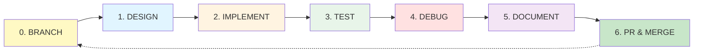
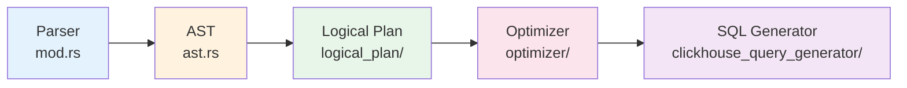
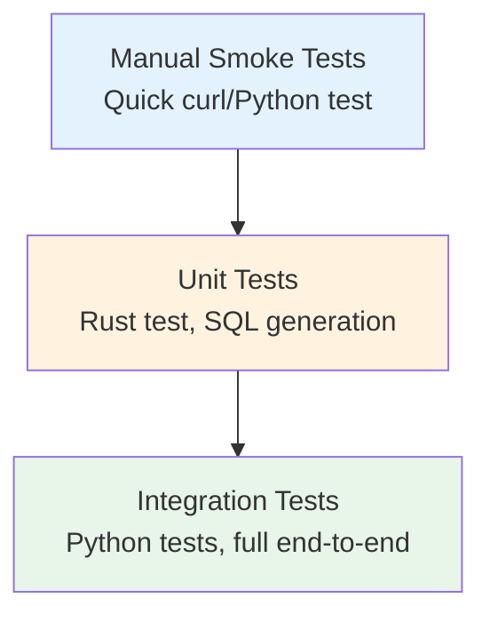

# Development Process - ClickGraph Development

**Purpose**: Standardized process for bug fixes, improvements, and features in ClickGraph. Based on lessons learned from OPTIONAL MATCH, Variable-Length Paths, Shortest Path, PageRank implementations.

**Note**: ClickGraph is in **late-stage development**. Most work is now bug fixes, performance improvements, and refinements rather than new features.

**Last Updated**: January 20, 2026

---

## 🎯 The Fundamental Process

### Overview: 6-Phase Iterative Development



**Key Principle**: Each phase has clear **entry criteria**, **exit criteria**, and **artifacts**.

**⚠️ CRITICAL**: All development MUST start with Phase 0 (creating a feature branch) and end with Phase 6 (PR review and merge).

---

## Phase 0: CREATE FEATURE BRANCH 🌿

**⚠️ REQUIRED FIRST STEP: Never develop on main branch!**

### Entry Criteria
- [ ] Clear task identified: bug fix, improvement, optimization, or feature
- [ ] Main branch is up to date
- [ ] Workspace is clean (no uncommitted changes)
- [ ] Issue/bug is well-understood (if applicable)

### Process Steps

#### 0.1 Sync with Main Branch
```bash
# Ensure you're on main and up to date
git checkout main
git pull origin main

# Verify clean state
git status
```

#### 0.2 Create Feature Branch
```bash
# Create and switch to new branch
git checkout -b <branch-type>/<descriptive-name>
```

**Branch Naming Convention** (in order of frequency):
- **Bug Fixes**: `fix/<bug-description>` (e.g., `fix/optional-match-null-handling`) - MOST COMMON
- **Performance**: `perf/<optimization>` (e.g., `perf/cte-optimization`) - COMMON
- **Refactoring**: `refactor/<component>` (e.g., `refactor/logical-plan`) - COMMON
- **Documentation**: `docs/<topic>` (e.g., `docs/update-cypher-reference`) - REGULAR
- **Tests**: `test/<test-type>` (e.g., `test/integration-suite`) - REGULAR
- **Features**: `feature/<feature-name>` (e.g., `feature/list-comprehensions`) - RARE

**Examples** (typical scenarios):
```bash
# Bug fix (most common)
git checkout -b fix/relationship-type-resolution

# Performance improvement
git checkout -b perf/join-elimination

# Code refactoring
git checkout -b refactor/simplify-query-planner

# Test improvements
git checkout -b test/edge-case-coverage

# Documentation update
git checkout -b docs/bolt-protocol-guide

# New feature (rare)
git checkout -b feature/list-comprehensions
```

#### 0.3 Verify Branch Creation
```bash
# Check current branch
git branch --show-current

# Should show your new branch name
```

### Exit Criteria
- [ ] New feature branch created from updated main
- [ ] Branch name follows naming convention
- [ ] Ready to start development work

### Artifacts
- New Git branch ready for development

**Common Mistakes to Avoid**:
- ❌ Developing directly on main branch
- ❌ Creating branch from outdated main
- ❌ Vague branch names (e.g., `my-branch`, `test`, `tmp`)
- ❌ Starting development with uncommitted changes

---

## Phase 1: DESIGN 📋

**Note**: For simple bug fixes, this phase may be brief (5-10 minutes). For features or complex issues, invest more time here.

### Entry Criteria
- [ ] **Feature branch created** (Phase 0 complete)
- [ ] Clear understanding of: bug to fix, improvement to make, or feature to add
- [ ] Root cause identified (for bug fixes)
- [ ] OpenCypher spec reviewed (for features/Cypher-related changes)
- [ ] Existing similar code identified (for reference)

### Process Steps

#### 1.1 Understand the Requirement

**For Bug Fixes** (most common):
- What is the incorrect behavior?
- What should the correct behavior be?
- What is the root cause?
- Which components are affected?
- Are there related bugs to fix together?

**For Performance Improvements**:
- What is the current performance bottleneck?
- What metrics are we optimizing (query time, memory, SQL efficiency)?
- What is the target improvement?
- Are there tradeoffs to consider?

**For New Features** (rare):
- What is the OpenCypher syntax?
- What does this feature do semantically?
- What SQL pattern will this translate to?

#### 1.1 Understand the Cypher Feature (for features only)
**Questions to Answer**:
- What is the OpenCypher syntax? (Check `open_cypher_parser/open_cypher_specs/`)
- What does this feature do semantically?
- Are there edge cases or variations?
- What SQL pattern will this translate to?

**Example** (OPTIONAL MATCH):
- Syntax: `OPTIONAL MATCH (pattern)` vs `MATCH (pattern)`
- Semantics: Match if exists, return NULL if doesn't exist
- SQL Pattern: Use LEFT JOIN instead of INNER JOIN
- Edge Cases: Multiple OPTIONAL MATCH clauses, OPTIONAL MATCH after WHERE

#### 1.2 Identify Affected Components
**Standard Architecture Path** (most features):



**Component Checklist**:
- [ ] **Parser** (`open_cypher_parser/`): Does syntax need parsing support?
- [ ] **AST** (`ast.rs`): Do we need new AST nodes?
- [ ] **Logical Plan** (`query_planner/logical_plan/`): New plan nodes needed?
- [ ] **Analyzer** (`query_planner/analyzer/`): Validation or inference needed?
- [ ] **Optimizer** (`query_planner/optimizer/`): Optimization passes?
- [ ] **SQL Generator** (`clickhouse_query_generator/`): SQL translation logic?
- [ ] **Server** (`server/`): API or handler changes?

#### 1.3 Design the Implementation
**Create Mental Model**:
1. Input: Example Cypher queries
2. AST: What AST structure represents this?
3. Logical Plan: How is this represented internally?
4. SQL Output: What SQL should be generated?

**Example Design Document** (see `notes/` directory):
- Summary: One-paragraph feature description
- How It Works: Architecture flow
- Key Files: List of files to modify
- Design Decisions: Why this approach?
- Examples: Input Cypher → Expected SQL

### Exit Criteria
- [ ] Clear understanding of what needs to be built
- [ ] Identified all files to modify
- [ ] Sketched SQL output for test cases
- [ ] (Optional) Created design note in `notes/<feature>.md`

### Artifacts
- Design notes (can be informal)
- Example queries (Cypher → SQL)
- Component checklist

---

## Phase 2: IMPLEMENT 🔨

### Entry Criteria
- [ ] Design phase complete
- [ ] Development environment ready (see `DEV_ENVIRONMENT_CHECKLIST.md`)
- [ ] Clean build: `cargo build` succeeds

### Process Steps

#### 2.1 Start with Parser (if needed)
**Location**: `src/open_cypher_parser/`

**Steps**:
1. Add token/keyword if needed (`mod.rs`)
2. Add parsing function (`mod.rs` or specific parser file)
3. Update AST structures (`ast.rs`)
4. Add unit tests in same file

**Example** (OPTIONAL MATCH):
```rust
// In mod.rs - add keyword
pub fn parse_optional_match(&mut self) -> Result<MatchClause> {
    self.expect_keyword("OPTIONAL")?;
    self.expect_keyword("MATCH")?;
    // ... rest of parsing logic
}

// In ast.rs - add field
pub struct Query {
    pub match_clause: Option<MatchClause>,
    pub optional_match_clauses: Vec<MatchClause>,  // ← NEW
    pub where_clause: Option<WhereClause>,
    // ...
}
```

**Testing Strategy**:
```rust
#[test]
fn test_parse_optional_match() {
    let query = "MATCH (a) OPTIONAL MATCH (a)-[:REL]->(b) RETURN a";
    let ast = parse_query(query).unwrap();
    assert_eq!(ast.optional_match_clauses.len(), 1);
}
```

#### 2.2 Update Logical Plan
**Location**: `src/query_planner/logical_plan/`

**Typical Changes**:
- Add new plan node types if needed
- Update `PlanContext` for tracking state
- Modify plan builders to construct new nodes

**Key Infrastructure**:
- Use `TypedVariable` system for variable registration (`query_planner/typed_variable.rs`)
- Use `define_*` methods in `PlanCtx` to register variables with full metadata
- Use `lookup_variable()` for unified variable lookups

#### 2.3 Implement SQL Generation
**Location**: `src/clickhouse_query_generator/` or `src/render_plan/`

**Common Patterns**:
- **Simple transformations**: Add cases to existing match statements
- **Complex features**: Create dedicated module (e.g., `variable_length_cte.rs`)
- **CTEs**: Use `CteManager` for schema-aware generation (`render_plan/cte_manager/`)
- **JOINs**: Use `PatternSchemaContext` for strategy selection (`graph_catalog/pattern_schema.rs`)

**⚠️ Per-Query State Must Use Task-Local**:
- ClickGraph runs on Axum (async server) where multiple concurrent queries share OS threads
- If you need per-query state (schema context, CTE mappings, temp caches), **use `tokio::task_local!` NOT `thread_local!`**
- Each async task gets isolated storage automatically - no interference between concurrent queries
- Example: `QUERY_SCHEMA_NAME` in `render_plan/render_expr.rs` uses `tokio::task_local!` so concurrent queries don't see each other's schema context
- See Core Infrastructure #5 in copilot-instructions.md for detailed pattern

#### 2.4 Wire Everything Together
**Common Integration Points**:
- Parser calls in `open_cypher_parser/mod.rs`
- Query planner calls in `query_planner/mod.rs`
- SQL generator calls in `render_plan/plan_builder.rs`

**Build Frequently**:
```bash
# Quick feedback loop
cargo build 2>&1 | grep -E "error|warning: unused|Compiling clickgraph|Finished"
```

### Exit Criteria
- [ ] `cargo build` succeeds (0 errors)
- [ ] New code integrated with existing architecture
- [ ] No unused imports or dead code warnings (ideally)
- [ ] Basic manual test passes (see Phase 3)

### Artifacts
- Modified source files
- Compilation success
- Git commits (can be WIP commits)

---

## Phase 3: TEST 🧪

### Entry Criteria
- [ ] Implementation complete
- [ ] Code compiles
- [ ] Server can start without crashes

### Testing Pyramid



#### 3.1 Manual Smoke Test (FIRST!)
**Purpose**: Verify basic functionality before writing formal tests

**Process**:
1. Start server with test database
2. Send simple query via Python or Invoke-RestMethod
3. Check response structure and SQL generation

**Example Script** (`test_<feature>.py`):
```python
import requests

# Test 1: Basic query
response = requests.post('http://localhost:8080/query', json={
    'query': 'OPTIONAL MATCH (a)-[:REL]->(b) RETURN a, b',
    'sql_only': True
})
print("Generated SQL:", response.json()['generated_sql'])

# Test 2: Execute query
response = requests.post('http://localhost:8080/query', json={
    'query': 'OPTIONAL MATCH (a)-[:REL]->(b) RETURN a.name, b.name'
})
print("Rows returned:", len(response.json()['rows']))
```

**Smoke Test Checklist**:
- [ ] Query parses successfully (no 400 errors)
- [ ] SQL generates without crashes (no 500 errors)
- [ ] SQL looks correct (manual inspection)
- [ ] Query executes against ClickHouse
- [ ] Results make sense (not all NULLs or all empty)

#### 3.2 Unit Tests
**Location**: Same file as implementation or `#[cfg(test)]` modules

**What to Test**:
- Parser: Various syntax patterns
- SQL generation: Expected SQL output
- Edge cases: Empty results, multiple clauses, nested patterns

**Example**:
```rust
#[cfg(test)]
mod tests {
    use super::*;

    #[test]
    fn test_optional_match_generates_left_join() {
        let query = "OPTIONAL MATCH (a)-[:REL]->(b) RETURN a";
        let sql = generate_sql(query).unwrap();
        assert!(sql.contains("LEFT JOIN"));
        assert!(!sql.contains("INNER JOIN"));
    }
}
```

**Run Unit Tests**:
```bash
cargo test --lib
```

#### 3.3 Integration Tests
**Location**: `tests/integration/` or standalone Python scripts

**Setup Requirements**:
1. ClickHouse running with test data
2. Server running with test schema
3. Test data loaded (see `scripts/setup/`)

**Test Structure**:
```python
import pytest
import requests

@pytest.fixture
def server_url():
    return "http://localhost:8080"

def test_optional_match_returns_nulls(server_url):
    """Test that OPTIONAL MATCH returns NULL for non-matches"""
    response = requests.post(f"{server_url}/query", json={
        'query': "MATCH (a:User) WHERE a.name='Alice' "
                 "OPTIONAL MATCH (a)-[:KNOWS]->(b) "
                 "RETURN a.name, b.name"
    })
    assert response.status_code == 200
    rows = response.json()['rows']
    assert any(row['b.name'] is None for row in rows)
```

**Run Integration Tests**:
```bash
# Single test
python -m pytest tests/integration/test_optional_match.py -v

# All tests in directory
python -m pytest tests/integration/ -v

# With output
python -m pytest tests/integration/ -v -s
```

#### 3.4 Test Data Management
**Always use test-specific data**:
- Database: `test_integration` (NOT `brahmand`)
- Schema: `test_integration_schema.yaml`
- Setup: `scripts/setup/setup_integration_test_data.sql`

**Reload Test Data**:
```bash
cat scripts/setup/setup_integration_test_data.sql | \
    docker exec -i clickhouse clickhouse-client \
    --user test_user --password test_pass --multiquery
```

### Exit Criteria
- [ ] Manual smoke test passes
- [ ] Unit tests pass: `cargo test`
- [ ] Integration tests pass: `pytest tests/integration/`
- [ ] No regressions in existing tests

### Artifacts
- Test scripts (`test_<feature>.py`)
- Unit test functions
- Integration test suite
- Test output logs

---

## Phase 4: DEBUG 🐛

### Entry Criteria
- [ ] Tests written
- [ ] Some tests failing OR unexpected behavior

### Debugging Strategies

#### 4.1 Add Debug Output
**Strategic Locations**:
- Parser: What did we parse?
- Planner: What logical plan was created?
- SQL Generator: What SQL are we generating?
- Execution: What rows came back?

**Example**:
```rust
// In parser
eprintln!("DEBUG: Parsed OPTIONAL MATCH clauses: {}", 
          ast.optional_match_clauses.len());

// In planner
eprintln!("DEBUG: GraphRel optional={}, left={:?}, right={:?}",
          graph_rel.is_optional, graph_rel.left, graph_rel.right);

// In SQL generator
eprintln!("DEBUG: Generated SQL:\n{}", sql);
```

**Pro Tip**: Use `RUST_LOG=debug` for built-in logging:
```rust
use log::debug;
debug!("Processing optional match: {:?}", pattern);
```

#### 4.2 Test with `sql_only` Flag
**Purpose**: See generated SQL without executing

```python
response = requests.post('http://localhost:8080/query', json={
    'query': 'OPTIONAL MATCH (a)-[:REL]->(b) RETURN a',
    'sql_only': True
})
print(response.json()['generated_sql'])
```

**Check SQL For**:
- Correct table names (with schema prefix)
- Correct JOIN types (INNER vs LEFT)
- Correct WHERE clause placement
- Correct column references
- No missing CTEs or subqueries

#### 4.3 Incremental Testing
**Strategy**: Test smallest possible units first

**Example** (Variable-Length Paths):
1. Test exact hop: `*2` (should use chained joins, not CTE)
2. Test range: `*1..3` (should use recursive CTE)
3. Test unbounded: `*1..` (should use CTE with max depth)
4. Test with filters: `WHERE end_node.age > 25`

**Testing Pattern**:
```bash
# Test 1: Basic
python -c "import requests; print(requests.post('http://localhost:8080/query', json={'query':'MATCH (a)-[*2]->(b) RETURN a'}).json())"

# Test 2: With filters  
python -c "import requests; print(requests.post('http://localhost:8080/query', json={'query':'MATCH (a)-[*1..3]->(b) WHERE b.age>25 RETURN a'}).json())"
```

#### 4.4 Compare Expected vs Actual SQL
**Create Reference SQL**:
```sql
-- Expected for: OPTIONAL MATCH (a)-[:FOLLOWS]->(b)
SELECT a.name, b.name
FROM test_integration.users AS a
LEFT JOIN test_integration.follows AS r 
  ON r.follower_id = a.user_id
LEFT JOIN test_integration.users AS b 
  ON b.user_id = r.followed_id
```

**Compare with Generated**:
- Use `diff` or visual comparison
- Check for missing/extra JOINs
- Check for wrong table aliases
- Check for wrong column references

#### 4.5 Check Server Logs
**Common Issues**:
- Schema not loaded: "Node type 'User' not found in schema"
- Table not found: "Unknown table test_integration.users"
- Column mismatch: "Property 'user_id' not found"

**Log Patterns**:
```bash
# Start server in background
nohup cargo run --bin clickgraph > server.log 2>&1 &

# Watch logs
tail -f server.log

# Or run in foreground with logging
RUST_LOG=debug cargo run --bin clickgraph 2>&1 | tee server.log
```

#### 4.6 Common Bug Patterns

**Pattern 1: Missing Schema Prefix**
- **Symptom**: `FROM users` instead of `FROM test_integration.users`
- **Cause**: Schema inference not using `database` field
- **Fix**: Use `format!("{}.{}", schema.database, schema.table_name)`

**Pattern 2: Duplicate WHERE Clauses**
- **Symptom**: `WHERE a.name='Alice' AND a.name='Alice'`
- **Cause**: Filter collected from both node and edge
- **Fix**: Only collect from one source (usually edge predicate)

**Pattern 3: Wrong Join Type**
- **Symptom**: INNER JOIN instead of LEFT JOIN for OPTIONAL MATCH
- **Cause**: Join type not checked in SQL generator
- **Fix**: Check `is_optional` flag in GraphRel

**Pattern 4: Missing Joins**
- **Symptom**: Multi-hop queries missing intermediate joins
- **Cause**: Recursion not visiting all plan nodes
- **Fix**: Ensure left AND right branches are recursed

**Pattern 5: Early Return in Tree Search** ⭐ (Jan 24, 2026)
- **Symptom**: Single-variable cases work, multi-variable cases fail silently
- **Cause**: Returning first `Ok()` result even if it's empty (e.g., empty Vec)
- **Example**: CartesianProduct search: checked left branch, got empty Vec, returned immediately without trying right branch
- **Fix**: Validate result is meaningful before returning
  ```rust
  // ❌ WRONG: Returns immediately, even with empty result
  if let Ok(result) = search_left() {
      return Ok(result);  // Could be empty!
  }
  if let Ok(result) = search_right() {
      return Ok(result);
  }
  
  // ✅ CORRECT: Only return if result is meaningful
  if let Ok(result) = search_left() {
      if !result.is_empty() {
          return Ok(result);  // Verified non-empty
      }
  }
  if let Ok(result) = search_right() {
      if !result.is_empty() {
          return Ok(result);
      }
  }
  ```
- **Testing**: Always test multi-variable cases alongside single-variable
  - Single var: `MATCH (u) WITH u AS person` ✅ Easy to pass
  - Multi var: `MATCH (u) MATCH (f) WITH u AS p, f AS fr` ✅ Catches branch-search bugs

### Exit Criteria
- [ ] Root cause identified
- [ ] Fix implemented
- [ ] Tests now pass
- [ ] No new regressions introduced

### Artifacts
- Debug output logs
- SQL comparisons
- Bug fix commits
- Lessons learned notes

---

## Phase 5: DOCUMENT 📚

### Entry Criteria
- [ ] Feature fully implemented
- [ ] Tests passing
- [ ] No known blockers

### Documentation Checklist

#### 5.1 Update STATUS.md
**Add to "What Works" Section**:
```markdown
### Feature Name (Date)
- **What**: One-sentence description
- **Example**: 
  ```cypher
  MATCH (a)-[*1..3]->(b) RETURN a
  ```
- **SQL Generated**: Brief description of SQL pattern
- **Testing**: X/Y tests passing
- **Files Modified**: List key files
```

#### 5.2 Create Feature Note (notes/)
**Template** (`notes/<feature>.md`):
```markdown
# Feature Name

## Summary
One-paragraph overview of what this feature does.

## How It Works
- Architecture flow
- Key components involved
- SQL generation strategy

## Key Files
- `file1.rs` - What it does
- `file2.rs` - What it does

## Design Decisions
- Why we chose this approach
- Alternatives considered

## Examples
### Example 1: Basic Usage
**Input**: Cypher query
**Output**: SQL query

### Example 2: Edge Case
**Input**: Complex query
**Output**: SQL with explanation

## Gotchas
- Known limitations
- Edge cases to watch

## Limitations
- What doesn't work yet
- Future improvements needed

## Testing
- Test coverage
- How to test manually
```

#### 5.3 Update CHANGELOG.md
**Format**:
```markdown
## [Unreleased]

### 🚀 Features
- **Feature Name**: One-line description with Cypher example
  - Key improvement or benefit
  - Related files: `file1.rs`, `file2.rs`
```

#### 5.4 Update README.md (if major feature)
**Only for user-visible features**:
- Add to Features list
- Update examples if relevant
- Add to Roadmap "Completed" section

#### 5.5 Add Example Scripts (examples/)
**If feature is complex**:
```python
# examples/test_<feature>.py
"""
Example usage of <Feature Name>

Demonstrates:
1. Basic query pattern
2. With filters
3. Edge cases
"""

import requests

# Example 1
response = requests.post('http://localhost:8080/query', json={
    'query': 'MATCH (a)-[*1..3]->(b) RETURN a.name'
})
print(response.json())
```

### Exit Criteria
- [ ] STATUS.md updated
- [ ] Feature note created in `notes/`
- [ ] CHANGELOG.md updated
- [ ] Examples added (if applicable)
- [ ] README.md updated (if major feature)

### Artifacts
- Updated documentation files
- Example scripts
- Git commits with documentation

---

## 🔄 Iteration & Refinement

### When to Iterate

**Triggers for Next Iteration**:
1. **Tests reveal edge cases**: Go back to Phase 2 (Implement)
2. **Performance issues**: Add optimization pass
3. **User feedback**: Refine design (Phase 1)
4. **Integration failures**: Debug (Phase 4)

### Iteration Best Practices

1. **Small Commits**: One logical change per commit
   ```
   git commit -m "feat: Add parser support for OPTIONAL MATCH"
   git commit -m "feat: Add LEFT JOIN generation for optional patterns"
   git commit -m "test: Add integration tests for OPTIONAL MATCH"
   git commit -m "docs: Document OPTIONAL MATCH feature"
   ```

2. **Test at Each Step**: Don't accumulate broken tests
   - After parser changes: Run parser unit tests
   - After SQL gen changes: Test SQL output
   - After integration: Run full test suite

3. **Document as You Go**: Don't wait until the end
   - Add comments during implementation
   - Create design notes during Phase 1
   - Update STATUS.md when tests pass

4. **Keep main Stable**: Use branches for risky changes
   ```bash
   git checkout -b feature/variable-length-paths
   # ... implement and test
   git checkout main
   git merge feature/variable-length-paths
   ```

---

## 📊 Success Metrics

### Per-Feature Metrics
- [ ] **Correctness**: All tests pass
- [ ] **Performance**: Query execution < 100ms for simple cases
- [ ] **Coverage**: Edge cases tested
- [ ] **Documentation**: Feature note + examples exist

### Project-Wide Metrics
- [ ] **Unit Tests**: >95% passing
- [ ] **Integration Tests**: >90% passing
- [ ] **Build Time**: < 5 minutes
- [ ] **Documentation**: All features documented

---

## 🚨 Common Pitfalls & Solutions

### Pitfall 1: Skipping Design Phase
**Symptom**: Implementing without understanding SQL output
**Solution**: Always sketch expected SQL first

### Pitfall 2: Not Testing Incrementally
**Symptom**: Accumulating failures, hard to debug
**Solution**: Test after each component (parser → planner → SQL gen)

### Pitfall 3: Testing Against Production Data
**Symptom**: Tests pass locally but fail in CI
**Solution**: Always use `test_integration` database and test schema

### Pitfall 4: Ignoring Server Logs
**Symptom**: "Query returns 500" but don't know why
**Solution**: Always check server logs for ClickHouse errors

### Pitfall 5: Not Using sql_only Flag
**Symptom**: Hard to debug SQL generation issues
**Solution**: Always test with `'sql_only': True` first

### Pitfall 6: Forgetting Windows Constraints
**Symptom**: curl doesn't work, volume permissions fail
**Solution**: Use Invoke-RestMethod and ENGINE=Memory (see copilot-instructions.md)

### Pitfall 7: Stale Docker Containers
**Symptom**: Code changes don't take effect
**Solution**: Run DEV_ENVIRONMENT_CHECKLIST.md before each session

---

## 🎓 Learning from Past Successes

### Case Study 1: OPTIONAL MATCH (Nov 4-5, 2025)
**Challenge**: Parser wasn't parsing OPTIONAL MATCH at all
**Root Cause**: Parser expected OPTIONAL MATCH before WHERE, but real queries have WHERE first
**Solution**: Reordered parser to handle WHERE before OPTIONAL MATCH
**Lesson**: Real-world query order ≠ grammar specification order
**Time**: 2 hours total (discovery + fix + test)

### Case Study 2: Variable-Length Paths (Oct 18, 2025)
**Challenge**: Multiple hop patterns (*2, *1..3, *2.., etc.)
**Strategy**: Implement incrementally
  1. Exact hops (*2) → Chained JOINs
  2. Ranges (*1..3) → Recursive CTEs
  3. Unbounded (*2..) → CTEs with max depth
**Lesson**: Complex features need incremental implementation
**Time**: 3 days (design + implement + test + debug)

### Case Study 3: Multi-Hop JOIN Bug (Nov 6, 2025)
**Challenge**: Multi-hop queries missing first relationship
**Root Cause**: `collect_graph_joins()` never recursed into `graph_rel.left`
**Discovery Method**: User insight → grep search → found commented code
**Lesson**: Always check if recursion visits ALL plan branches
**Status**: Fix attempted but introduced regression (ongoing)

---

## 📋 Quick Reference Checklists

### Starting a New Feature
- [ ] Read OpenCypher spec for feature
- [ ] Sketch 3-5 example queries (Cypher → SQL)
- [ ] Identify components to modify
- [ ] Create design note in `notes/<feature>.md`
- [ ] Create git branch: `git checkout -b feature/<name>`

### Before Committing Code
- [ ] `cargo build` succeeds (0 errors)
- [ ] `cargo test` passes (no new failures)
- [ ] Manual smoke test passes
- [ ] No debug print statements left in code
- [ ] Updated relevant documentation

### Before Merging to Main
- [ ] All unit tests pass: `cargo test`
- [ ] Integration tests pass: `pytest tests/integration/`
- [ ] STATUS.md updated
- [ ] CHANGELOG.md updated
- [ ] Feature note exists in `notes/`
- [ ] No known regressions

### After Completing a Feature
- [ ] Create final commit with docs
- [ ] Tag if significant: `git tag v0.x.y`
- [ ] Update NEXT_STEPS.md with next priority
- [ ] Archive session notes if any

---

## 🏗️ Architecture Pattern: Metadata Preservation

### The Problem

When adding metadata fields to LogicalPlan nodes (e.g., `tuple_properties` on Unwind), the metadata must be preserved through **all** pipeline transformations. Without a systematic approach, this requires updating 15-20 files, which is error-prone and creates bugs.

### The Solution: Builder Pattern with Helper Methods

**Pattern**: Add helper methods to struct that clone metadata automatically

```rust
impl Unwind {
    /// Preserve all metadata while changing input
    pub fn with_new_input(&self, new_input: Arc<LogicalPlan>) -> Self {
        Unwind {
            input: new_input,
            expression: self.expression.clone(),
            alias: self.alias.clone(),
            label: self.label.clone(),
            tuple_properties: self.tuple_properties.clone(), // ← Automatic
            // Future metadata fields get added here once
        }
    }

    /// Standard rebuild pattern used in pipeline transformations
    pub fn rebuild_or_clone(
        &self,
        input_tf: Transformed<Arc<LogicalPlan>>,
        old_plan: Arc<LogicalPlan>,
    ) -> Transformed<Arc<LogicalPlan>> {
        match input_tf {
            Transformed::Yes(new_input) => {
                Transformed::Yes(Arc::new(LogicalPlan::Unwind(
                    self.with_new_input(new_input)
                )))
            }
            Transformed::No(_) => Transformed::No(old_plan.clone()),
        }
    }
}
```

### Usage in Pipeline Code

**Before** (error-prone):
```rust
LogicalPlan::Unwind(u) => {
    let child_tf = self.analyze(u.input.clone(), _plan_ctx)?;
    match child_tf {
        Transformed::Yes(new_input) => Transformed::Yes(Arc::new(LogicalPlan::Unwind(
            Unwind {
                input: new_input,
                expression: u.expression.clone(),
                alias: u.alias.clone(),
                label: u.label.clone(),
                tuple_properties: u.tuple_properties.clone(), // EASY TO FORGET!
            },
        ))),
        Transformed::No(_) => Transformed::No(logical_plan.clone()),
    }
}
```

**After** (automatic):
```rust
LogicalPlan::Unwind(u) => {
    let child_tf = self.analyze(u.input.clone(), _plan_ctx)?;
    u.rebuild_or_clone(child_tf, logical_plan.clone())
}
```

### Guidelines for Adding Metadata Fields

#### When Adding a New Metadata Field

1. **Add field to struct** in `query_planner/logical_plan/mod.rs`
   ```rust
   pub struct Unwind {
       // ... existing fields ...
       pub new_metadata: Option<SomeType>,
   }
   ```

2. **Update helper methods** (ONE place):
   ```rust
   impl Unwind {
       pub fn with_new_input(&self, new_input: Arc<LogicalPlan>) -> Self {
           Unwind {
               input: new_input,
               // ... existing clones ...
               new_metadata: self.new_metadata.clone(), // ← Add here
           }
       }
   }
   ```

3. **Set metadata where created** (analyzer, enricher):
   ```rust
   LogicalPlan::Unwind(Unwind {
       input,
       expression,
       alias,
       label: Some("User".to_string()),
       new_metadata: Some(computed_value), // ← Initialize
   })
   ```

4. **Test metadata flows through**:
   - Add test to verify metadata preserved after optimization
   - Check in query_planner tests
   - Verify in integration tests

#### When NOT to Use This Pattern

- **Immutable leaf nodes** (Empty, ViewScan) - no transformations
- **Simple wrapper nodes** - use spread operator `..node.clone()`
- **One-off transformations** - manual clone acceptable

### Benefits

✅ **Single Point of Update**: New metadata = update 1 method, not 19 files  
✅ **Compiler Enforced**: Forget to update method → compilation error  
✅ **Self-Documenting**: Helper names explain intent  
✅ **Testing**: Easy to verify metadata preservation  

### See Also

- **Design Document**: `notes/metadata_preservation.md`
- **Case Study**: `tuple_properties` field (Dec 20, 2025)
- **Example Implementation**: `src/query_planner/logical_plan/mod.rs` - Unwind impl block

---

---

## Phase 6: PULL REQUEST & MERGE 🔀

**⚠️ REQUIRED FINAL STEP: All code must be reviewed before merging to main!**

### Entry Criteria
- [ ] Phase 5 (Documentation) complete
- [ ] All tests passing (unit + integration)
- [ ] Code committed to feature branch
- [ ] No uncommitted changes
- [ ] Feature is fully functional and ready for review

### Process Steps

#### 6.1 Pre-PR Self-Review Checklist

**Code Quality**:
- [ ] All tests passing: `cargo test` (unit) and `pytest` (integration)
- [ ] **Code formatting applied: `cargo fmt --all`** ⚠️ MANDATORY
- [ ] No compilation warnings
- [ ] Code follows Rust style guidelines
- [ ] No debug/temporary code left in (println!, commented blocks)
- [ ] All new functions have doc comments
- [ ] No unused imports or dead code

**Documentation**:
- [ ] **Cypher Language Reference updated** (PRIMARY - most important!)
- [ ] `STATUS.md` updated (feature moved to "What Works")
- [ ] `CHANGELOG.md` updated under `[Unreleased]` section
- [ ] Feature note created in `notes/` (if major feature)
- [ ] API documentation updated (if API changes)
- [ ] Code comments explain "why", not "what"

**Testing**:
- [ ] Unit tests added for new code paths
- [ ] Integration tests added for end-to-end scenarios
- [ ] Edge cases tested
- [ ] Error cases tested
- [ ] Test coverage is reasonable (use `cargo tarpaulin` if needed)

#### 6.2 Push Feature Branch

```bash
# MANDATORY: Format code before pushing
cargo fmt --all

# Verify formatting didn't break anything
cargo test --lib

# Final commit with all changes
git status
git add -A  # Include formatting changes
git commit -m "<type>: complete <feature> implementation"

# Push to remote
git push origin <branch-name>

# If branch doesn't exist on remote yet:
git push --set-upstream origin <branch-name>
```

#### 6.3 Create Pull Request

**On GitHub**:
1. Go to repository → Pull Requests → New Pull Request
2. Select your feature branch as source, main as target
3. Fill out PR template:

**PR Title Format**:
```
<type>: Brief description (one line)

Examples:
feat: Add aggregate function support (COUNT, SUM, AVG)
fix: Resolve OPTIONAL MATCH NULL handling in joins
docs: Complete Cypher Language Reference for variable-length paths
perf: Optimize CTE generation for simple patterns
```

**PR Description Template**:
```markdown
## Summary
[Brief description of what this PR does]

## Changes Made
- [ ] List specific changes
- [ ] Component 1: Description
- [ ] Component 2: Description

## Testing
- Unit tests: XX passing
- Integration tests: XX passing
- Manual testing: [scenarios tested]

## Documentation
- [ ] Cypher Language Reference updated
- [ ] STATUS.md updated
- [ ] CHANGELOG.md updated
- [ ] Feature note added (if applicable)

## Examples
```cypher
# Example Cypher query showing new feature
MATCH (n:User) RETURN count(n)
```

## Related Issues
Closes #XX (if applicable)
Related to #YY

## Breaking Changes
[ ] Yes - [describe]
[X] No

## Checklist
- [ ] All tests passing
- [ ] No compilation warnings
- [ ] Documentation complete
- [ ] Code reviewed by self
- [ ] Ready for team review
```

#### 6.4 Address Review Comments

**During Review Process**:
1. **Respond to comments**: Acknowledge feedback, ask clarifying questions
2. **Make revisions**: Address requested changes
3. **Commit and push**: Additional commits to same branch
   ```bash
   git add <revised files>
   git commit -m "fix: address review feedback - <specific change>"
   git push origin <branch-name>
   ```
4. **Re-request review**: After addressing all comments
5. **Resolve conversations**: Mark discussions as resolved when fixed

**Review Response Best Practices**:
- ✅ Be responsive to feedback
- ✅ Explain reasoning for design decisions
- ✅ Ask questions if suggestions are unclear
- ✅ Keep discussions professional and constructive
- ❌ Don't take criticism personally
- ❌ Don't argue about style (follow project conventions)

#### 6.5 Merge to Main

**Prerequisites for Merge**:
- [ ] All CI checks passing (if CI configured)
- [ ] At least one approval from reviewer
- [ ] All conversations resolved
- [ ] No merge conflicts
- [ ] Branch is up to date with main

**Merge Options** (choose based on situation):

1. **Squash and Merge** (RECOMMENDED for most features):
   - Combines all commits into one
   - Creates clean, linear history
   - Use when: Multiple small commits during development
   ```
   Commit message format:
   feat: Add aggregate function support (#123)
   
   - Implemented COUNT, SUM, AVG, MIN, MAX
   - Added query planning support
   - Comprehensive test coverage
   ```

2. **Merge Commit** (for preserving commit history):
   - Keeps all individual commits
   - Shows full development history
   - Use when: Commits are well-organized and meaningful

3. **Rebase and Merge** (for clean linear history):
   - Replays commits on top of main
   - No merge commit
   - Use when: Commits are clean and you want linear history

**After Merge**:
```bash
# Switch to main and pull
git checkout main
git pull origin main

# Delete local feature branch
git branch -d <branch-name>

# Delete remote feature branch (usually done automatically by GitHub)
git push origin --delete <branch-name>
```

#### 6.6 Post-Merge Verification

```bash
# Verify main branch
git log --oneline -5

# Run tests on main
cargo test
pytest tests/integration/

# If tests fail on main (should never happen!):
# - Investigate immediately
# - Create hotfix branch if needed
# - Revert merge if necessary: git revert -m 1 <merge-commit-hash>
```

### Exit Criteria
- [ ] PR approved and merged to main
- [ ] Feature branch deleted
- [ ] Main branch tests passing
- [ ] Documentation live in main branch
- [ ] Feature available in main branch

### Artifacts
- Merged pull request
- Updated main branch with feature
- Closed feature branch

### Common Issues & Solutions

**Merge Conflicts**:
```bash
# Update your branch with latest main
git checkout <your-branch>
git fetch origin
git merge origin/main

# Resolve conflicts in files
# After resolving:
git add <resolved-files>
git commit -m "merge: resolve conflicts with main"
git push origin <your-branch>
```

**CI Failures**:
- Check GitHub Actions logs
- Reproduce failure locally
- Fix issue and push additional commits

**Forgotten Documentation**:
- Add documentation in new commits to PR
- Use "docs: add missing documentation" commit
- Don't merge until documentation is complete

### Emergency Hotfixes (Exception to Process)

**Only for critical production issues**:
```bash
# Create hotfix branch from main
git checkout main
git pull origin main
git checkout -b hotfix/<critical-issue>

# Fix issue, test thoroughly
git commit -m "hotfix: resolve critical bug in <component>"

# Push and create PR with HOTFIX label
git push origin hotfix/<critical-issue>

# Fast-track review and merge
```

**Hotfix Criteria**:
- ✅ Production is broken or severely degraded
- ✅ Security vulnerability discovered
- ✅ Data corruption risk
- ❌ Regular bugs (use normal workflow)
- ❌ Feature requests (use normal workflow)
- ❌ Performance optimizations (use normal workflow)

---

## � Quick Reference: Bug Fix Workflow

**Since bug fixes are the most common work, here's a streamlined guide:**

### 1. Reproduce the Bug
```bash
# Create bug fix branch
git checkout main && git pull
git checkout -b fix/descriptive-bug-name

# Reproduce the issue
# - Run failing test
# - Try manual query that fails
# - Check logs for error
```

### 2. Identify Root Cause
- Add debug logging (`eprintln!`, `tracing::debug!`)
- Use `sql_only` mode to inspect generated SQL
- Check server logs for stack traces
- Trace code path from parser → planner → SQL gen

### 3. Fix and Test
```bash
# Make minimal fix
# Run relevant tests
cargo test <test_name>
pytest tests/integration/test_<relevant>.py

# Verify fix works
# Test edge cases
```

### 4. Submit PR
```bash
# Commit with clear message
git add <files>
git commit -m "fix: resolve <specific issue>

Root cause: <brief explanation>
Solution: <what you changed>
Tests: <what you verified>"

# Push and create PR
git push origin fix/descriptive-bug-name
```

### Common Bug Patterns
- **Alias propagation**: Check `plan_sanitization.rs` and `graph_traversal_planning.rs`
- **Property mapping**: Verify schema lookups in `graph_catalog/`
- **SQL generation**: Debug in `clickhouse_query_generator/`
- **Type resolution**: Check analyzer passes in `query_planner/analyzer/`
- **NULL handling**: Review LEFT JOIN logic for OPTIONAL MATCH

---

## �🔗 Related Documents

- **Architecture**: `.github/copilot-instructions.md` - Project structure and conventions
- **Git Workflow**: `docs/development/git-workflow.md` - Detailed Git commands and recovery
- **Environment Setup**: `docs/development/environment-checklist.md` - Pre-session checklist
- **Current Status**: `STATUS.md` - What works now
- **Next Priorities**: `NEXT_STEPS.md` - What to build next
- **Testing Guide**: `docs/development/testing.md` - Comprehensive testing strategies
- **Feature Notes**: `notes/` - Individual feature documentation

---

## 💡 Final Thoughts

**The Process is a Guide, Not a Prison**:
- For simple features: Skip formal design notes
- For experiments: Skip integration tests initially
- For bug fixes: Start with Phase 4 (Debug), but still create a branch!

**But Always (Non-Negotiable)**:
1. ✅ **Create feature branch** (Phase 0 - ALWAYS)
2. ✅ Test incrementally
3. ✅ Check server logs
4. ✅ Use sql_only for debugging
5. ✅ Document when complete
6. ✅ **Submit PR for review** (Phase 6 - ALWAYS)
7. ✅ Keep main branch stable (never commit directly!)

**The Two Absolutes**:
- **Phase 0 (Branch)**: NEVER skip - protects main branch
- **Phase 6 (PR & Merge)**: NEVER skip - ensures code quality and review

**Remember**: "Good code is debuggable code." Add logging, test often, commit frequently. "Safe code is reviewed code." Always use pull requests.

---

**Version**: 1.0  
**Based on**: OPTIONAL MATCH, Variable-Length Paths, Shortest Path, PageRank implementations  
**Maintained by**: ClickGraph development team


