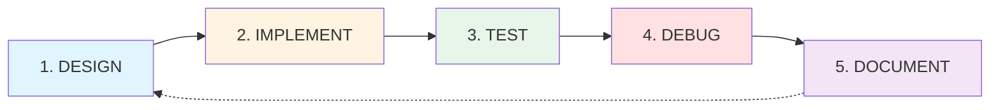
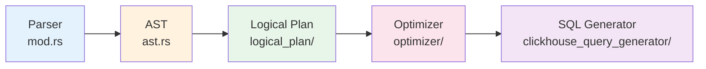
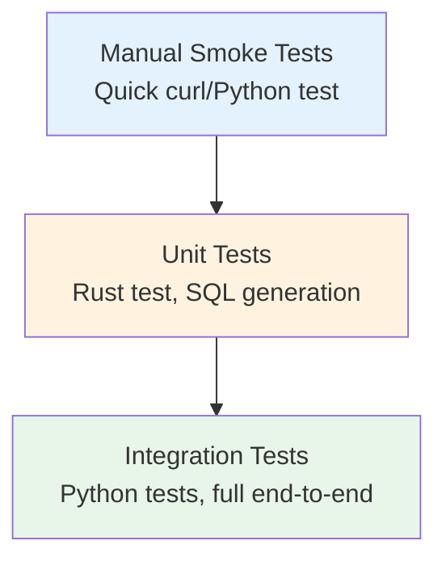

# Development Process - ClickGraph Feature Development

**Purpose**: Standardized process for adding features to ClickGraph, based on lessons learned from OPTIONAL MATCH, Variable-Length Paths, Shortest Path, PageRank, and other successful implementations.

**Last Updated**: November 6, 2025

---

## 🎯 The Fundamental Process

### Overview: 5-Phase Iterative Development



**Key Principle**: Each phase has clear **entry criteria**, **exit criteria**, and **artifacts**.

---

## Phase 1: DESIGN 📋

### Entry Criteria
- [ ] Clear feature request or Cypher functionality to add
- [ ] Understanding of OpenCypher specification for feature
- [ ] Existing similar features identified (for reference)

### Process Steps

#### 1.1 Understand the Cypher Feature
**Questions to Answer**:
- What is the OpenCypher syntax? (Check `open_cypher_parser/open_cypher_specs/`)
- What does this feature do semantically?
- Are there edge cases or variations?
- What SQL pattern will this translate to?

**Example** (OPTIONAL MATCH):
- Syntax: `OPTIONAL MATCH (pattern)` vs `MATCH (pattern)`
- Semantics: Match if exists, return NULL if doesn't exist
- SQL Pattern: Use LEFT JOIN instead of INNER JOIN
- Edge Cases: Multiple OPTIONAL MATCH clauses, OPTIONAL MATCH after WHERE

#### 1.2 Identify Affected Components
**Standard Architecture Path** (most features):



**Component Checklist**:
- [ ] **Parser** (`open_cypher_parser/`): Does syntax need parsing support?
- [ ] **AST** (`ast.rs`): Do we need new AST nodes?
- [ ] **Logical Plan** (`query_planner/logical_plan/`): New plan nodes needed?
- [ ] **Analyzer** (`query_planner/analyzer/`): Validation or inference needed?
- [ ] **Optimizer** (`query_planner/optimizer/`): Optimization passes?
- [ ] **SQL Generator** (`clickhouse_query_generator/`): SQL translation logic?
- [ ] **Server** (`server/`): API or handler changes?

#### 1.3 Design the Implementation
**Create Mental Model**:
1. Input: Example Cypher queries
2. AST: What AST structure represents this?
3. Logical Plan: How is this represented internally?
4. SQL Output: What SQL should be generated?

**Example Design Document** (see `notes/` directory):
- Summary: One-paragraph feature description
- How It Works: Architecture flow
- Key Files: List of files to modify
- Design Decisions: Why this approach?
- Examples: Input Cypher → Expected SQL

### Exit Criteria
- [ ] Clear understanding of what needs to be built
- [ ] Identified all files to modify
- [ ] Sketched SQL output for test cases
- [ ] (Optional) Created design note in `notes/<feature>.md`

### Artifacts
- Design notes (can be informal)
- Example queries (Cypher → SQL)
- Component checklist

---

## Phase 2: IMPLEMENT 🔨

### Entry Criteria
- [ ] Design phase complete
- [ ] Development environment ready (see `DEV_ENVIRONMENT_CHECKLIST.md`)
- [ ] Clean build: `cargo build` succeeds

### Process Steps

#### 2.1 Start with Parser (if needed)
**Location**: `src/open_cypher_parser/`

**Steps**:
1. Add token/keyword if needed (`mod.rs`)
2. Add parsing function (`mod.rs` or specific parser file)
3. Update AST structures (`ast.rs`)
4. Add unit tests in same file

**Example** (OPTIONAL MATCH):
```rust
// In mod.rs - add keyword
pub fn parse_optional_match(&mut self) -> Result<MatchClause> {
    self.expect_keyword("OPTIONAL")?;
    self.expect_keyword("MATCH")?;
    // ... rest of parsing logic
}

// In ast.rs - add field
pub struct Query {
    pub match_clause: Option<MatchClause>,
    pub optional_match_clauses: Vec<MatchClause>,  // ← NEW
    pub where_clause: Option<WhereClause>,
    // ...
}
```

**Testing Strategy**:
```rust
#[test]
fn test_parse_optional_match() {
    let query = "MATCH (a) OPTIONAL MATCH (a)-[:REL]->(b) RETURN a";
    let ast = parse_query(query).unwrap();
    assert_eq!(ast.optional_match_clauses.len(), 1);
}
```

#### 2.2 Update Logical Plan
**Location**: `src/query_planner/logical_plan/`

**Typical Changes**:
- Add new plan node types if needed
- Update `PlanContext` for tracking state
- Modify plan builders to construct new nodes

**Example** (Path Variables):
```rust
// In plan_ctx/mod.rs - track path variables
pub struct PlanContext {
    // ... existing fields
    pub path_variables: HashMap<String, PathVariableInfo>,  // ← NEW
}
```

#### 2.3 Implement SQL Generation
**Location**: `src/clickhouse_query_generator/` or `src/render_plan/`

**Common Patterns**:
- **Simple transformations**: Add cases to existing match statements
- **Complex features**: Create dedicated module (e.g., `variable_length_cte.rs`)
- **CTEs**: Use `WITH` clause generation helpers
- **JOINs**: Modify join collection in `plan_builder.rs`

**Example** (Variable-Length Paths):
```rust
// New file: variable_length_cte.rs
pub fn generate_variable_length_cte(
    rel: &GraphRel,
    plan_ctx: &PlanContext,
) -> Result<String> {
    match &rel.min_hops {
        Some(1) if rel.max_hops == Some(1) => {
            // Single hop - no CTE needed
            generate_simple_join(rel, plan_ctx)
        }
        _ => {
            // Multi-hop - use recursive CTE
            generate_recursive_cte(rel, plan_ctx)
        }
    }
}
```

#### 2.4 Wire Everything Together
**Common Integration Points**:
- Parser calls in `open_cypher_parser/mod.rs`
- Query planner calls in `query_planner/mod.rs`
- SQL generator calls in `render_plan/plan_builder.rs`

**Build Frequently**:
```powershell
# Quick feedback loop
cargo build 2>&1 | Select-String "error|warning: unused|Compiling clickgraph|Finished"
```

### Exit Criteria
- [ ] `cargo build` succeeds (0 errors)
- [ ] New code integrated with existing architecture
- [ ] No unused imports or dead code warnings (ideally)
- [ ] Basic manual test passes (see Phase 3)

### Artifacts
- Modified source files
- Compilation success
- Git commits (can be WIP commits)

---

## Phase 3: TEST 🧪

### Entry Criteria
- [ ] Implementation complete
- [ ] Code compiles
- [ ] Server can start without crashes

### Testing Pyramid



#### 3.1 Manual Smoke Test (FIRST!)
**Purpose**: Verify basic functionality before writing formal tests

**Process**:
1. Start server with test database
2. Send simple query via Python or Invoke-RestMethod
3. Check response structure and SQL generation

**Example Script** (`test_<feature>.py`):
```python
import requests

# Test 1: Basic query
response = requests.post('http://localhost:8080/query', json={
    'query': 'OPTIONAL MATCH (a)-[:REL]->(b) RETURN a, b',
    'sql_only': True
})
print("Generated SQL:", response.json()['generated_sql'])

# Test 2: Execute query
response = requests.post('http://localhost:8080/query', json={
    'query': 'OPTIONAL MATCH (a)-[:REL]->(b) RETURN a.name, b.name'
})
print("Rows returned:", len(response.json()['rows']))
```

**Smoke Test Checklist**:
- [ ] Query parses successfully (no 400 errors)
- [ ] SQL generates without crashes (no 500 errors)
- [ ] SQL looks correct (manual inspection)
- [ ] Query executes against ClickHouse
- [ ] Results make sense (not all NULLs or all empty)

#### 3.2 Unit Tests
**Location**: Same file as implementation or `#[cfg(test)]` modules

**What to Test**:
- Parser: Various syntax patterns
- SQL generation: Expected SQL output
- Edge cases: Empty results, multiple clauses, nested patterns

**Example**:
```rust
#[cfg(test)]
mod tests {
    use super::*;

    #[test]
    fn test_optional_match_generates_left_join() {
        let query = "OPTIONAL MATCH (a)-[:REL]->(b) RETURN a";
        let sql = generate_sql(query).unwrap();
        assert!(sql.contains("LEFT JOIN"));
        assert!(!sql.contains("INNER JOIN"));
    }
}
```

**Run Unit Tests**:
```powershell
cargo test --lib
```

#### 3.3 Integration Tests
**Location**: `tests/integration/` or standalone Python scripts

**Setup Requirements**:
1. ClickHouse running with test data
2. Server running with test schema
3. Test data loaded (see `scripts/setup/`)

**Test Structure**:
```python
import pytest
import requests

@pytest.fixture
def server_url():
    return "http://localhost:8080"

def test_optional_match_returns_nulls(server_url):
    """Test that OPTIONAL MATCH returns NULL for non-matches"""
    response = requests.post(f"{server_url}/query", json={
        'query': "MATCH (a:User) WHERE a.name='Alice' "
                 "OPTIONAL MATCH (a)-[:KNOWS]->(b) "
                 "RETURN a.name, b.name"
    })
    assert response.status_code == 200
    rows = response.json()['rows']
    assert any(row['b.name'] is None for row in rows)
```

**Run Integration Tests**:
```powershell
# Single test
python -m pytest tests/integration/test_optional_match.py -v

# All tests in directory
python -m pytest tests/integration/ -v

# With output
python -m pytest tests/integration/ -v -s
```

#### 3.4 Test Data Management
**Always use test-specific data**:
- Database: `test_integration` (NOT `brahmand`)
- Schema: `test_integration_schema.yaml`
- Setup: `scripts/setup/setup_integration_test_data.sql`

**Reload Test Data**:
```powershell
Get-Content scripts\setup\setup_integration_test_data.sql | `
    docker exec -i clickhouse clickhouse-client `
    --user test_user --password test_pass --multiquery
```

### Exit Criteria
- [ ] Manual smoke test passes
- [ ] Unit tests pass: `cargo test`
- [ ] Integration tests pass: `pytest tests/integration/`
- [ ] No regressions in existing tests

### Artifacts
- Test scripts (`test_<feature>.py`)
- Unit test functions
- Integration test suite
- Test output logs

---

## Phase 4: DEBUG 🐛

### Entry Criteria
- [ ] Tests written
- [ ] Some tests failing OR unexpected behavior

### Debugging Strategies

#### 4.1 Add Debug Output
**Strategic Locations**:
- Parser: What did we parse?
- Planner: What logical plan was created?
- SQL Generator: What SQL are we generating?
- Execution: What rows came back?

**Example**:
```rust
// In parser
eprintln!("DEBUG: Parsed OPTIONAL MATCH clauses: {}", 
          ast.optional_match_clauses.len());

// In planner
eprintln!("DEBUG: GraphRel optional={}, left={:?}, right={:?}",
          graph_rel.is_optional, graph_rel.left, graph_rel.right);

// In SQL generator
eprintln!("DEBUG: Generated SQL:\n{}", sql);
```

**Pro Tip**: Use `RUST_LOG=debug` for built-in logging:
```rust
use log::debug;
debug!("Processing optional match: {:?}", pattern);
```

#### 4.2 Test with `sql_only` Flag
**Purpose**: See generated SQL without executing

```python
response = requests.post('http://localhost:8080/query', json={
    'query': 'OPTIONAL MATCH (a)-[:REL]->(b) RETURN a',
    'sql_only': True
})
print(response.json()['generated_sql'])
```

**Check SQL For**:
- Correct table names (with schema prefix)
- Correct JOIN types (INNER vs LEFT)
- Correct WHERE clause placement
- Correct column references
- No missing CTEs or subqueries

#### 4.3 Incremental Testing
**Strategy**: Test smallest possible units first

**Example** (Variable-Length Paths):
1. Test exact hop: `*2` (should use chained joins, not CTE)
2. Test range: `*1..3` (should use recursive CTE)
3. Test unbounded: `*1..` (should use CTE with max depth)
4. Test with filters: `WHERE end_node.age > 25`

**PowerShell Testing Pattern**:
```powershell
# Test 1: Basic
python -c "import requests; print(requests.post('http://localhost:8080/query', json={'query':'MATCH (a)-[*2]->(b) RETURN a'}).json())"

# Test 2: With filters
python -c "import requests; print(requests.post('http://localhost:8080/query', json={'query':'MATCH (a)-[*1..3]->(b) WHERE b.age>25 RETURN a'}).json())"
```

#### 4.4 Compare Expected vs Actual SQL
**Create Reference SQL**:
```sql
-- Expected for: OPTIONAL MATCH (a)-[:FOLLOWS]->(b)
SELECT a.name, b.name
FROM test_integration.users AS a
LEFT JOIN test_integration.follows AS r 
  ON r.follower_id = a.user_id
LEFT JOIN test_integration.users AS b 
  ON b.user_id = r.followed_id
```

**Compare with Generated**:
- Use `diff` or visual comparison
- Check for missing/extra JOINs
- Check for wrong table aliases
- Check for wrong column references

#### 4.5 Check Server Logs
**Common Issues**:
- Schema not loaded: "Node type 'User' not found in schema"
- Table not found: "Unknown table test_integration.users"
- Column mismatch: "Property 'user_id' not found"

**Log Patterns**:
```powershell
# Start server and watch logs
.\start_server_new_window.bat

# Or capture to file
cargo run 2>&1 | Tee-Object -FilePath "server.log"
```

#### 4.6 Common Bug Patterns

**Pattern 1: Missing Schema Prefix**
- **Symptom**: `FROM users` instead of `FROM test_integration.users`
- **Cause**: Schema inference not using `database` field
- **Fix**: Use `format!("{}.{}", schema.database, schema.table_name)`

**Pattern 2: Duplicate WHERE Clauses**
- **Symptom**: `WHERE a.name='Alice' AND a.name='Alice'`
- **Cause**: Filter collected from both node and edge
- **Fix**: Only collect from one source (usually edge predicate)

**Pattern 3: Wrong Join Type**
- **Symptom**: INNER JOIN instead of LEFT JOIN for OPTIONAL MATCH
- **Cause**: Join type not checked in SQL generator
- **Fix**: Check `is_optional` flag in GraphRel

**Pattern 4: Missing Joins**
- **Symptom**: Multi-hop queries missing intermediate joins
- **Cause**: Recursion not visiting all plan nodes
- **Fix**: Ensure left AND right branches are recursed

### Exit Criteria
- [ ] Root cause identified
- [ ] Fix implemented
- [ ] Tests now pass
- [ ] No new regressions introduced

### Artifacts
- Debug output logs
- SQL comparisons
- Bug fix commits
- Lessons learned notes

---

## Phase 5: DOCUMENT 📚

### Entry Criteria
- [ ] Feature fully implemented
- [ ] Tests passing
- [ ] No known blockers

### Documentation Checklist

#### 5.1 Update STATUS.md
**Add to "What Works" Section**:
```markdown
### Feature Name (Date)
- **What**: One-sentence description
- **Example**: 
  ```cypher
  MATCH (a)-[*1..3]->(b) RETURN a
  ```
- **SQL Generated**: Brief description of SQL pattern
- **Testing**: X/Y tests passing
- **Files Modified**: List key files
```

#### 5.2 Create Feature Note (notes/)
**Template** (`notes/<feature>.md`):
```markdown
# Feature Name

## Summary
One-paragraph overview of what this feature does.

## How It Works
- Architecture flow
- Key components involved
- SQL generation strategy

## Key Files
- `file1.rs` - What it does
- `file2.rs` - What it does

## Design Decisions
- Why we chose this approach
- Alternatives considered

## Examples
### Example 1: Basic Usage
**Input**: Cypher query
**Output**: SQL query

### Example 2: Edge Case
**Input**: Complex query
**Output**: SQL with explanation

## Gotchas
- Known limitations
- Edge cases to watch

## Limitations
- What doesn't work yet
- Future improvements needed

## Testing
- Test coverage
- How to test manually
```

#### 5.3 Update CHANGELOG.md
**Format**:
```markdown
## [Unreleased]

### 🚀 Features
- **Feature Name**: One-line description with Cypher example
  - Key improvement or benefit
  - Related files: `file1.rs`, `file2.rs`
```

#### 5.4 Update README.md (if major feature)
**Only for user-visible features**:
- Add to Features list
- Update examples if relevant
- Add to Roadmap "Completed" section

#### 5.5 Add Example Scripts (examples/)
**If feature is complex**:
```python
# examples/test_<feature>.py
"""
Example usage of <Feature Name>

Demonstrates:
1. Basic query pattern
2. With filters
3. Edge cases
"""

import requests

# Example 1
response = requests.post('http://localhost:8080/query', json={
    'query': 'MATCH (a)-[*1..3]->(b) RETURN a.name'
})
print(response.json())
```

### Exit Criteria
- [ ] STATUS.md updated
- [ ] Feature note created in `notes/`
- [ ] CHANGELOG.md updated
- [ ] Examples added (if applicable)
- [ ] README.md updated (if major feature)

### Artifacts
- Updated documentation files
- Example scripts
- Git commits with documentation

---

## 🔄 Iteration & Refinement

### When to Iterate

**Triggers for Next Iteration**:
1. **Tests reveal edge cases**: Go back to Phase 2 (Implement)
2. **Performance issues**: Add optimization pass
3. **User feedback**: Refine design (Phase 1)
4. **Integration failures**: Debug (Phase 4)

### Iteration Best Practices

1. **Small Commits**: One logical change per commit
   ```
   git commit -m "feat: Add parser support for OPTIONAL MATCH"
   git commit -m "feat: Add LEFT JOIN generation for optional patterns"
   git commit -m "test: Add integration tests for OPTIONAL MATCH"
   git commit -m "docs: Document OPTIONAL MATCH feature"
   ```

2. **Test at Each Step**: Don't accumulate broken tests
   - After parser changes: Run parser unit tests
   - After SQL gen changes: Test SQL output
   - After integration: Run full test suite

3. **Document as You Go**: Don't wait until the end
   - Add comments during implementation
   - Create design notes during Phase 1
   - Update STATUS.md when tests pass

4. **Keep main Stable**: Use branches for risky changes
   ```powershell
   git checkout -b feature/variable-length-paths
   # ... implement and test
   git checkout main
   git merge feature/variable-length-paths
   ```

---

## 📊 Success Metrics

### Per-Feature Metrics
- [ ] **Correctness**: All tests pass
- [ ] **Performance**: Query execution < 100ms for simple cases
- [ ] **Coverage**: Edge cases tested
- [ ] **Documentation**: Feature note + examples exist

### Project-Wide Metrics
- [ ] **Unit Tests**: >95% passing
- [ ] **Integration Tests**: >90% passing
- [ ] **Build Time**: < 5 minutes
- [ ] **Documentation**: All features documented

---

## 🚨 Common Pitfalls & Solutions

### Pitfall 1: Skipping Design Phase
**Symptom**: Implementing without understanding SQL output
**Solution**: Always sketch expected SQL first

### Pitfall 2: Not Testing Incrementally
**Symptom**: Accumulating failures, hard to debug
**Solution**: Test after each component (parser → planner → SQL gen)

### Pitfall 3: Testing Against Production Data
**Symptom**: Tests pass locally but fail in CI
**Solution**: Always use `test_integration` database and test schema

### Pitfall 4: Ignoring Server Logs
**Symptom**: "Query returns 500" but don't know why
**Solution**: Always check server logs for ClickHouse errors

### Pitfall 5: Not Using sql_only Flag
**Symptom**: Hard to debug SQL generation issues
**Solution**: Always test with `'sql_only': True` first

### Pitfall 6: Forgetting Windows Constraints
**Symptom**: curl doesn't work, volume permissions fail
**Solution**: Use Invoke-RestMethod and ENGINE=Memory (see copilot-instructions.md)

### Pitfall 7: Stale Docker Containers
**Symptom**: Code changes don't take effect
**Solution**: Run DEV_ENVIRONMENT_CHECKLIST.md before each session

---

## 🎓 Learning from Past Successes

### Case Study 1: OPTIONAL MATCH (Nov 4-5, 2025)
**Challenge**: Parser wasn't parsing OPTIONAL MATCH at all
**Root Cause**: Parser expected OPTIONAL MATCH before WHERE, but real queries have WHERE first
**Solution**: Reordered parser to handle WHERE before OPTIONAL MATCH
**Lesson**: Real-world query order ≠ grammar specification order
**Time**: 2 hours total (discovery + fix + test)

### Case Study 2: Variable-Length Paths (Oct 18, 2025)
**Challenge**: Multiple hop patterns (*2, *1..3, *2.., etc.)
**Strategy**: Implement incrementally
  1. Exact hops (*2) → Chained JOINs
  2. Ranges (*1..3) → Recursive CTEs
  3. Unbounded (*2..) → CTEs with max depth
**Lesson**: Complex features need incremental implementation
**Time**: 3 days (design + implement + test + debug)

### Case Study 3: Multi-Hop JOIN Bug (Nov 6, 2025)
**Challenge**: Multi-hop queries missing first relationship
**Root Cause**: `collect_graph_joins()` never recursed into `graph_rel.left`
**Discovery Method**: User insight → grep search → found commented code
**Lesson**: Always check if recursion visits ALL plan branches
**Status**: Fix attempted but introduced regression (ongoing)

---

## 📋 Quick Reference Checklists

### Starting a New Feature
- [ ] Read OpenCypher spec for feature
- [ ] Sketch 3-5 example queries (Cypher → SQL)
- [ ] Identify components to modify
- [ ] Create design note in `notes/<feature>.md`
- [ ] Create git branch: `git checkout -b feature/<name>`

### Before Committing Code
- [ ] `cargo build` succeeds (0 errors)
- [ ] `cargo test` passes (no new failures)
- [ ] Manual smoke test passes
- [ ] No debug print statements left in code
- [ ] Updated relevant documentation

### Before Merging to Main
- [ ] All unit tests pass: `cargo test`
- [ ] Integration tests pass: `pytest tests/integration/`
- [ ] STATUS.md updated
- [ ] CHANGELOG.md updated
- [ ] Feature note exists in `notes/`
- [ ] No known regressions

### After Completing a Feature
- [ ] Create final commit with docs
- [ ] Tag if significant: `git tag v0.x.y`
- [ ] Update NEXT_STEPS.md with next priority
- [ ] Archive session notes if any

---

## 🔗 Related Documents

- **Architecture**: `.github/copilot-instructions.md` - Project structure and conventions
- **Environment Setup**: `docs/development/environment-checklist.md` - Pre-session checklist
- **Current Status**: `STATUS.md` - What works now
- **Next Priorities**: `NEXT_STEPS.md` - What to build next
- **Testing Guide**: `docs/development/testing.md` - Comprehensive testing strategies
- **Feature Notes**: `notes/` - Individual feature documentation

---

## 💡 Final Thoughts

**The Process is a Guide, Not a Prison**:
- For simple features: Skip formal design notes
- For experiments: Skip integration tests initially
- For bug fixes: Start with Phase 4 (Debug)

**But Always**:
1. ✅ Test incrementally
2. ✅ Check server logs
3. ✅ Use sql_only for debugging
4. ✅ Document when complete
5. ✅ Keep main branch stable

**Remember**: "Good code is debuggable code." Add logging, test often, commit frequently.

---

**Version**: 1.0  
**Based on**: OPTIONAL MATCH, Variable-Length Paths, Shortest Path, PageRank implementations  
**Maintained by**: ClickGraph development team


