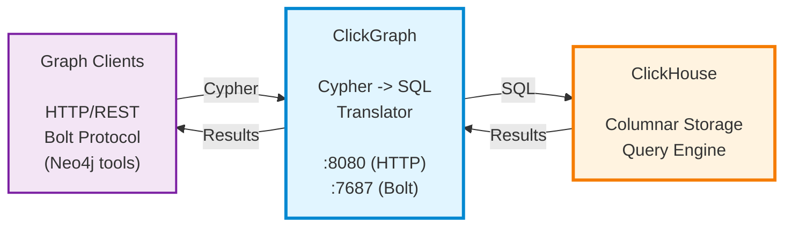

<div align="center">
  
</div>

# ClickGraph

#### ClickGraph - A high-performance, stateless, read-only graph query service for ClickHouse, written in Rust, with Neo4j ecosystem compatibility - Cypher and Bolt Protocol 5.8 support.

> **Note: ClickGraph dev release is at beta quality for view-based graph analytics applications. Kindly raise an issue if you encounter any problem.**

---
## Motivation and Rationale
- There are huge volumes of data in ClickHouse databases, viewing them as graph data with graph analytics capability brings another level of abstraction and boosts productivity with graph tools, in ways beyond relational analytics alone.
- Research shows relational analytics with columnar stores and vectorized execution engines like ClickHouse provide superior analytical performance and scalability to graph-native technologies, which usually leverage explicit adjacency representations and are more suitable for local-area graph traversals.
- View-based graph analytics offer the benefits of zero-ETL without the hassle of data migration and duplicate cost, yet better performance and scalability than most of the native graph analytics options.
- Neo4j Bolt protocol support gives access to the tools available based on the Bolt protocol.
---

## What's New in v0.6.3-dev

- **LDBC SNB: 36/37 queries (97%)** - Up from 14/37, near-complete Social Network Benchmark coverage
- **GraphRAG structured output** - `format: "Graph"` returns deduplicated nodes, edges, and stats
- **ClickHouse cluster load balancing** - Set `CLICKHOUSE_CLUSTER` to auto-discover and balance across cluster nodes
- **`apoc.meta.schema()` for MCP** - Schema discovery procedure for AI assistant integration
- **LLM-powered schema design tool** - Interactive schema generation from natural language
- **1,131 unit tests** - Up from 1,032, with 76 schema-parameterized SQL generation tests

See [CHANGELOG.md](CHANGELOG.md) for complete release history.

---

## Features

### Core Capabilities
- **Cypher-to-SQL Translation** - Industry-standard Cypher read syntax translated to optimized ClickHouse SQL
- **Stateless Architecture** - Offloads all query execution to ClickHouse; no extra datastore required
- **Variable-Length Paths** - Recursive traversals with `*1..3` syntax using ClickHouse `WITH RECURSIVE` CTEs
- **Path Functions** - `length(p)`, `nodes(p)`, `relationships(p)` for path analysis
- **Parameterized Queries** - Neo4j-compatible `$param` syntax for SQL injection prevention
- **Query Cache** - LRU caching with 10-100x speedup for repeated translations
- **ClickHouse Functions** - Pass-through via `ch.function_name()` and `chagg.aggregate()` prefixes
- **Query Metrics** - Phase-by-phase timing via HTTP headers and structured logging

### Neo4j Ecosystem Compatibility
- **Bolt Protocol v5.8** - Full Neo4j driver compatibility (cypher-shell, Neo4j Browser, graph-notebook)
- **HTTP REST API** - Complete query execution with parameters and aggregations
- **Multi-Schema Support** - Per-request schema selection via `USE` clause, session parameter, or default
- **Authentication** - Multiple auth schemes including basic auth

### View-Based Graph Model
- **Zero Migration** - Map existing tables to graph format through YAML configuration
- **Auto-Discovery** - `auto_discover_columns: true` queries ClickHouse metadata automatically
- **Dynamic Schema Loading** - Runtime schema registration via `POST /schemas/load`
- **Composite Node IDs** - Multi-column identity (e.g., `node_id: [tenant_id, user_id]`)

---

## Architecture

ClickGraph runs as a lightweight stateless query translator alongside ClickHouse:



**Three-tier architecture:** Graph clients -> ClickGraph translator -> ClickHouse database

---

## Quick Start

**New to ClickGraph?** See the **[Getting Started Guide](docs/getting-started.md)** for a complete walkthrough.

### Option 1: Docker (Recommended)

```bash
# Pull the latest image
docker pull genezhang/clickgraph:latest

# Start ClickHouse only
docker-compose up -d clickhouse-service

# Run ClickGraph from Docker Hub image
docker run -d \
  --name clickgraph \
  --network clickgraph_default \
  -p 8080:8080 \
  -p 7687:7687 \
  -e CLICKHOUSE_URL="http://clickhouse-service:8123" \
  -e CLICKHOUSE_USER="test_user" \
  -e CLICKHOUSE_PASSWORD="test_pass" \
  -e GRAPH_CONFIG_PATH="/app/schemas/social_benchmark.yaml" \
  -v $(pwd)/benchmarks/social_network/schemas:/app/schemas:ro \
  genezhang/clickgraph:latest
```

Or use docker-compose (uses published image by default):

```bash
docker-compose up -d
```

### Option 2: Build from Source

```bash
# Prerequisites: Rust toolchain (1.85+) and Docker for ClickHouse

# 1. Clone and start ClickHouse
git clone https://github.com/genezhang/clickgraph
cd clickgraph
docker-compose up -d clickhouse-service

# 2. Build and run
cargo build --release
export CLICKHOUSE_URL="http://localhost:8123"
export CLICKHOUSE_USER="test_user"
export CLICKHOUSE_PASSWORD="test_pass"
export GRAPH_CONFIG_PATH="./benchmarks/social_network/schemas/social_benchmark.yaml"
cargo run --bin clickgraph
```

> `GRAPH_CONFIG_PATH` is required. It tells ClickGraph how to map ClickHouse tables to graph nodes and edges.

### Test Your Setup

```bash
# HTTP API
curl -X POST http://localhost:8080/query \
  -H "Content-Type: application/json" \
  -d '{"query": "MATCH (u:User) RETURN u.full_name LIMIT 5"}'

# Bolt protocol (cypher-shell, Neo4j Browser, or any Neo4j driver)
cypher-shell -a bolt://localhost:7687 -u neo4j -p password
```

### Visualize with Neo4j Browser

Run the included demo for interactive graph visualization:

```bash
cd demos/neo4j-browser && bash setup.sh
```

Then open http://localhost:7474 and connect to `bolt://localhost:7687`.
See [demos/neo4j-browser/README.md](https://github.com/genezhang/clickgraph/blob/main/demos/neo4j-browser/README.md) for details.

### AI Assistant Integration (MCP)

ClickGraph implements `apoc.meta.schema()` and Neo4j-compatible schema procedures, enabling AI assistants (Claude, etc.) to discover your graph structure via MCP servers like [`@anthropic-ai/mcp-server-neo4j`](https://www.npmjs.com/package/@anthropic-ai/mcp-server-neo4j) and [`@neo4j/mcp-neo4j`](https://www.npmjs.com/package/@neo4j/mcp-neo4j).

See the **[MCP Setup Guide](https://github.com/genezhang/clickgraph/blob/main/docs/wiki/AI-Assistant-Integration-MCP.md)** for configuration details.

### CLI Client

```bash
cargo build --release -p clickgraph-client
./target/release/clickgraph-client  # connects to http://localhost:8080
```

---

## Schema Configuration

Map your tables to a graph with YAML:

```yaml
views:
  - name: social_network
    nodes:
      - label: user
        table: users
        database: mydb
        node_id: user_id
        property_mappings:
          name: full_name
    edges:
      - type: follows
        table: user_follows
        database: mydb
        from_node: user
        to_node: user
        from_id: follower_id
        to_id: followed_id
```

```cypher
MATCH (u:user)-[:follows]->(friend:user)
WHERE u.name = 'Alice'
RETURN friend.name
```

---

## Documentation

- **[Getting Started](docs/getting-started.md)** - Setup walkthrough and first queries
- **[Features Overview](docs/features.md)** - Comprehensive feature list
- **[API Documentation](docs/api.md)** - HTTP REST API and Bolt protocol
- **[Configuration Guide](docs/configuration.md)** - Server configuration and CLI options
- **[Wiki](https://github.com/genezhang/clickgraph/blob/main/docs/wiki/)** - Comprehensive guides: [Cypher Reference](https://github.com/genezhang/clickgraph/blob/main/docs/wiki/Cypher-Language-Reference.md), [Schema Basics](https://github.com/genezhang/clickgraph/blob/main/docs/wiki/Schema-Basics.md), [Graph-Notebook](https://github.com/genezhang/clickgraph/blob/main/docs/wiki/Graph-Notebook-Compatibility.md), [Neo4j Tools](https://github.com/genezhang/clickgraph/blob/main/docs/wiki/Neo4j-Tools-Integration.md)
- **[Examples](examples/)** - [Quick Start](examples/quick-start.md) | [E-commerce Analytics](examples/ecommerce-analytics.md)
- **[Dev Quick Start](DEV_QUICK_START.md)** - 30-second workflow for contributors

---

## Development Status

**Current Version**: v0.6.3-dev

### Test Coverage
- **Rust Unit Tests**: 1,131 passing (100%)
- **LDBC SNB**: 36/37 queries passing (97%)
- **Benchmarks**: 14/14 passing (100%)
- **E2E Tests**: Bolt 4/4, Cache 5/5 (100%)

### Known Limitations
- **Read-Only Engine**: Write operations not supported by design
- **Anonymous Nodes**: Use named nodes for better SQL generation

See [STATUS.md](STATUS.md) and [KNOWN_ISSUES.md](KNOWN_ISSUES.md) for details.

## Roadmap

| Phase | Version | Status |
|-------|---------|--------|
| Phase 1 | v0.4.0 | Complete - Query cache, parameters, Bolt protocol |
| Phase 2 | v0.5.0 | Complete - Multi-tenancy, RBAC, auto-schema discovery |
| Phase 2.5-2.6 | v0.5.2-v0.5.3 | Complete - Schema variations, Cypher functions |
| Phase 3 | v0.6.3 | Complete - WITH redesign, GraphRAG, LDBC SNB, MCP |
| Phase 4 | v0.6.x | Next - user-requested features, advanced optimizations |

See [ROADMAP.md](ROADMAP.md) for detailed feature tracking.

## Contributing

Contributions welcome! See [DEV_QUICK_START.md](DEV_QUICK_START.md) to get started and [DEVELOPMENT_PROCESS.md](DEVELOPMENT_PROCESS.md) for the full workflow.

## License

ClickGraph is licensed under the Apache License, Version 2.0. See the LICENSE file for details.

This project is developed on a forked repo of [Brahmand](https://github.com/darshanDevrai/brahmand) with zero-ETL view-based graph querying, Neo4j ecosystem compatibility and enterprise deployment capabilities.
