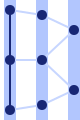
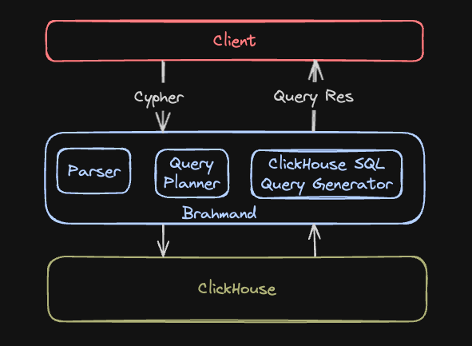

<div align="center">
  
</div>

# ClickGraph

#### ClickGraph - A Fork of Brahmand

**A high-performance, stateless, read-only graph query engine for ClickHouse with Neo4j ecosystem compatibility.**

> **Note: ClickGraph is a fork of Brahmand with additional features including Neo4j Bolt protocol support and view-based graph analysis. This is a read-only analytical query engine - write operations are not supported.**

---

## 🚀 What's New (November 1, 2025)

### Large-Scale Testing & Bug Fixes

**ClickGraph tested successfully on 5 MILLION users and 50 MILLION relationships!**

| Benchmark | Dataset Size | Success Rate | Status |
|-----------|-------------|--------------|--------|
| **Large** | 5M users, 50M follows | 9/10 (90%) | ✅ **Stress Tested** |
| **Medium** | 10K users, 50K follows | 10/10 (100%) | ✅ Well Validated |
| **Small** | 1K users, 5K follows | 10/10 (100%) | ✅ Fully Tested |

**What We Learned:**
- ✅ **Direct relationships**: Handling 50M edges successfully
- ✅ **Multi-hop traversals**: Working on 5M node graphs  
- ✅ **Variable-length paths**: Scaling to large datasets
- ✅ **Aggregations**: Pattern matching across millions of rows
- ✅ **Performance**: ~2 seconds for most queries, even at large scale
- ⚠️ **Shortest paths**: Memory limits on largest dataset (ClickHouse config dependent)

**Recent Bug Fixes:**
- 🐛 ChainedJoin CTE wrapper for exact hop variable-length paths (`*2`, `*3`)
- 🐛 Shortest path filter rewriting for WHERE clauses on end nodes
- 🐛 Aggregation table name schema lookup for GROUP BY queries

**Tooling:**
- 📊 Comprehensive benchmarking suite with 3 scale levels
- 🔧 ClickHouse-native data generation for efficient loading
- 📈 Performance metrics collection and analysis

**📖 Documentation:**
- [Detailed Benchmark Results](notes/benchmarking.md) - Complete analysis across all scales
- [CHANGELOG.md](CHANGELOG.md) - Technical details and bug fixes
- [STATUS.md](STATUS.md) - Current project status

---

## Features

### Core Capabilities
- **Read-Only Graph Analytics**: Translates Cypher graph queries into optimized ClickHouse SQL for analytical workloads
- **ClickHouse-native**: Extends ClickHouse with native graph modeling, merging OLAP speed with graph-analysis power
- **Stateless Architecture**: Offloads all storage and query execution to ClickHouse—no extra datastore required
- **Cypher Query Language**: Industry-standard Cypher read syntax for intuitive, expressive property-graph querying
- **Variable-Length Paths**: Recursive traversals with `*1..3` syntax using ClickHouse WITH RECURSIVE CTEs
- **Path Variables & Functions**: Capture and analyze path data with `length(p)`, `nodes(p)`, `relationships(p)` functions
- **Analytical-scale Performance**: Optimized for very large datasets and complex multi-hop traversals
- **Query Performance Metrics**: Phase-by-phase timing with HTTP headers and structured logging for monitoring and optimization

### Neo4j Ecosystem Compatibility
- **Bolt Protocol v4.4**: Full Neo4j driver compatibility for seamless integration
- **Dual Server Architecture**: HTTP REST API and Bolt protocol running simultaneously
- **Authentication Support**: Multiple authentication schemes including basic auth
- **Tool Compatibility**: Works with existing Neo4j drivers, browsers, and applications

### View-Based Graph Model
- **Zero Migration**: Transform existing relational data into graph format through YAML configuration
- **Native Performance**: Leverages ClickHouse's columnar storage and query optimization
- **Robust Implementation**: Comprehensive validation, error handling, and optimization passes

---

## Architecture

ClickGraph runs as a lightweight graph wrapper alongside ClickHouse with dual protocol support:



### HTTP API (Port 8080)
1. **Client** sends HTTP POST request with Cypher query to ClickGraph
2. **ClickGraph** parses & plans the query, translates to ClickHouse SQL
3. **ClickHouse** executes the SQL and returns results
4. **ClickGraph** sends JSON results back to the client

### Bolt Protocol (Port 7687) 
1. **Neo4j Driver/Tool** connects via Bolt protocol to ClickGraph
2. **ClickGraph** handles Bolt handshake, authentication, and message protocol
3. **Cypher queries** are processed through the same query engine as HTTP
4. **Results** are streamed back via Bolt protocol format

Both protocols share the same underlying query engine and ClickHouse backend.

---

## 🚀 Quick Start

**New to ClickGraph?** See the **[Getting Started Guide](docs/getting-started.md)** for a complete walkthrough.

> **⚠️ Windows Users**: The HTTP server has a known issue on Windows. Use Docker or WSL for development. See [KNOWN_ISSUES.md](KNOWN_ISSUES.md) for details.

### 5-Minute Setup (Docker - Recommended)

1. **Clone and start services**:
   ```bash
   git clone https://github.com/genezhang/clickgraph
   cd clickgraph
   docker-compose up -d
   ```
   This starts both ClickHouse and ClickGraph with test data pre-loaded.

2. **Test the setup**:
   ```bash
   curl -X POST http://localhost:8080/query \
     -H "Content-Type: application/json" \
     -d '{"query": "MATCH (u:User) RETURN u.full_name LIMIT 5"}'
   ```

### Native Build (Linux/macOS/WSL)

1. **Start ClickHouse**:
   ```bash
   docker-compose up -d clickhouse
   ```

2. **Configure and run**:
   ```bash
   export CLICKHOUSE_URL="http://localhost:8123"
   export CLICKHOUSE_USER="test_user"
   export CLICKHOUSE_PASSWORD="test_pass"
   export CLICKHOUSE_DATABASE="brahmand"
   
   cargo run --bin clickgraph
   ```

3. **Test with HTTP API**:
   ```bash
   curl -X POST http://localhost:8080/query \
     -H "Content-Type: application/json" \
     -d '{"query": "RETURN 1 as test"}'
   ```

4. **Test with Neo4j driver**:
   ```python
   from neo4j import GraphDatabase
   
   driver = GraphDatabase.driver("bolt://localhost:7687")
   with driver.session() as session:
       result = session.run("RETURN 1 as test")
   ```

📖 **[Complete Setup Guide →](docs/getting-started.md)**

## 📊 View-Based Graph Model

Transform existing relational data into graph format through YAML configuration:

**Example**: Map your `users` and `user_follows` tables to a social network graph:
```yaml
views:
  - name: social_network
    nodes:
      user:
        source_table: users
        id_column: user_id
        property_mappings:
          name: full_name
    relationships:
      follows:
        source_table: user_follows
        from_node: user
        to_node: user
        from_id: follower_id
        to_id: followed_id
```

Then query with standard Cypher:
```cypher
MATCH (u:user)-[:follows]->(friend:user)
WHERE u.name = 'Alice'
RETURN friend.name
```

**OPTIONAL MATCH** for handling optional patterns:
```cypher
-- Find all users and their friends (if any)
MATCH (u:user)
OPTIONAL MATCH (u)-[:follows]->(friend:user)
RETURN u.name, friend.name

-- Mixed required and optional patterns
MATCH (u:user)-[:authored]->(p:post)
OPTIONAL MATCH (p)-[:liked_by]->(liker:user)
RETURN u.name, p.title, COUNT(liker) as likes
```
→ Generates efficient `LEFT JOIN` SQL with NULL handling for unmatched patterns

## 🚀 Examples

### ⚡ **[Quick Start](examples/quick-start.md)** - 5 Minutes to Graph Analytics

Perfect for first-time users! Simple social network demo with:
- **3 users, friendships** - minimal setup with Memory tables
- **Basic Cypher queries** - find friends, mutual connections  
- **HTTP & Neo4j drivers** - both integration methods
- **5-minute setup** - zero to working graph analytics

### 📊 **[E-commerce Analytics](examples/ecommerce-analytics.md)** - Comprehensive Demo

Complete end-to-end demonstration with:
- **Complete data setup** with realistic e-commerce schema (customers, products, orders, reviews)
- **Advanced graph queries** for customer segmentation, product recommendations, and market basket analysis  
- **Real-world workflows** with both HTTP REST API and Neo4j driver examples
- **Performance optimization** techniques and expected benchmarks
- **Business insights** from customer journeys, seasonal patterns, and cross-selling opportunities

**Start with Quick Start, then explore E-commerce Analytics for advanced usage!** 🎯

## �🔧 Configuration

ClickGraph supports flexible configuration via command-line arguments and environment variables:

```bash
# View all options
cargo run --bin clickgraph -- --help

# Custom ports
cargo run --bin clickgraph -- --http-port 8081 --bolt-port 7688

# Disable Bolt protocol (HTTP only)
cargo run --bin clickgraph -- --disable-bolt

# Custom host binding
cargo run --bin clickgraph -- --http-host 127.0.0.1 --bolt-host 127.0.0.1

# Configure CTE depth limit for variable-length paths (default: 100)
cargo run --bin clickgraph -- --max-cte-depth 150
export CLICKGRAPH_MAX_CTE_DEPTH=150  # Or via environment variable
```

See `docs/configuration.md` for complete configuration documentation.

## � Running in Background (Windows)

For Windows users, ClickGraph supports running in the background using PowerShell jobs:

### PowerShell Background Jobs (Recommended)

```powershell
# Start server in background
.\start_server_background.ps1

# Check if server is running
Invoke-WebRequest -Uri "http://localhost:8080/health"

# Stop the server (replace JOB_ID with actual job ID shown)
Stop-Job -Id JOB_ID; Remove-Job -Id JOB_ID
```

### Alternative: New Command Window

Use the batch file to start the server in a separate command window:

```batch
start_server_background.bat
```

### Manual Daemon Mode

The server also supports a `--daemon` flag for Unix-like daemon behavior:

```bash
cargo run --bin clickgraph -- --daemon --http-port 8080
```

## �📚 Documentation

### User Guides
- **[Getting Started](docs/getting-started.md)** - Complete setup walkthrough and first queries
- **[Features Overview](docs/features.md)** - Comprehensive feature list and capabilities  
- **[API Documentation](docs/api.md)** - HTTP REST API and Bolt protocol usage
- **[Configuration Guide](docs/configuration.md)** - Server configuration and CLI options

### Technical Documentation  
- **[GraphView Model](docs/graphview1-branch-summary.md)** - Complete view-based graph analysis
- **[Test Infrastructure](docs/test-infrastructure-redesign.md)** - Testing framework and validation
- **[Development Guide](.github/copilot-instructions.md)** - Development workflow and architecture

### Reference
- **[Original Brahmand Docs](https://www.brahmanddb.com/introduction/intro)** - Original project documentation
- **[Neo4j Cypher Manual](https://neo4j.com/docs/cypher-manual/)** - Cypher query language reference
- **[ClickHouse Documentation](https://clickhouse.com/docs/)** - ClickHouse database documentation

## 🚀 Performance

Preliminary informal tests on a MacBook Pro (M3 Pro, 18 GB RAM) running ClickGraph in Docker against a ~12 million-node Stack Overflow dataset show multihop traversals running approximately 10× faster than Neo4j v2025.03. These early, unoptimized results are for reference only; a full benchmark report is coming soon.

## 🧪 Development Status

**Latest Update**: November 1, 2025 - **100% Benchmark Success Rate** 🎉

### Production-Ready Features
- ✅ **All Graph Query Types Working**: 10/10 benchmark queries passing (100% success rate)
  - Simple node lookups and filtered scans
  - Direct and multi-hop relationship traversals
  - Variable-length paths with exact (`*2`) and range (`*1..3`) specifications
  - Shortest path algorithms with WHERE clause filtering
  - Aggregations with GROUP BY and ORDER BY
  - Bidirectional patterns (mutual relationships)
- ✅ **Query Performance Metrics**: Phase-by-phase timing with HTTP headers and structured logging
- ✅ **Neo4j Bolt Protocol v4.4**: Full compatibility with Neo4j drivers and tools
- ✅ **PageRank Algorithm**: Graph centrality analysis with `CALL pagerank(iterations: 10, damping: 0.85)`
- ✅ **OPTIONAL MATCH**: LEFT JOIN semantics for optional graph patterns with NULL handling
- ✅ **Variable-Length Paths**: Recursive CTEs with chained JOIN optimization for exact hop counts
- ✅ **Shortest Path Functions**: `shortestPath()` and `allShortestPaths()` with early termination
- ✅ **Path Variables & Functions**: `MATCH p = (a)-[*]->(b) RETURN length(p), nodes(p), relationships(p)`
- ✅ **Multiple Relationship Types**: `[:FOLLOWS|FRIENDS_WITH]` with UNION ALL SQL generation
- ✅ **View-Based Graph Model**: Transform existing tables to graphs via YAML configuration  
- ✅ **Dual Server Architecture**: HTTP REST API and Bolt protocol simultaneously
- ✅ **Comprehensive Testing**: 312/312 tests passing (100% success rate)
- ✅ **Flexible Configuration**: CLI options, environment variables, Docker deployment

### Recent Bug Fixes (November 1, 2025)
- 🐛 **Fixed**: ChainedJoin CTE wrapper for exact hop queries (`*2`, `*3`)
- 🐛 **Fixed**: Shortest path filter rewriting for WHERE clauses
- 🐛 **Fixed**: Table name schema lookup for aggregation queries
- 📊 **Validated**: All fixes confirmed with production benchmark suite

### Known Considerations
- ⚠️ **Read-Only Engine**: Write operations (CREATE, SET, DELETE, MERGE) are not supported
- ⚠️ **Schema warnings**: Cosmetic warnings about internal catalog system (functionality unaffected)
- 🔧 **Memory vs MergeTree**: Use Memory engine for development, MergeTree for persistent storage
- 🐳 **Docker permissions**: May require volume permission fixes on some systems

### Benchmark Results
Tested with 1,000 users, 4,997 relationships on `social_benchmark.yaml`:
- **Success Rate**: 10/10 queries (100%)
- **Performance**: All query types executing correctly
- **Documentation**: See `notes/benchmarking.md` for detailed results

## 🤝 Contributing

ClickGraph welcomes contributions! Key areas for development:
- Additional Cypher language features
- Query optimization improvements  
- Neo4j compatibility enhancements
- Performance benchmarking
- Documentation improvements

## 📄 License

ClickGraph is licensed under the Apache License, Version 2.0. See the LICENSE file for details.

This project is a fork of [Brahmand](https://github.com/suryatmodulus/brahmand) with significant enhancements for Neo4j ecosystem compatibility and enterprise deployment capabilities.