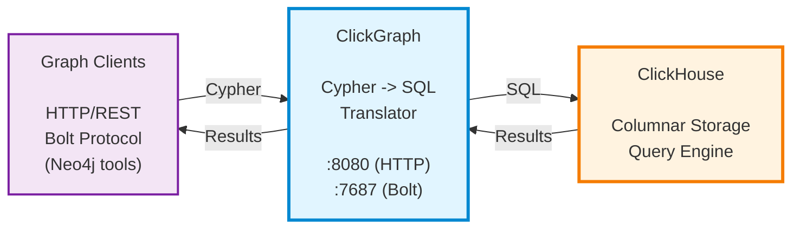

<div align="center">
  
</div>

# ClickGraph

#### ClickGraph - A high-performance, stateless, read-only graph query service for ClickHouse, written in Rust, with Neo4j ecosystem compatibility - Cypher and Bolt Protocol 5.8 support. Now supports embedded mode with local writes, and exporting query results to external destinations, with Golang, Python bindings, in addition to native Rust.

> **Note: ClickGraph dev release is at beta quality for view-based graph analytics applications. Kindly raise an issue if you encounter any problem.**

---
## Motivation and Rationale
- Viewing ClickHouse databases (including external sources) as graph data with graph analytics capability brings another level of abstraction and boosts productivity with graph tools, and enables agentic GraphRAG support with local writes.
- Research shows relational analytics with columnar stores and vectorized execution engines like ClickHouse provide superior analytical performance and scalability to graph-native technologies, which usually leverage explicit adjacency representations and are more suitable for local-area graph traversals.
- View-based graph analytics offer the benefits of zero-ETL without the hassle of data migration and duplicate cost, yet better performance and scalability than most of the native graph analytics options.
- Neo4j Bolt protocol support gives access to the tools available based on the Bolt protocol.
---
## What's New in v0.6.6-dev

- **`cg` CLI tool** — Agent/script-oriented CLI (`clickgraph-tool` crate). Translate and execute Cypher without a running server: `cg sql`, `cg validate`, `cg query`, `cg nl` (NL→Cypher via LLM), `cg schema show/validate/discover/diff`. Config via `~/.config/cg/config.toml`. Designed for agentic callers, CI pipelines, and scripting.
- **`embedded` feature now opt-in** — `clickgraph-embedded` compiles without chdb by default. New `Database::new_remote(schema, RemoteConfig)` constructor executes Cypher against external ClickHouse with no chdb dependency — useful for lightweight tooling and the `cg` CLI.
- **Agent skills** — Three publishable skills for any agentic framework (Claude Code, LangChain, AutoGen, CrewAI, OpenAI function calling): `/cypher` (NL→Cypher→execute), `/graph-schema` (show schema), `/schema-discover` (generate schema YAML from ClickHouse via LLM). See [skills/README.md](skills/README.md).
- **openCypher TCK** — 383/402 openCypher Technology Compatibility Kit scenarios passing (95.3%), 0 failures. The 19 skipped scenarios cover Cypher write clauses (`CREATE`, `SET`, `DELETE`, `MERGE`) — not yet supported as Cypher syntax. Note: a programmatic write API (`create_node()`, `create_edge()`, `upsert_node()`) is already available in embedded mode; Cypher write syntax support is planned.

## What's New in v0.6.5-dev

- **Hybrid remote query + local storage** — Execute Cypher against a remote ClickHouse cluster from embedded mode, store results locally in chdb for fast re-querying. `query_remote()`, `query_remote_graph()`, `store_subgraph()` — ideal for GraphRAG context enrichment. Available in Rust, Python, and Go.
- **Embedded write API for GraphRAG** — `create_node()`, `create_edge()`, `upsert_node()` with batch variants. AI agents can extract entities from documents, store them as an in-process graph, and query with Cypher — all without a server.
- **Kuzu API parity** — `Value::Date/Timestamp/UUID` types, query timing (`compiling_time`/`execution_time`), `Database::in_memory()`, `Connection::set_query_timeout()`, column type metadata, multi-format file import (CSV/Parquet/JSON).
- **DataFrame output** — `result.get_as_df()` (Pandas), `result.get_as_arrow()` (PyArrow), `result.get_as_pl()` (Polars) for Python data science workflows.

See [CHANGELOG.md](CHANGELOG.md) for complete release history.

---
## Features

### Core Capabilities
- **Cypher-to-SQL Translation** - Industry-standard Cypher read syntax translated to optimized ClickHouse SQL
- **Stateless Architecture** - Offloads all query execution to ClickHouse; no extra datastore required
- **Embedded Mode** - In-process graph queries over Parquet/Iceberg/Delta/S3 via chdb; no ClickHouse server needed (`--features embedded`)
- **Remote Mode** - Cypher translated locally, executed against external ClickHouse — no chdb required (`Database::new_remote`)
- **LLM-powered schema discovery** - `cg schema discover` or `:discover` generates YAML schema from ClickHouse table metadata using Anthropic or OpenAI — no server needed
- **Variable-Length Paths** - Recursive traversals with `*1..3` syntax using ClickHouse `WITH RECURSIVE` CTEs
- **Path Functions** - `length(p)`, `nodes(p)`, `relationships(p)` for path analysis
- **Parameterized Queries** - Neo4j-compatible `$param` syntax for SQL injection prevention
- **Query Cache** - LRU caching with 10-100x speedup for repeated translations
- **ClickHouse Functions** - Pass-through via `ch.function_name()` and `chagg.aggregate()` prefixes
- **GraphRAG structured output** - `format: "Graph"` returns deduplicated nodes, edges, and stats for graph visualization and RAG pipelines
- **GraphRAG write API** - `create_node()`, `create_edge()`, `upsert_node()` for in-process graph building (embedded mode)
- **Hybrid remote + local** - Query remote ClickHouse, store subgraph locally in chdb for fast re-querying
- **Query Metrics** - Phase-by-phase timing via HTTP headers and structured logging
- **ClickHouse cluster load balancing** - `CLICKHOUSE_CLUSTER` env var auto-discovers and balances queries across cluster nodes
- **openCypher TCK: 383/402 passing (95.3%)** - 0 failures; 19 skipped = Cypher write clauses (`CREATE`, `SET`, `DELETE`, `MERGE`) not yet implemented as Cypher syntax (programmatic write API available in embedded mode)
- **LDBC SNB benchmark: 36/37 queries (97%)** - Near-complete Social Network Benchmark coverage. See [benchmark results](benchmarks/ldbc_snb/BENCHMARK_RESULTS.md) for performance data on sf0.003, sf1 and sf10 datasets

### Neo4j Ecosystem Compatibility
- **Bolt Protocol v5.8** - Full Neo4j driver compatibility (cypher-shell, Neo4j Browser, graph-notebook)
- **HTTP REST API** - Complete query execution with parameters and aggregations
- **Multi-Schema Support** - Per-request schema selection via `USE` clause, session parameter, or default
- **Authentication** - Multiple auth schemes including basic auth

### Agentic & AI Integration
- **Agent skills** - `/cypher`, `/graph-schema`, `/schema-discover` for Claude Code, LangChain, AutoGen, CrewAI, and OpenAI function calling (see [skills/README.md](skills/README.md))
- **`cg` CLI** - Subprocess-friendly CLI for agentic callers; outputs clean text/JSON, no interactive prompts
- **MCP compatibility** - `apoc.meta.schema()` and Neo4j schema procedures for MCP-based AI assistants
- **DataFrame output** - `get_as_df()` (Pandas), `get_as_arrow()` (PyArrow), `get_as_pl()` (Polars) for Python data science

### View-Based Graph Model
- **Zero Migration** - Map existing tables to graph format through YAML configuration
- **Auto-Discovery** - `auto_discover_columns: true` queries ClickHouse metadata automatically
- **Dynamic Schema Loading** - Runtime schema registration via `POST /schemas/load`
- **Composite Node IDs** - Multi-column identity (e.g., `node_id: [tenant_id, user_id]`)

---

## Architecture

ClickGraph runs as a lightweight stateless query translator alongside ClickHouse:


```mermaid
flowchart LR
    Clients["Graph Clients<br/><br/>HTTP/REST<br/>Bolt Protocol<br/>(Neo4j tools)"]

    ClickGraph["ClickGraph<br/><br/>Cypher -> SQL<br/>Translator<br/><br/>:8080 (HTTP)<br/>:7687 (Bolt)"]

    ClickHouse["ClickHouse<br/><br/>Columnar Storage<br/>Query Engine"]

    Clients -->|Cypher| ClickGraph
    ClickGraph -->|SQL| ClickHouse
    ClickHouse -->|Results| ClickGraph
    ClickGraph -->|Results| Clients

    style ClickGraph fill:#e1f5ff,stroke:#0288d1,stroke-width:3px
    style ClickHouse fill:#fff3e0,stroke:#f57c00,stroke-width:3px
    style Clients fill:#f3e5f5,stroke:#7b1fa2,stroke-width:2px
```

**Three-tier architecture:** Graph clients -> ClickGraph translator -> ClickHouse database

---

## Quick Start

**New to ClickGraph?** See the **[Getting Started Guide](docs/getting-started.md)** for a complete walkthrough.

### Option 0: Pre-built Binaries

Download the latest release from [GitHub Releases](https://github.com/genezhang/clickgraph/releases/latest):

```bash
# ClickGraph server
curl -L https://github.com/genezhang/clickgraph/releases/latest/download/clickgraph-linux-x86_64 \
  -o clickgraph && chmod +x clickgraph

# cg CLI tool (agent/scripting use)
curl -L https://github.com/genezhang/clickgraph/releases/latest/download/cg-linux-x86_64 \
  -o cg && chmod +x cg
```

### Option 1: Docker (Recommended)

```bash
# Pull the latest image
docker pull genezhang/clickgraph:latest

# Start ClickHouse only
docker-compose up -d clickhouse-service

# Run ClickGraph from Docker Hub image
docker run -d \
  --name clickgraph \
  --network clickgraph_default \
  -p 8080:8080 \
  -p 7687:7687 \
  -e CLICKHOUSE_URL="http://clickhouse-service:8123" \
  -e CLICKHOUSE_USER="test_user" \
  -e CLICKHOUSE_PASSWORD="test_pass" \
  -e GRAPH_CONFIG_PATH="/app/schemas/social_benchmark.yaml" \
  -v $(pwd)/benchmarks/social_network/schemas:/app/schemas:ro \
  genezhang/clickgraph:latest
```

Or use docker-compose (uses published image by default):

```bash
docker-compose up -d
```

### Option 2: Build from Source

```bash
# Prerequisites: Rust toolchain (1.85+) and Docker for ClickHouse

# 1. Clone and start ClickHouse
git clone https://github.com/genezhang/clickgraph
cd clickgraph
docker-compose up -d clickhouse-service

# 2. Build and run
cargo build --release
export CLICKHOUSE_URL="http://localhost:8123"
export CLICKHOUSE_USER="test_user"
export CLICKHOUSE_PASSWORD="test_pass"
export GRAPH_CONFIG_PATH="./benchmarks/social_network/schemas/social_benchmark.yaml"
cargo run --bin clickgraph
```

> `GRAPH_CONFIG_PATH` is required. It tells ClickGraph how to map ClickHouse tables to graph nodes and edges.

### Test Your Setup

```bash
# HTTP API
curl -X POST http://localhost:8080/query \
  -H "Content-Type: application/json" \
  -d '{"query": "MATCH (u:User) RETURN u.full_name LIMIT 5"}'

# Bolt protocol (cypher-shell, Neo4j Browser, or any Neo4j driver)
cypher-shell -a bolt://localhost:7687 -u neo4j -p password
```

### Visualize with Neo4j Browser

Run the included demo for interactive graph visualization:

```bash
cd demos/neo4j-browser && bash setup.sh
```

Then open http://localhost:7474 and connect to `bolt://localhost:7687`.
See [demos/neo4j-browser/README.md](https://github.com/genezhang/clickgraph/blob/main/demos/neo4j-browser/README.md) for details.

### AI Assistant Integration

**Agent skills** — drop-in skills for Claude Code and other agentic frameworks, backed by the `cg` CLI (no MCP server needed):

```bash
# Install for Claude Code
mkdir -p .claude/commands
curl -L https://raw.githubusercontent.com/genezhang/clickgraph/main/skills/cypher.md \
  -o .claude/commands/cypher.md
curl -L https://raw.githubusercontent.com/genezhang/clickgraph/main/skills/graph-schema.md \
  -o .claude/commands/graph-schema.md

# Then in Claude Code:
# /cypher find users with more than 10 followers
# /graph-schema
```

See **[skills/README.md](skills/README.md)** for installation across Claude Code, LangChain, AutoGen, CrewAI, and OpenAI function calling.

**MCP server** — for frameworks requiring the MCP protocol, ClickGraph implements `apoc.meta.schema()` and Neo4j-compatible schema procedures, compatible with [`@anthropic-ai/mcp-server-neo4j`](https://www.npmjs.com/package/@anthropic-ai/mcp-server-neo4j) and [`@neo4j/mcp-neo4j`](https://www.npmjs.com/package/@neo4j/mcp-neo4j).

See the **[MCP Setup Guide](https://github.com/genezhang/clickgraph/blob/main/docs/wiki/AI-Assistant-Integration-MCP.md)** for configuration details.

### CLI Tools

**`cg` — agent/script CLI** (no server needed):
```bash
cargo build --release -p clickgraph-tool
# Translate Cypher → SQL
./target/release/cg --schema schema.yaml sql "MATCH (u:User) RETURN u.name LIMIT 5"
# Execute against ClickHouse
./target/release/cg --schema schema.yaml --clickhouse http://localhost:8123 \
  query "MATCH (u:User)-[:FOLLOWS]->(f) RETURN f.name LIMIT 5"
# NL → Cypher (requires ANTHROPIC_API_KEY or OPENAI_API_KEY)
./target/release/cg --schema schema.yaml nl "find users with more than 10 followers"
```

**`clickgraph-client` — interactive REPL** (connects to a running server):
```bash
cargo build --release -p clickgraph-client
./target/release/clickgraph-client  # connects to http://localhost:8080
```

---

## Schema Configuration

Map your tables to a graph with YAML:

```yaml
views:
  - name: social_network
    nodes:
      - label: user
        table: users
        database: mydb
        node_id: user_id
        property_mappings:
          name: full_name
    edges:
      - type: follows
        table: user_follows
        database: mydb
        from_node: user
        to_node: user
        from_id: follower_id
        to_id: followed_id
```

```cypher
MATCH (u:user)-[:follows]->(friend:user)
WHERE u.name = 'Alice'
RETURN friend.name
```

---

## Documentation

- **[Getting Started](docs/getting-started.md)** - Setup walkthrough and first queries
- **[Features Overview](docs/features.md)** - Comprehensive feature list
- **[API Documentation](docs/api.md)** - HTTP REST API and Bolt protocol
- **[Configuration Guide](docs/configuration.md)** - Server configuration and CLI options
- **[Wiki](https://github.com/genezhang/clickgraph/blob/main/docs/wiki/)** - Comprehensive guides: [Cypher Reference](https://github.com/genezhang/clickgraph/blob/main/docs/wiki/Cypher-Language-Reference.md), [Schema Basics](https://github.com/genezhang/clickgraph/blob/main/docs/wiki/Schema-Basics.md), [Graph-Notebook](https://github.com/genezhang/clickgraph/blob/main/docs/wiki/Graph-Notebook-Compatibility.md), [Neo4j Tools](https://github.com/genezhang/clickgraph/blob/main/docs/wiki/Neo4j-Tools-Integration.md)
- **[Examples](examples/)** - [Quick Start](examples/quick-start.md) | [E-commerce Analytics](examples/ecommerce-analytics.md)
- **[Dev Quick Start](DEV_QUICK_START.md)** - 30-second workflow for contributors

---

## Development Status

**Current Version**: v0.6.6-dev

### Test Coverage
- **Rust Unit Tests**: 1,601 passing (100%)
- **Integration Tests**: 3,068 passing (108 environment-dependent)
- **openCypher TCK**: 383/402 scenarios passing (95.3%), 0 failures, 19 skipped
- **LDBC SNB**: 36/37 queries passing (97%)
- **Benchmarks**: 14/14 passing (100%)
- **E2E Tests**: Bolt 4/4, Cache 5/5 (100%)

### Known Limitations
- **Cypher write syntax**: `CREATE`, `SET`, `DELETE`, `MERGE` not yet supported as Cypher queries. Programmatic write API (`create_node()`, `create_edge()`, `upsert_node()`) is available in embedded mode; full Cypher write support is planned.
- **Anonymous Nodes**: Use named nodes for better SQL generation

See [STATUS.md](STATUS.md) and [KNOWN_ISSUES.md](KNOWN_ISSUES.md) for details.

## Roadmap

| Phase | Version | Status |
|-------|---------|--------|
| Phase 1 | v0.4.0 | Complete - Query cache, parameters, Bolt protocol |
| Phase 2 | v0.5.0 | Complete - Multi-tenancy, RBAC, auto-schema discovery |
| Phase 2.5-2.6 | v0.5.2-v0.5.3 | Complete - Schema variations, Cypher functions |
| Phase 3 | v0.6.3 | Complete - WITH redesign, GraphRAG, LDBC SNB, MCP |
| Phase 4 | v0.6.x | Next - user-requested features, advanced optimizations |

See [ROADMAP.md](ROADMAP.md) for detailed feature tracking.

## Contributing

Contributions welcome! See [DEV_QUICK_START.md](DEV_QUICK_START.md) to get started and [DEVELOPMENT_PROCESS.md](DEVELOPMENT_PROCESS.md) for the full workflow.

## License

ClickGraph is licensed under the Apache License, Version 2.0. See the LICENSE file for details.

This project is developed on a forked repo of [Brahmand](https://github.com/darshanDevrai/brahmand) with zero-ETL view-based graph querying, Neo4j ecosystem compatibility and enterprise deployment capabilities.
