<div align="center">
  
</div>

# ClickGraph

#### ClickGraph - A high-performance, stateless, read-only graph query translator for ClickHouse®, written in Rust, with Neo4j ecosystem compatibility - Cypher and Bolt Protocol 5.8 support.

> **Note: ClickGraph is under active development and is development-ready for view-based graph analytics applications.**

---
## Motivation and Rationale
- There are huge volumes of data in ClickHouse databases, viewing them as graph data with graph analytics capability brings another level of abstraction and boosts productivity with graph tools, in ways beyond relational analytics alone.
- Research shows relational analytics with columnar stores and vectorized execution engines like ClickHouse provide superior analytical performance and scalability to graph-native technologies, which usually leverage explicit adjacency representations and are more suitable for local-area graph traversals.
- View-based graph analytics offer the benefits of zero-ETL without the hassle of data migration and duplicate cost, yet better performance and scalability than most of the native graph analytics options.
---
## 🚀 What's New in v0.5.4 (December 7, 2025)

### Major Release: Cross-Table Queries, Smart Inference & Real-World Benchmarks

**v0.5.4 delivers major improvements for complex graph analytics on ClickHouse.**

### Highlights ✨

- **Cross-table query support** - Zeek log correlation and multi-table JOINs now work correctly
- **Smart type inference** - Automatic node and relationship type inference from schema context
- **FK-Edge patterns** - File systems, org charts with variable-length paths  
- **String predicates** - `STARTS WITH`, `ENDS WITH`, `CONTAINS` operators
- **OnTime Flights benchmark** - Validated against 20M row real-world dataset
- **1,378 tests passing** - Comprehensive test coverage across multiple schemas

### New Features

- **Cross-table WITH correlation** - Multi-table JOINs with WHERE clause correlation
- **Smart relationship inference** - `(a:Airport)-[r]->()` automatically infers r:FLIGHT
- **Smart node inference** - `MATCH (n)` works on single-node-type schemas
- **Label inference** - Unlabeled nodes infer types from relationship schema
- **Relationship uniqueness** - Multi-hop undirected patterns enforce Neo4j-style uniqueness

### Bug Fixes 🐛

- Fixed 17+ issues including polymorphic edges, OPTIONAL MATCH, multi-hop patterns, and more
- See [CHANGELOG.md](CHANGELOG.md) for complete details

---

## 📦 Previous Releases

<details>
<summary><b>v0.5.3 (December 2, 2025)</b> - Cypher Functions Release</summary>

- **`label()` function**: Get scalar label for nodes
- **EXISTS subqueries**: Filter based on pattern existence
- **WITH + MATCH chaining**: Multi-stage query pipelines
- **Regex matching (`=~`)**: Pattern matching via ClickHouse `match()`
- **`collect()` function**: Aggregate to arrays via `groupArray()`

</details>

<details>
<summary><b>v0.5.2 (November 30, 2025)</b> - Schema Variations Release</summary>

**Comprehensive support for advanced schema patterns including polymorphic edges, coupled edges, and denormalized tables.**

- **Polymorphic Edge Tables**: Single table with multiple edge types
- **Coupled Edge Optimization**: Automatic JOIN elimination for same-table edges
- **VLP + UNWIND Support**: Path decomposition with ARRAY JOIN
- **OPTIONAL MATCH + VLP Fix**: Anchor nodes preserved when no path exists

</details>

<details>
<summary><b>v0.5.1 (November 21, 2025)</b> - Docker Hub Release 🐳</summary>

- Official Docker Hub availability: `docker pull genezhang/clickgraph:latest`
- Multi-platform support (linux/amd64, linux/arm64)
- RETURN DISTINCT support
- Docker image validation suite

</details>

<details>
<summary><b>v0.5.0 (November 2025)</b> - Phase 2 Complete</summary>

- Multi-tenancy with parameterized views (99% cache memory reduction)
- SET ROLE RBAC support for column-level security
- Query cache with LRU eviction (10-100x speedup)
- Parameterized queries with Neo4j-compatible $param syntax
- Auto-schema discovery from ClickHouse metadata
- Complete Bolt Protocol 5.8 implementation
- 22% code reduction in core modules

</details>

See [CHANGELOG.md](CHANGELOG.md) for complete release history.

---

## Features

### Core Capabilities
- **Read-Only Graph Analytics**: Translates Cypher graph queries into optimized ClickHouse SQL for analytical workloads
- **ClickHouse-native**: Leverages ClickHouse for graph queries on shared data with SQL, merging OLAP speed with graph-analysis power
- **Stateless Architecture**: Offloads all query execution to ClickHouse—no extra datastore required
- **Cypher Query Language**: Industry-standard Cypher read syntax for intuitive, expressive property-graph querying
- **Parameterized Queries**: Neo4j-compatible parameter support (`$param` syntax) for SQL injection prevention and query plan caching
- **Query Cache**: Development-ready LRU caching with 10-100x speedup for repeated query translations, SQL template reuse with parameter substitution, and Neo4j-compatible CYPHER replan options
- **Variable-Length Paths**: Recursive traversals with `*1..3` syntax using ClickHouse WITH RECURSIVE CTEs
- **Path Variables & Functions**: Capture and analyze path data with `length(p)`, `nodes(p)`, `relationships(p)` functions
- **Analytical-scale Performance**: Optimized for very large datasets and complex multi-hop traversals
- **Query Performance Metrics**: Phase-by-phase timing with HTTP headers and structured logging for monitoring and optimization

### Neo4j Ecosystem Compatibility
- **Bolt Protocol v5.8**: ✅ **Fully functional** - Complete query execution, authentication, and multi-database support. Compatible with Neo4j drivers, cypher-shell, and Neo4j Browser.
- **HTTP REST API**: ✅ **Fully functional** - Complete query execution with parameters, aggregations, and all Cypher features
- **Multi-Schema Support**: ✅ **Fully working** - Complete schema isolation with per-request schema selection:
  - **USE clause**: Cypher `USE database_name` syntax (highest priority)
  - **Session/request parameter**: Bolt session database or HTTP `schema_name` parameter
  - **Default schema**: Fallback to "default" schema
  - **Schema isolation**: Different schemas map same labels to different ClickHouse tables
- **Dual Server Architecture**: HTTP and Bolt servers running simultaneously (both production-ready)
- **Authentication Support**: Multiple authentication schemes including basic auth

### View-Based Graph Model
- **Zero Migration**: Transform existing relational data into graph format through YAML configuration
- **Auto-Discovery**: Automatically query ClickHouse `system.columns` for property mappings with `auto_discover_columns: true` - no manual mapping needed!
- **Dynamic Schema Loading**: Runtime schema registration via HTTP API (`POST /schemas/load`) with full YAML content support
- **Native Performance**: Leverages ClickHouse's columnar storage and query optimization
- **Robust Implementation**: Comprehensive validation, error handling, and optimization passes

---

## Architecture

ClickGraph runs as a lightweight stateless query translator alongside ClickHouse:

```mermaid
flowchart LR
    Clients["📱 Graph Clients<br/><br/>HTTP/REST<br/>Bolt Protocol<br/>(Neo4j tools)"]
    
    ClickGraph["⚡ ClickGraph<br/><br/>Cypher → SQL<br/>Translator<br/><br/>:8080 (HTTP)<br/>:7687 (Bolt)"]
    
    ClickHouse["💾 ClickHouse®<br/><br/>Columnar Storage<br/>Query Engine"]
    
    Clients -->|Cypher| ClickGraph
    ClickGraph -->|SQL| ClickHouse
    ClickHouse -->|Results| ClickGraph
    ClickGraph -->|Results| Clients
    
    style ClickGraph fill:#e1f5ff,stroke:#0288d1,stroke-width:3px
    style ClickHouse fill:#fff3e0,stroke:#f57c00,stroke-width:3px
    style Clients fill:#f3e5f5,stroke:#7b1fa2,stroke-width:2px
```



**Three-tier architecture:** Graph clients → ClickGraph translator → ClickHouse storage

Both protocols share the same underlying query engine and ClickHouse backend. Both are production-ready.

## 🚀 Quick Start

**New to ClickGraph?** See the **[Getting Started Guide](docs/getting-started.md)** for a complete walkthrough.

### Option 1: Docker (Recommended - No Build Required)

Pull and run the pre-built image:

```bash
# Pull the latest image
docker pull genezhang/clickgraph:latest

# Start ClickHouse only
docker-compose up -d clickhouse-service

# Run ClickGraph from Docker Hub image
docker run -d \
  --name clickgraph \
  --network clickgraph_default \
  -p 8080:8080 \
  -p 7687:7687 \
  -e CLICKHOUSE_URL="http://clickhouse-service:8123" \
  -e CLICKHOUSE_USER="test_user" \
  -e CLICKHOUSE_PASSWORD="test_pass" \
  -e CLICKHOUSE_DATABASE="brahmand" \
  -e GRAPH_CONFIG_PATH="/app/schemas/social_benchmark.yaml" \
  -v $(pwd)/benchmarks/schemas:/app/schemas:ro \
  genezhang/clickgraph:latest
```

Or use docker-compose (uses published image by default):

```bash
docker-compose up -d
```

### Option 2: Build from Source

Build and run locally with Rust:

```bash
# Prerequisites: Rust toolchain (1.85+) and Docker for ClickHouse

# 1. Clone and start ClickHouse
git clone https://github.com/genezhang/clickgraph
cd clickgraph
docker-compose up -d clickhouse-service

# 2. Build ClickGraph
cargo build --release

# 3. Set required environment variables and run
export CLICKHOUSE_URL="http://localhost:8123"
export CLICKHOUSE_USER="test_user"
export CLICKHOUSE_PASSWORD="test_pass"
export CLICKHOUSE_DATABASE="brahmand"
export GRAPH_CONFIG_PATH="./benchmarks/social_network/schemas/social_benchmark.yaml"
cargo run --bin clickgraph

# Or inline (all on one command):
CLICKHOUSE_URL="http://localhost:8123" \
CLICKHOUSE_USER="test_user" \
CLICKHOUSE_PASSWORD="test_pass" \
CLICKHOUSE_DATABASE="brahmand" \
GRAPH_CONFIG_PATH="./benchmarks/social_network/schemas/social_benchmark.yaml" \
cargo run --bin clickgraph -- --http-port 8080 --bolt-port 7687
```

> **⚠️ Required Environment Variables**: `GRAPH_CONFIG_PATH` is required to start the server. Without it, ClickGraph won't know how to map your ClickHouse tables to graph nodes and edges.

### Test Your Setup

Query via HTTP API:
```bash
curl -X POST http://localhost:8080/query \
  -H "Content-Type: application/json" \
  -d '{"query": "MATCH (u:User) RETURN u.full_name LIMIT 5"}'
```

Or connect with Neo4j tools (cypher-shell, Neo4j Browser):
```bash
cypher-shell -a bolt://localhost:7687 -u neo4j -p password
```

---
   ```bash
   # Simple query
   curl -X POST http://localhost:8080/query \
     -H "Content-Type: application/json" \
     -d '{"query": "RETURN 1 as test"}'
   
   # Query with parameters
   curl -X POST http://localhost:8080/query \
     -H "Content-Type: application/json" \
     -d '{"query": "MATCH (u:User) WHERE u.age >= $minAge RETURN u.full_name, u.age", "parameters": {"minAge": 25}}'
   ```

4. **Bolt Protocol** (Neo4j driver compatibility):
   ```python
   from neo4j import GraphDatabase
   
   driver = GraphDatabase.driver("bolt://localhost:7687")
   with driver.session() as session:
       result = session.run("RETURN 1 as test")
       for record in result:
           print(record["test"])  # Outputs: 1
   driver.close()
   ```

5. **Use the USE clause for multi-database queries**:
   ```cypher
   -- Query specific database using Neo4j-compatible USE clause
   USE social_network
   MATCH (u:User)-[:FOLLOWS]->(friend)
   RETURN u.name, collect(friend.name) AS friends
   
   -- USE overrides session/request parameters
   USE ecommerce
   MATCH (p:Product) WHERE p.price > 100 RETURN p.name
   ```

📖 **[Complete Setup Guide →](docs/getting-started.md)**

---

## 💻 Interactive CLI Client

ClickGraph includes an interactive command-line client for easy querying:

### Build and Run

```bash
# Build the client
cargo build --release -p clickgraph-client

# Run with default settings (connects to http://localhost:8080)
./target/release/clickgraph-client

# Or connect to a custom server
./target/release/clickgraph-client --url http://your-server:8080
```

### Usage

```
clickgraph-client :) MATCH (u:User) RETURN u.name LIMIT 5

Tim Duncan
Tony Parker
LaMarcus Aldridge
Manu Ginobili
Boris Diaw

clickgraph-client :) MATCH (u:User)-[:FOLLOWS]->(friend) WHERE u.user_id = 101 RETURN friend.name

Tim Duncan
LaMarcus Aldridge

clickgraph-client :) <Ctrl+C or Ctrl+D to exit>
I'll be back:)
```

**Features**:
- Interactive REPL with history support
- Automatic result formatting (JSON or text)
- Command history (up/down arrows)
- Simple connection to any ClickGraph server

---

## 📊 View-Based Graph Model

Transform existing relational data into graph format through YAML configuration:

**Example**: Map your `users` and `user_follows` tables to a social network graph:
```yaml
views:
  - name: social_network
    nodes:
      user:                    # Node label in Cypher queries
        source_table: users
        node_id: user_id
        property_mappings:
          name: full_name
    relationships:
      follows:                 # Relationship type in Cypher queries
        source_table: user_follows
        from_node: user        # Source node label
        to_node: user          # Target node label
        from_id: follower_id
        to_id: followed_id
```

Then query with standard Cypher:
```cypher
MATCH (u:user)-[:follows]->(friend:user)
WHERE u.name = 'Alice'
RETURN friend.name
```

**OPTIONAL MATCH** for handling optional patterns:
```cypher
-- Find all users and their friends (if any)
MATCH (u:user)
OPTIONAL MATCH (u)-[:follows]->(friend:user)
RETURN u.name, friend.name

-- Mixed required and optional patterns
MATCH (u:user)-[:authored]->(p:post)
OPTIONAL MATCH (p)-[:liked_by]->(liker:user)
RETURN u.name, p.title, COUNT(liker) as likes
```
→ Generates efficient `LEFT JOIN` SQL with NULL handling for unmatched patterns

## 🚀 Examples

### ⚡ **[Quick Start](examples/quick-start.md)** - 5 Minutes to Graph Analytics

Perfect for first-time users! Simple social network demo with:
- **3 users, friendships** - minimal setup with Memory tables
- **Basic Cypher queries** - find friends, mutual connections  
- **HTTP & Neo4j drivers** - both integration methods
- **5-minute setup** - zero to working graph analytics

### 📊 **[E-commerce Analytics](examples/ecommerce-analytics.md)** - Comprehensive Demo

Complete end-to-end demonstration with:
- **Complete data setup** with realistic e-commerce schema (customers, products, orders, reviews)
- **Advanced graph queries** for customer segmentation, product recommendations, and market basket analysis  
- **Real-world workflows** with both HTTP REST API and Neo4j driver examples
- **Performance optimization** techniques and expected benchmarks
- **Business insights** from customer journeys, seasonal patterns, and cross-selling opportunities

**Start with Quick Start, then explore E-commerce Analytics for advanced usage!** 🎯

## �🔧 Configuration

ClickGraph supports flexible configuration via command-line arguments and environment variables:

```bash
# View all options
cargo run --bin clickgraph -- --help

# Custom ports
cargo run --bin clickgraph -- --http-port 8081 --bolt-port 7688

# Disable Bolt protocol (HTTP only)
cargo run --bin clickgraph -- --disable-bolt

# Custom host binding
cargo run --bin clickgraph -- --http-host 127.0.0.1 --bolt-host 127.0.0.1

# Configure CTE depth limit for variable-length paths (default: 100)
cargo run --bin clickgraph -- --max-cte-depth 150
export CLICKGRAPH_MAX_CTE_DEPTH=150  # Or via environment variable
```

See `docs/configuration.md` for complete configuration documentation.

## 📚 Documentation

- **[Getting Started](docs/getting-started.md)** - Setup walkthrough and first queries
- **[Features Overview](docs/features.md)** - Comprehensive feature list
- **[API Documentation](docs/api.md)** - HTTP REST API and Bolt protocol
- **[Configuration Guide](docs/configuration.md)** - Server configuration and CLI options
- **[Development Process](DEVELOPMENT_PROCESS.md)** - ⭐ **5-phase feature workflow** (START HERE for contributors!)
- **[Current Status](STATUS.md)** - What works now, what's in progress
- **[Known Issues](KNOWN_ISSUES.md)** - Active bugs and limitations

## 🧪 Development Status

**Current Version**: v0.5.3 (December 2, 2025)

### Test Coverage
- ✅ **Rust Unit Tests**: 534/534 passing (100%)
- ✅ **Schema Variation Tests**: 73 tests across 4 schema types
- ✅ **Benchmarks**: 14/14 passing (100%)
- ✅ **E2E Tests**: Bolt 4/4, Cache 5/5 (100%)

### Key Features
- ✅ **Polymorphic & Coupled Edge Tables**: Advanced schema patterns
- ✅ **Multi-Tenancy**: Parameterized views with row-level security
- ✅ **Bolt Protocol 5.8**: Full Neo4j driver compatibility
- ✅ **Query Cache**: 10-100x speedup with LRU eviction
- ✅ **Parameterized Queries**: Neo4j-compatible `$param` syntax
- ✅ **Variable-Length Paths**: Recursive CTEs with configurable depth

### Known Limitations
- ⚠️ **Read-Only Engine**: Write operations not supported by design
- ⚠️ **Anonymous Nodes**: Use named nodes for better SQL generation

See [STATUS.md](STATUS.md) and [KNOWN_ISSUES.md](KNOWN_ISSUES.md) for details.

## 🗺️ Roadmap

**Phase 1 (v0.4.0)** ✅ - Query cache, parameters, Bolt protocol, Neo4j functions
**Phase 2 (v0.5.0)** ✅ - Multi-tenancy, RBAC, auto-schema discovery
**Phase 2.5 (v0.5.2)** ✅ - Schema variations (polymorphic, coupled edges)
**Phase 2.6 (v0.5.3)** ✅ - Cypher functions (label, EXISTS, regex, collect)
**Phase 3 (v0.6.0)** 🔄 - Additional graph algorithms, query optimization

See [ROADMAP.md](ROADMAP.md) for detailed feature tracking.

## 🤝 Contributing

ClickGraph welcomes contributions! Key areas for development:
- Additional Cypher language features (Phase 3)
- Query optimization improvements  
- Neo4j compatibility enhancements
- Performance benchmarking
- Documentation improvements

**Development Resources**:
- [DEVELOPMENT_PROCESS.md](DEVELOPMENT_PROCESS.md) - ⭐ **5-phase feature development workflow** (START HERE!)
- [STATUS.md](STATUS.md) - Current project status and test results
- [KNOWN_ISSUES.md](KNOWN_ISSUES.md) - Active bugs and limitations
- [.github/copilot-instructions.md](.github/copilot-instructions.md) - Architecture and conventions

## 📄 License

ClickGraph is licensed under the Apache License, Version 2.0. See the LICENSE file for details.

This project is developed on a forked repo of [Brahmand](https://github.com/suryatmodulus/brahmand) with zero-ETL view-based graph querying, Neo4j ecosystem compatibility and enterprise deployment capabilities.

