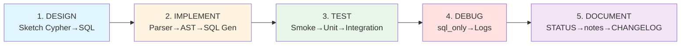
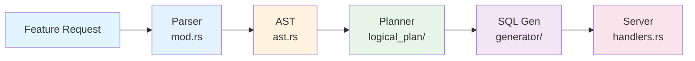

# Quick Reference Card - ClickGraph Development

**Keep this open while coding!**

---

## 🚦 The 5-Phase Process (2-Minute Version)



---

## 🎯 Before You Start

```powershell
# 1. Clean environment
docker ps -a | Select-String "clickgraph"  # Should be empty
netstat -ano | Select-String "8080|7687"   # Should be empty

# 2. Start ClickHouse
docker-compose up -d

# 3. Set environment
$env:CLICKHOUSE_URL = "http://localhost:8123"
$env:CLICKHOUSE_USER = "test_user"
$env:CLICKHOUSE_PASSWORD = "test_pass"
$env:CLICKHOUSE_DATABASE = "test_integration"
$env:GRAPH_CONFIG_PATH = "schemas/test/test_integration_schema.yaml"
$env:RUST_LOG = "debug"

# 4. Start server
.\start_server_new_window.bat

# 5. Load test data
Get-Content scripts\setup\setup_integration_test_data.sql | `
    docker exec -i clickhouse clickhouse-client `
    --user test_user --password test_pass --multiquery
```

---

## 📂 Where to Edit (Architecture Map)



**Common Edit Patterns**:
- **New syntax**: `open_cypher_parser/mod.rs` (parsing) + `ast.rs` (structure)
- **New plan node**: `query_planner/logical_plan/` (structure) + `plan_builder.rs` (construction)
- **New SQL pattern**: `clickhouse_query_generator/` (generation) + `plan_builder.rs` (rendering)
- **New JOIN logic**: `query_planner/analyzer/graph_join_inference.rs`
- **New CTE**: `clickhouse_query_generator/variable_length_cte.rs` (or create new file)

---

## 🧪 Testing Commands (Copy-Paste Ready)

### Quick Smoke Test
```powershell
# Test SQL generation only
python -c "import requests; r = requests.post('http://localhost:8080/query', json={'query': 'MATCH (a)-[:FOLLOWS]->(b) RETURN a', 'sql_only': True}); print(r.json()['generated_sql'])"

# Test query execution
python -c "import requests; r = requests.post('http://localhost:8080/query', json={'query': 'MATCH (a)-[:FOLLOWS]->(b) RETURN a.name'}); print('Status:', r.status_code); print('Rows:', len(r.json().get('rows', [])))"
```

### Unit Tests
```powershell
cargo test --lib                    # All unit tests
cargo test test_parse_optional      # Specific test
cargo test 2>&1 | Select-String "test result"  # Summary only
```

### Integration Tests
```powershell
python -m pytest tests/integration/ -v                    # All
python -m pytest tests/integration/test_optional_match.py -v  # Specific
python -m pytest tests/integration/ -v -s                 # With output
```

### Build
```powershell
cargo build                                              # Full build
cargo build 2>&1 | Select-String "error|Finished"        # Errors only
```

---

## 🐛 Debugging Checklist

**When tests fail:**

1. **Check SQL first** (use `sql_only: True`):
   - [ ] Tables have schema prefix? (`test_integration.users`)
   - [ ] Correct JOIN type? (LEFT vs INNER)
   - [ ] All tables/columns referenced?
   - [ ] No missing JOINs or CTEs?

2. **Check server logs**:
   - [ ] Schema loaded? "Successfully loaded schema"
   - [ ] Parser errors? "Failed to parse"
   - [ ] ClickHouse errors? "Unknown table" or "Unknown column"

3. **Add debug output**:
   ```rust
   eprintln!("DEBUG: ast.optional_match_clauses.len() = {}", 
             ast.optional_match_clauses.len());
   ```

4. **Test incrementally**:
   - [ ] Parser only: Does AST look correct?
   - [ ] SQL gen only: Use `sql_only: True`
   - [ ] Full query: Execute and check results

---

## 📝 Common Bug Patterns

| Symptom | Likely Cause | Fix Location |
|---------|--------------|--------------|
| `FROM users` (no prefix) | Schema inference not using `database` | `schema_inference.rs` line ~80 |
| `WHERE a.x AND a.x` (duplicate) | Filter collected twice | `plan_builder.rs` extract_filters |
| INNER JOIN for OPTIONAL | Not checking `is_optional` | `plan_builder.rs` join generation |
| Missing joins in multi-hop | Recursion not visiting left branch | `graph_join_inference.rs` collect_graph_joins |
| "Property 'id' not found" | ID column not in schema YAML | `schemas/test/*.yaml` property_mappings |
| Parser doesn't see clause | Parser order wrong | `open_cypher_parser/mod.rs` parse order |

---

## 📋 Commit Checklist

**Before committing:**
- [ ] `cargo build` succeeds (0 errors)
- [ ] `cargo test` passes (no new failures)
- [ ] Manual smoke test passes
- [ ] No `eprintln!` debug statements left
- [ ] Relevant docs updated

**Commit message format**:
```
feat: Add OPTIONAL MATCH support
fix: Multi-hop JOIN recursion
test: Add integration tests for variable-length paths
docs: Document PageRank algorithm
```

---

## 🔗 Quick Links

| Document | Purpose | When to Use |
|----------|---------|-------------|
| `DEVELOPMENT_PROCESS.md` | **Full workflow guide** | Planning new features |
| `DEV_ENVIRONMENT_CHECKLIST.md` | **Setup checklist** | Before each session |
| `STATUS.md` | **Current state** | See what works now |
| `TESTING_GUIDE.md` | **Testing strategies** | Writing tests |
| `.github/copilot-instructions.md` | **Architecture reference** | Understanding codebase |
| `notes/<feature>.md` | **Feature details** | Implementing similar feature |

---

## 🚨 Windows-Specific Reminders

**Always use**:
```powershell
# ✅ PowerShell HTTP requests
Invoke-RestMethod -Method POST -Uri "http://localhost:8080/query" `
    -ContentType "application/json" -Body '{"query":"..."}'

# ✅ Python for complex requests
python -c "import requests; ..."

# ❌ NEVER use curl (doesn't work on Windows)
```

**Test data must use**:
```sql
-- ✅ Memory engine (Windows Docker volume issue)
CREATE TABLE users (...) ENGINE = Memory;

-- ❌ MergeTree won't work
CREATE TABLE users (...) ENGINE = MergeTree() ORDER BY id;
```

---

## 💡 One-Liners for Common Tasks

```powershell
# Kill all clickgraph processes
Get-Process | Where {$_.ProcessName -like "*clickgraph*"} | Stop-Process -Force

# Check server health
Invoke-RestMethod -Method GET -Uri "http://localhost:8080/health"

# See generated SQL
python -c "import requests; print(requests.post('http://localhost:8080/query', json={'query':'MATCH (a) RETURN a','sql_only':True}).json()['generated_sql'])"

# Quick integration test
python -c "import requests; r=requests.post('http://localhost:8080/query',json={'query':'MATCH(a:User)WHERE a.name=\"Alice\"RETURN a.name'}); print(r.status_code,r.json())"

# Reload test data
Get-Content scripts\setup\setup_integration_test_data.sql | docker exec -i clickhouse clickhouse-client --user test_user --password test_pass --multiquery

# Clean build
cargo clean; cargo build 2>&1 | Select-String "error|Finished"
```

---

## 🎓 Learn from Past Wins

**OPTIONAL MATCH** (2 hours):
- Root cause: Parser order wrong (expected OPTIONAL before WHERE)
- Fix: Reorder parsing to handle WHERE first
- Lesson: Real queries ≠ grammar spec order

**Variable-Length Paths** (3 days):
- Strategy: Incremental (exact hops → ranges → unbounded)
- Key: Different SQL for different hop patterns
- Lesson: Complex features need step-by-step implementation

**Multi-Hop JOINs** (ongoing):
- Issue: Missing left branch recursion
- Discovery: User insight + grep search
- Lesson: Always recurse ALL branches in plan tree

---

## ✅ Success Criteria

**Feature is "Done" when**:
- [ ] Manual smoke test passes
- [ ] Unit tests pass
- [ ] Integration tests pass  
- [ ] No regressions
- [ ] SQL looks correct (manual review)
- [ ] STATUS.md updated
- [ ] Feature note created (`notes/<feature>.md`)
- [ ] CHANGELOG.md updated

---

**Print this and keep it next to your monitor!**

Version 1.0 | November 6, 2025
