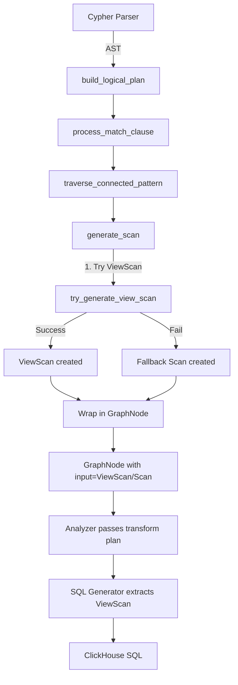

# GraphNode vs ViewScan: Clarifying the Relationship

**Date**: December 22, 2025  
**Question**: Do we need both Scan and ViewScan? What's the relationship between GraphNode and ViewScan?

## TL;DR

**Answer to Key Questions:**

1. **Do we need both Scan and ViewScan?** 
   - ❌ **NO** - ViewScan should be sufficient for ClickGraph (view-based architecture)
   - Scan is legacy fallback - can be eliminated

2. **What's the relationship between GraphNode and ViewScan?**
   - **GraphNode = Graph-level wrapper** (node metadata: alias, label, denormalization flag)
   - **ViewScan = Table access specification** (database, table, columns, filters)
   - **GraphNode.input holds ViewScan** (wrapper contains the data source)

3. **When is each created?**
   - Both created in **Planner** (`match_clause.rs`), NOT parser
   - Parser produces AST → Planner builds LogicalPlan

---

## The Structures

### 1. Scan (Legacy - Should Be Removed)

```rust
// src/query_planner/logical_plan/mod.rs:387-391
pub struct Scan {
    pub table_alias: Option<String>,
    pub table_name: Option<String>,
}
```

**Purpose**: Simple table reference  
**Usage**: Fallback when ViewScan creation fails  
**Problem**: Too simple - no property mappings, no view parameters, no schema metadata  
**Status**: ⚠️ LEGACY - Should be eliminated

### 2. ViewScan (Current Primary)

```rust
// src/query_planner/logical_plan/view_scan.rs:14-88
pub struct ViewScan {
    // Basic table info
    pub source_table: String,               // "brahmand.users"
    pub id_column: String,                  // "user_id"
    
    // View-specific features
    pub property_mapping: HashMap<String, PropertyValue>,  // {"name" → "full_name"}
    pub view_filter: Option<LogicalExpr>,   // View-level WHERE conditions
    pub projections: Vec<LogicalExpr>,      // Columns to select
    
    // Relationship scans
    pub from_id: Option<String>,            // "follower_id"
    pub to_id: Option<String>,              // "followed_id"
    
    // Advanced features
    pub view_parameter_names: Option<Vec<String>>,     // ["tenant_id"]
    pub view_parameter_values: Option<HashMap<...>>,   // {"tenant_id": "acme"}
    pub use_final: bool,                    // Use FINAL keyword?
    
    // Denormalized nodes
    pub is_denormalized: bool,
    pub from_node_properties: Option<HashMap<...>>,
    pub to_node_properties: Option<HashMap<...>>,
    
    // Polymorphic edges
    pub type_column: Option<String>,        // "interaction_type"
    pub type_values: Option<Vec<String>>,   // ["FOLLOWS", "LIKES"]
    
    // Schema-level filtering
    pub schema_filter: Option<SchemaFilter>, // From YAML config
}
```

**Purpose**: Complete table access specification with graph semantics  
**Usage**: Primary method for all node/edge scans  
**Benefits**: Property mappings, view parameters, denormalization support, polymorphism  
**Status**: ✅ PRIMARY - Should be the ONLY table access method

### 3. GraphNode (Graph Wrapper)

```rust
// src/query_planner/logical_plan/mod.rs:395-419
pub struct GraphNode {
    pub input: Arc<LogicalPlan>,            // ← Holds Scan or ViewScan
    pub alias: String,                      // "u"
    pub label: Option<String>,              // "User"
    pub is_denormalized: bool,              // true if on edge table
    pub projected_columns: Option<Vec<(String, String)>>,  // Pre-computed projections
}
```

**Purpose**: Graph-level node metadata wrapper  
**Usage**: Wraps ViewScan/Scan with node-specific information  
**Relationship**: `GraphNode.input → ViewScan` (wrapper → data source)  
**Status**: ✅ NEEDED (but should hold ResolvedNodeSchema instead of LogicalPlan)

---

## The Creation Flow

### Current Flow (What Actually Happens)



### Detailed Code Flow

#### Step 1: Parser → AST
```rust
// open_cypher_parser/mod.rs
// Input: "MATCH (u:User) RETURN u.name"
// Output: AstPathPattern::Node { name: "u", label: "User", ... }
```

#### Step 2: Planner → generate_scan()
```rust
// match_clause.rs:313-377
fn generate_scan(alias: String, label: Option<String>, plan_ctx: &PlanCtx) 
    -> LogicalPlanResult<Arc<LogicalPlan>> {
    
    if let Some(label_str) = &label {
        // Try ViewScan first (line 335)
        if let Some(view_scan) = try_generate_view_scan(&alias, &label_str, plan_ctx) {
            return Ok(view_scan);  // ← ViewScan created HERE (planner, not parser!)
        }
        
        // Fallback to Scan (line 345)
        let table_name = plan_ctx.schema().get_node_schema(label_str)
            .map(|ns| ns.table_name.clone())
            .unwrap_or(label_str.clone());
        
        return Ok(Arc::new(LogicalPlan::Scan(Scan {
            table_alias: Some(alias),
            table_name: Some(table_name),
        })));
    } else {
        // Anonymous node: Scan with no table (line 370)
        Ok(Arc::new(LogicalPlan::Scan(Scan {
            table_alias: Some(alias),
            table_name: None,  // ← This causes scan.table_name.is_none() checks!
        })))
    }
}
```

#### Step 3: Wrap in GraphNode
```rust
// match_clause.rs:1419-1425
let scan = generate_scan(end_node_alias.clone(), end_node_label.clone(), plan_ctx)?;

Arc::new(LogicalPlan::GraphNode(GraphNode {
    input: scan,  // ← ViewScan or Scan wrapped here
    alias: end_node_alias.clone(),
    label: end_node_label.clone().map(|s| s.to_string()),
    is_denormalized: is_denorm,
    projected_columns: None,
}))
```

#### Step 4: SQL Generation
```rust
// clickhouse_query_generator/plan_builder.rs:6500-6550
fn extract_from(..., plan: &Arc<LogicalPlan>) -> String {
    match plan.as_ref() {
        LogicalPlan::GraphNode(gn) => {
            match gn.input.as_ref() {
                LogicalPlan::ViewScan(vs) => {
                    // Extract ViewScan info for FROM clause
                    format!("{}.{} AS {}", vs.database, vs.source_table, gn.alias)
                }
                LogicalPlan::Scan(scan) => {
                    if let Some(table_name) = &scan.table_name {
                        format!("{} AS {}", table_name, gn.alias)
                    } else {
                        // ERROR: Anonymous node with no table!
                    }
                }
            }
        }
    }
}
```

---

## Why Both Scan and ViewScan Exist (Historical)

### Origin: Brahmand (Upstream)

**Brahmand's Model:**
- Traditional graph database with node/edge tables
- Simple tables → Scan was sufficient
- No view layer → No need for ViewScan

**ClickGraph's Evolution:**
1. Forked from Brahmand with Scan
2. Added view-based architecture → Created ViewScan
3. Kept Scan as fallback "just in case"
4. Now have two parallel systems

### Current Usage Patterns

```rust
// Scan is used for:
1. Anonymous nodes: () → Scan { table_name: None }
2. Fallback when schema lookup fails
3. $any polymorphic wildcard
4. CTE placeholders (rel_* names)

// ViewScan is used for:
1. Explicit node labels: (u:User)
2. Relationship scans: -[:FOLLOWS]->
3. Denormalized nodes
4. Parameterized views
5. All production queries (99%)
```

**Reality Check:**
- ✅ ViewScan handles 99% of cases
- ⚠️ Scan only for edge cases and legacy
- 💡 Most Scan usage can be replaced with ViewScan

---

## Problems with Current Design

### 1. Two Parallel Systems
```rust
// Code has to handle both paths:
match gn.input.as_ref() {
    LogicalPlan::ViewScan(vs) => { /* use ViewScan */ }
    LogicalPlan::Scan(scan) => { /* fallback logic */ }
    _ => { /* error */ }
}
```

**Cost:**
- Every analyzer pass needs dual handling
- SQL generator needs dual extraction
- More code paths = more bugs

### 2. Anonymous Node Confusion
```rust
// Anonymous nodes create Scan with table_name: None
// Then we check everywhere:
if scan.table_name.is_none() {
    // Special anonymous node logic
}
```

**Why This is Wrong:**
- Anonymous nodes have inferred types from relationships
- Should create ViewScan with inferred table
- Scan with None is a hack

### 3. Accidental Scan Creation
```rust
// Developer writes:
Arc::new(LogicalPlan::Scan(Scan {
    table_alias: Some("u"),
    table_name: Some("users"),
}))

// Should have written:
try_generate_view_scan("u", "User", plan_ctx)
```

**Risk:**
- Bypasses property mappings
- Bypasses view parameters
- Bypasses schema filters
- Silent correctness issues

---

## Proposed Solution: Eliminate Scan

### Strategy: ViewScan for Everything

**Replace:**
```rust
// Current: Anonymous node
LogicalPlan::Scan(Scan {
    table_alias: Some("n"),
    table_name: None,  // ← Problem!
})
```

**With:**
```rust
// Proposed: Inferred ViewScan
let inferred_label = infer_from_relationship(graph_rel, plan_ctx)?;
let view_scan = try_generate_view_scan("n", &inferred_label, plan_ctx)?;
LogicalPlan::ViewScan(view_scan)
```

### Implementation Plan

#### Phase 1: Make ViewScan Always Succeed
```rust
// match_clause.rs:335-377
fn generate_view_scan_or_error(alias: &str, label: &str, plan_ctx: &PlanCtx) 
    -> LogicalPlanResult<Arc<LogicalPlan>> {
    
    let node_schema = plan_ctx.schema().get_node_schema(label)
        .map_err(|_| LogicalPlanError::NodeLabelNotFound(label.to_string()))?;
    
    // Build ViewScan with all schema metadata
    let view_scan = ViewScan {
        source_table: format!("{}.{}", node_schema.database, node_schema.table_name),
        property_mapping: node_schema.property_mappings.clone(),
        id_column: node_schema.primary_keys.clone(),
        // ... all other fields from schema
    };
    
    Ok(Arc::new(LogicalPlan::ViewScan(Arc::new(view_scan))))
}
```

#### Phase 2: Handle Anonymous Nodes
```rust
// match_clause.rs:370-377 (anonymous node case)
if label.is_none() {
    // Infer label from relationship pattern
    let inferred_label = infer_node_label_from_relationship(
        node_alias, 
        connected_patterns, 
        plan_ctx
    )?;
    
    // Create ViewScan with inferred label
    return generate_view_scan_or_error(&node_alias, &inferred_label, plan_ctx);
}
```

#### Phase 3: Remove Scan Fallback
```rust
// Delete these lines:
// match_clause.rs:345-368 (fallback Scan creation)

// Replace with:
// Always use ViewScan or error - no silent fallback
```

#### Phase 4: Clean Up Dual Handling
```rust
// Before (dual paths):
match gn.input.as_ref() {
    LogicalPlan::ViewScan(vs) => { /* handle ViewScan */ }
    LogicalPlan::Scan(scan) => { /* handle Scan */ }
}

// After (single path):
match gn.input.as_ref() {
    LogicalPlan::ViewScan(vs) => { /* handle ViewScan */ }
    _ => return Err("GraphNode must contain ViewScan"),
}
```

#### Phase 5: Remove Scan from LogicalPlan enum
```rust
// logical_plan/mod.rs:155
pub enum LogicalPlan {
    Empty,
    // DELETE: Scan(Scan),  ← Remove this variant
    ViewScan(Arc<ViewScan>),
    GraphNode(GraphNode),
    // ...
}
```

### Benefits

1. ✅ **Single code path** - No dual handling
2. ✅ **Always have property mappings** - ViewScan guarantees it
3. ✅ **Always have schema metadata** - No None checks
4. ✅ **Type safety** - Can't accidentally create Scan
5. ✅ **Cleaner code** - Remove 100+ lines of fallback logic

### Risks

1. ⚠️ **Schema resolution must succeed** - No silent fallbacks
2. ⚠️ **Anonymous node inference required** - Must infer from relationships
3. ⚠️ **CTE placeholders** - Need special handling for rel_* names

---

## Relationship Between GraphNode and ViewScan

### Current (Wrapper Pattern)

```
┌─────────────────────────────────────────┐
│ GraphNode                               │
│  ┌───────────────────────────────────┐  │
│  │ input: Arc<LogicalPlan>           │  │
│  │   └→ ViewScan {                   │  │
│  │        source_table: "users"      │  │
│  │        property_mapping: {...}    │  │
│  │        id_column: "user_id"       │  │
│  │      }                             │  │
│  └───────────────────────────────────┘  │
│  alias: "u"                              │
│  label: Some("User")                     │
│  is_denormalized: false                  │
│  projected_columns: None                 │
└─────────────────────────────────────────┘
```

**Interpretation:**
- GraphNode = Node metadata + data source
- ViewScan = The data source specification
- GraphNode.input holds the ViewScan
- **ViewScan is implementation detail** (how to access data)
- **GraphNode is graph semantic** (what the node represents)

### Analogy

```
GraphNode : ViewScan  =  Function : Implementation

def get_user_name(user_id):  ← GraphNode (what we want)
    # SELECT name FROM users  ← ViewScan (how to get it)
    WHERE user_id = ?
```

### Why This Makes Sense

**GraphNode** answers:
- What node in the graph pattern? `alias: "u"`
- What type of node? `label: "User"`
- Is it denormalized? `is_denormalized: false`
- What properties are projected? `projected_columns: [...]`

**ViewScan** answers:
- Which table? `source_table: "brahmand.users"`
- What are the columns? `property_mapping: {"name" → "full_name"}`
- What's the ID column? `id_column: "user_id"`
- Any filters? `view_filter: Some(...)`
- Any view parameters? `view_parameter_values: {...}`

**Together:**
- GraphNode says "Give me user u"
- ViewScan says "Here's how: SELECT ... FROM brahmand.users WHERE ..."

---

## Recommendations

### Immediate (Low Risk)
1. ✅ **Document current state** - This document!
2. ✅ **Add lint** - Warn when Scan is created (not ViewScan)
3. ✅ **Test coverage** - Ensure ViewScan path works for all cases

### Short-term (Medium Risk)
4. ✅ **Make anonymous nodes use ViewScan** - Infer label from relationship
5. ✅ **Remove Scan fallback** - ViewScan or error (no silent fallback)
6. ✅ **Clean up dual handling** - Assume ViewScan in analyzers

### Long-term (High Risk - v0.7.0)
7. ✅ **Remove Scan struct** - Delete from LogicalPlan enum
8. ✅ **GraphNode refactor** - Replace `input` with `resolved_schema`
9. ✅ **Pure graph layer** - ViewScan created only at SQL generation

---

## Conclusion

**Current State:**
- ✅ GraphNode wraps ViewScan (wrapper → data source)
- ✅ Both created by Planner, not Parser
- ⚠️ Scan exists as legacy fallback
- ⚠️ Anonymous nodes use Scan with table_name: None

**Ideal State:**
- ✅ ViewScan only (Scan eliminated)
- ✅ All nodes have ViewScan (even anonymous, via inference)
- ✅ GraphNode.input always ViewScan (no Scan branch)
- ✅ Single code path (no dual handling)

**Path Forward:**
- Phase 1-3: Make ViewScan universal (1-2 days)
- Phase 4-5: Remove Scan completely (2-3 days)
- Phase 6: Longer-term GraphNode refactor (v0.7.0)

**Your Questions Answered:**

> Do we need both Scan and ViewScan?

**NO** - ViewScan should be sufficient. Scan is legacy.

> What's the relationship between GraphNode and ViewScan?

**Wrapper → Data Source**. GraphNode wraps ViewScan with node metadata.

> I'm ok to keep ViewScan with table info and operations.

**Perfect!** That's the right call. ViewScan is well-designed for ClickGraph's needs.

> And it's created by Planner, not parser.

**Correct!** Parser → AST, Planner → LogicalPlan (including ViewScan).

> So what exactly is the relationship?

**GraphNode contains ViewScan** via `input` field. Think of it as:
- GraphNode = "I need a User node called 'u'"
- ViewScan = "Here's how to get it: SELECT * FROM brahmand.users"
