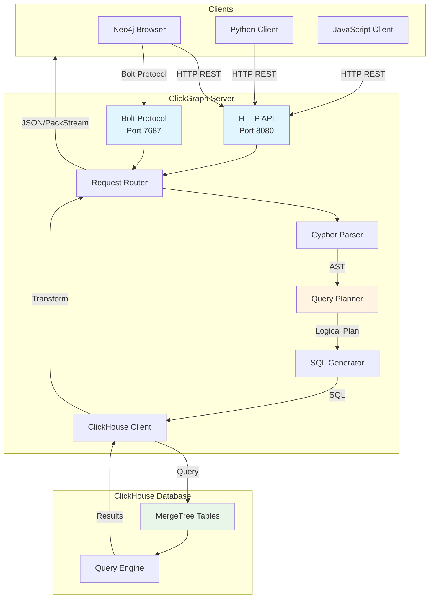

> **Note**: This documentation is for ClickGraph v0.5.2. [View latest docs →](../../wiki/Home.md)
# Architecture & Extension Development

Deep dive into ClickGraph's internal architecture and guide for extending functionality.

## Table of Contents
- [Architecture Overview](#architecture-overview)
- [Core Components](#core-components)
- [Query Execution Pipeline](#query-execution-pipeline)
- [Extension Points](#extension-points)
- [Custom Functions](#custom-functions)
- [Protocol Extensions](#protocol-extensions)
- [Contributing Guide](#contributing-guide)

---

## Architecture Overview

### High-Level Architecture



### Design Principles

1. **Stateless Architecture**: No query state stored in ClickGraph (scales horizontally)
2. **View-Based Model**: Map existing tables to graphs (non-invasive)
3. **Optimization-First**: Multiple optimization passes before SQL generation
4. **Protocol Agnostic**: Support HTTP REST and Neo4j Bolt protocol
5. **Rust Performance**: Zero-cost abstractions, memory safety, concurrency

---

## Core Components

### 1. open_cypher_parser/

**Purpose**: Parse Cypher queries into Abstract Syntax Tree (AST).

**Key Files**:
- `ast.rs` - AST node definitions (MatchClause, WhereClause, ReturnClause, etc.)
- `mod.rs` - Parser entry point using Pest grammar
- `cypher.pest` - Cypher grammar specification

**Example AST**:
```rust
// Input: MATCH (u:User {user_id: 1})-[:FOLLOWS]->(f:User) RETURN f.name

QueryAst {
    match_clause: MatchClause {
        patterns: vec![
            Pattern {
                nodes: vec![
                    NodePattern {
                        variable: Some("u"),
                        labels: vec!["User"],
                        properties: PropertyMap { user_id: 1 }
                    },
                    NodePattern {
                        variable: Some("f"),
                        labels: vec!["User"],
                        properties: PropertyMap::empty()
                    }
                ],
                relationships: vec![
                    RelationshipPattern {
                        direction: Outgoing,
                        types: vec!["FOLLOWS"],
                        properties: PropertyMap::empty()
                    }
                ]
            }
        ]
    },
    return_clause: ReturnClause {
        items: vec![
            ReturnItem::Property("f", "name")
        ]
    }
}
```

### 2. query_planner/

**Purpose**: Transform AST into optimized logical plan.

**Key Submodules**:
- `analyzer/` - Semantic analysis and validation
  - `view_resolver.rs` - Map labels to schema views
  - `graph_traversal_planning.rs` - Plan multi-hop traversals
  - `property_resolver.rs` - Resolve property mappings
  
- `logical_plan/` - Logical plan structures
  - `plan.rs` - LogicalPlan enum (Scan, Join, Filter, Project, etc.)
  - `plan_builder.rs` - Builder pattern for plan construction
  
- `optimizer/` - Optimization passes
  - `filter_pushdown.rs` - Push filters to table scans
  - `join_reorder.rs` - Optimize JOIN order
  - `view_optimizer.rs` - Apply view-specific optimizations
  - `chained_join_optimizer.rs` - Optimize fixed-length paths

**Optimization Pipeline**:
```rust
// Query: MATCH (u:User)-[:FOLLOWS]->(:User)-[:FOLLOWS]->(f:User) 
//        WHERE u.user_id = 1 RETURN f.name

// 1. Initial Plan (unoptimized)
LogicalPlan::Project {
    input: LogicalPlan::Filter {
        condition: "u.user_id = 1",
        input: LogicalPlan::Join {
            left: LogicalPlan::Scan("User"),
            right: LogicalPlan::Join {
                left: LogicalPlan::Scan("User"),
                right: LogicalPlan::Scan("User")
            }
        }
    }
}

// 2. After filter pushdown
LogicalPlan::Project {
    input: LogicalPlan::Join {
        left: LogicalPlan::Filter {  // Filter pushed to scan
            condition: "user_id = 1",
            input: LogicalPlan::Scan("User")
        },
        right: LogicalPlan::Join {
            left: LogicalPlan::Scan("User"),
            right: LogicalPlan::Scan("User")
        }
    }
}

// 3. After chained join optimization
LogicalPlan::Project {
    input: LogicalPlan::ChainedJoin {  // Single multi-table join
        base: LogicalPlan::Filter {
            condition: "user_id = 1",
            input: LogicalPlan::Scan("User")
        },
        joins: vec![
            JoinStep { table: "user_follows", ... },
            JoinStep { table: "User", ... },
            JoinStep { table: "user_follows", ... },
            JoinStep { table: "User", ... }
        ]
    }
}
```

### 3. clickhouse_query_generator/

**Purpose**: Generate ClickHouse SQL from logical plan.

**Key Files**:
- `mod.rs` - Main SQL generation logic
- `cte_generator.rs` - Common Table Expression (CTE) generation
- `join_generator.rs` - JOIN clause construction
- `recursive_query_generator.rs` - Recursive CTE for variable-length paths

**Example SQL Generation**:
```rust
// Logical Plan → SQL

// Input: LogicalPlan::ChainedJoin (2-hop FOLLOWS)
let plan = LogicalPlan::ChainedJoin {
    base: Filter { condition: "user_id = 1", input: Scan("User") },
    joins: vec![
        Join { table: "user_follows", on: "follower_id = user_id" },
        Join { table: "users", on: "followed_id = user_id" }
    ]
};

// Output SQL:
SELECT t2.full_name AS name
FROM users_bench t0
JOIN user_follows_bench r0 ON t0.user_id = r0.follower_id
JOIN users_bench t1 ON r0.followed_id = t1.user_id
JOIN user_follows_bench r1 ON t1.user_id = r1.follower_id
JOIN users_bench t2 ON r1.followed_id = t2.user_id
WHERE t0.user_id = 1;
```

**Variable-Length Path SQL**:
```rust
// Input: MATCH (u:User)-[:FOLLOWS*1..3]->(f:User) WHERE u.user_id = 1

// Output: Recursive CTE
WITH RECURSIVE path_cte AS (
    -- Base case (depth 0)
    SELECT 
        user_id AS start_id,
        user_id AS end_id,
        0 AS depth,
        [user_id] AS path_ids
    FROM users_bench
    WHERE user_id = 1
    
    UNION ALL
    
    -- Recursive case (depth 1-3)
    SELECT
        p.start_id,
        u.user_id AS end_id,
        p.depth + 1 AS depth,
        arrayConcat(p.path_ids, [u.user_id]) AS path_ids
    FROM path_cte p
    JOIN user_follows_bench r ON p.end_id = r.follower_id
    JOIN users_bench u ON r.followed_id = u.user_id
    WHERE p.depth < 3
)
SELECT DISTINCT
    u.full_name AS name
FROM path_cte p
JOIN users_bench u ON p.end_id = u.user_id
WHERE p.depth >= 1 AND p.depth <= 3;
```

### 4. graph_catalog/

**Purpose**: Manage graph schema metadata.

**Key Files**:
- `graph_schema.rs` - Schema data structures
- `schema_loader.rs` - Load YAML schemas
- `schema_validator.rs` - Validate schema correctness

**Schema Data Structures**:
```rust
pub struct GraphSchema {
    pub name: String,
    pub databases: Vec<Database>,
    pub views: Vec<View>,
}

pub struct View {
    pub name: String,
    pub view_parameters: Vec<String>,  // e.g., ["tenant_id"]
    pub nodes: HashMap<String, NodeDefinition>,
    pub relationships: HashMap<String, RelationshipDefinition>,
}

pub struct NodeDefinition {
    pub source_table: String,
    pub identifier_property: String,
    pub property_mappings: HashMap<String, String>,
    pub filters: Vec<String>,  // e.g., ["tenant_id = ${tenant_id}"]
}

pub struct RelationshipDefinition {
    pub source_table: String,
    pub from_node: String,
    pub to_node: String,
    pub from_property: String,
    pub to_property: String,
    pub property_mappings: HashMap<String, String>,
    pub filters: Vec<String>,
}
```

### 5. server/

**Purpose**: HTTP and Bolt protocol servers.

**Key Files**:
- `handlers.rs` - HTTP REST API handlers
- `bolt_protocol/` - Neo4j Bolt protocol implementation
  - `connection.rs` - Connection state management
  - `messages.rs` - Bolt message types
  - `packstream.rs` - PackStream encoding/decoding
  - `auth.rs` - Authentication handlers
- `clickhouse_client.rs` - ClickHouse connection pooling

**HTTP API**:
```rust
// POST /query
pub async fn execute_query(
    State(app_state): State<AppState>,
    Json(request): Json<QueryRequest>
) -> Result<Json<QueryResponse>, StatusCode> {
    // 1. Parse Cypher
    let ast = parse_cypher(&request.query)?;
    
    // 2. Plan & optimize
    let logical_plan = plan_query(ast, &app_state.schema)?;
    let optimized_plan = optimize(logical_plan)?;
    
    // 3. Generate SQL
    let sql = generate_sql(optimized_plan)?;
    
    // 4. Execute on ClickHouse
    let rows = app_state.clickhouse_client.query(&sql).await?;
    
    // 5. Transform results
    let results = transform_results(rows)?;
    
    Ok(Json(QueryResponse { results }))
}
```

---

## Query Execution Pipeline

### Step-by-Step Execution

**Example Query**: `MATCH (u:User {user_id: 1})-[:FOLLOWS]->(f:User) RETURN f.name LIMIT 10`

**1. HTTP Request Received**
```json
POST /query
{
  "query": "MATCH (u:User {user_id: 1})-[:FOLLOWS]->(f:User) RETURN f.name LIMIT 10",
  "schema_name": "social_graph"
}
```

**2. Schema Resolution**
```rust
// Load schema "social_graph"
let schema = GLOBAL_SCHEMAS.get("social_graph")?;
```

**3. Cypher Parsing**
```rust
// Parse Cypher → AST
let ast = CypherParser::parse(&query)?;

// AST structure:
QueryAst {
    match_clause: MatchClause {
        patterns: [
            Pattern {
                nodes: [
                    Node { var: "u", label: "User", props: {user_id: 1} },
                    Node { var: "f", label: "User", props: {} }
                ],
                rels: [
                    Rel { type: "FOLLOWS", direction: Outgoing }
                ]
            }
        ]
    },
    return_clause: ReturnClause { items: ["f.name"] },
    limit: Some(10)
}
```

**4. View Resolution**
```rust
// Map "User" label → schema node definition
let user_node = schema.views[0].nodes.get("User")?;
// → source_table: "users_bench"
// → property_mappings: { name: "full_name", user_id: "user_id", ... }

// Map "FOLLOWS" type → schema relationship definition
let follows_rel = schema.views[0].relationships.get("FOLLOWS")?;
// → source_table: "user_follows_bench"
// → from_property: "follower_id", to_property: "followed_id"
```

**5. Query Planning**
```rust
// Build logical plan
let plan = LogicalPlan::Project {
    columns: vec!["f.name"],
    input: Box::new(LogicalPlan::Limit {
        count: 10,
        input: Box::new(LogicalPlan::Join {
            left: Box::new(LogicalPlan::Filter {
                condition: Expr::Eq("user_id", 1),
                input: Box::new(LogicalPlan::Scan {
                    table: "users_bench",
                    alias: "u"
                })
            }),
            right: Box::new(LogicalPlan::Scan {
                table: "users_bench",
                alias: "f"
            }),
            on: JoinCondition::RelationshipTable {
                table: "user_follows_bench",
                from_col: "follower_id",
                to_col: "followed_id"
            }
        })
    })
};
```

**6. Optimization**
```rust
// Apply optimization passes
let optimized = plan
    .apply(FilterPushdownOptimizer)
    .apply(ViewOptimizer)
    .apply(ChainedJoinOptimizer);
```

**7. SQL Generation**
```sql
-- Generated ClickHouse SQL
SELECT t1.full_name AS name
FROM users_bench t0
JOIN user_follows_bench r0 ON t0.user_id = r0.follower_id
JOIN users_bench t1 ON r0.followed_id = t1.user_id
WHERE t0.user_id = 1
LIMIT 10;
```

**8. ClickHouse Execution**
```rust
let rows = clickhouse_client.query(&sql).await?;
// → [[Row { name: "Alice" }], [Row { name: "Bob" }], ...]
```

**9. Result Transformation**
```json
{
  "results": [
    {"name": "Alice"},
    {"name": "Bob"},
    ...
  ],
  "stats": {
    "rows_returned": 10,
    "execution_time_ms": 42
  }
}
```

---

## Extension Points

### 1. Custom Optimization Passes

**Create New Optimizer**:
```rust
// src/query_planner/optimizer/my_optimizer.rs

use crate::query_planner::logical_plan::LogicalPlan;
use crate::query_planner::optimizer::OptimizerPass;

pub struct MyCustomOptimizer;

impl OptimizerPass for MyCustomOptimizer {
    fn optimize(&self, plan: LogicalPlan) -> Result<LogicalPlan, Error> {
        match plan {
            LogicalPlan::Filter { condition, input } => {
                // Apply custom optimization logic
                let optimized_input = self.optimize(*input)?;
                Ok(LogicalPlan::Filter {
                    condition,
                    input: Box::new(optimized_input)
                })
            }
            _ => Ok(plan)
        }
    }
}
```

**Register Optimizer**:
```rust
// src/query_planner/optimizer/mod.rs

pub fn optimize_plan(plan: LogicalPlan) -> Result<LogicalPlan, Error> {
    plan
        .apply(FilterPushdownOptimizer)
        .apply(ViewOptimizer)
        .apply(ChainedJoinOptimizer)
        .apply(MyCustomOptimizer)  // Add your optimizer
}
```

### 2. Custom Cypher Functions

**Add Function to AST**:
```rust
// src/open_cypher_parser/ast.rs

#[derive(Debug, Clone)]
pub enum Expression {
    // ... existing variants
    CustomFunction { name: String, args: Vec<Expression> },
}
```

**Implement Function Logic**:
```rust
// src/clickhouse_query_generator/function_generator.rs

pub fn generate_custom_function(
    name: &str,
    args: &[Expression]
) -> Result<String, Error> {
    match name {
        "my_custom_func" => {
            let arg_sql: Vec<String> = args.iter()
                .map(|arg| generate_expression(arg))
                .collect::<Result<_, _>>()?;
            Ok(format!("myClickHouseUDF({})", arg_sql.join(", ")))
        }
        _ => Err(Error::UnknownFunction(name.to_string()))
    }
}
```

**Usage**:
```cypher
MATCH (u:User)
RETURN u.name, my_custom_func(u.age, u.score)
```

### 3. Custom Graph Algorithms

**Implement Algorithm**:
```rust
// src/query_planner/algorithms/my_algorithm.rs

use crate::query_planner::logical_plan::LogicalPlan;

pub fn generate_my_algorithm_plan(
    start_node: &str,
    params: &AlgorithmParams
) -> Result<LogicalPlan, Error> {
    // 1. Generate recursive CTE for algorithm
    let cte_sql = format!(
        "WITH RECURSIVE algo_cte AS ( ... ) SELECT * FROM algo_cte"
    );
    
    // 2. Return as RawSql plan
    Ok(LogicalPlan::RawSql { sql: cte_sql })
}
```

**Register as Cypher Procedure**:
```cypher
CALL my_algorithm(start_node, {param1: value1, param2: value2})
YIELD result
RETURN result
```

---

## Custom Functions

### Example: Levenshtein Distance

**1. Add to AST**:
```rust
// ast.rs
Expression::Function {
    name: "levenshtein".to_string(),
    args: vec![str1, str2]
}
```

**2. Generate ClickHouse SQL**:
```rust
// function_generator.rs
"levenshtein" => {
    format!("editDistance({}, {})", 
        generate_expression(&args[0])?,
        generate_expression(&args[1])?)
}
```

**3. Use in Queries**:
```cypher
MATCH (u1:User), (u2:User)
WHERE levenshtein(u1.name, u2.name) < 3
RETURN u1.name, u2.name
```

---

## Protocol Extensions

### Custom Bolt Message Types

**1. Define Message**:
```rust
// server/bolt_protocol/messages.rs

#[derive(Debug)]
pub enum CustomMessage {
    GetStats,
    CacheStatus,
}

impl BoltMessage for CustomMessage {
    fn encode(&self) -> Vec<u8> {
        // PackStream encoding
        match self {
            CustomMessage::GetStats => vec![0xB1, 0x70],  // Structure: 1 field, tag 0x70
            CustomMessage::CacheStatus => vec![0xB1, 0x71],
        }
    }
}
```

**2. Handle Message**:
```rust
// server/bolt_protocol/handler.rs

async fn handle_custom_message(
    msg: CustomMessage,
    state: &mut ConnectionState
) -> Result<Response, Error> {
    match msg {
        CustomMessage::GetStats => {
            let stats = get_query_stats();
            Ok(Response::Success { metadata: stats })
        }
        CustomMessage::CacheStatus => {
            let cache_info = get_cache_info();
            Ok(Response::Success { metadata: cache_info })
        }
    }
}
```

---

## Contributing Guide

### Development Setup

```bash
# 1. Clone repository
git clone https://github.com/yourusername/clickgraph.git
cd clickgraph

# 2. Install Rust toolchain
rustup install stable
rustup default stable

# 3. Install development tools
cargo install cargo-watch
cargo install cargo-audit

# 4. Start dependencies
docker-compose up -d clickhouse

# 5. Build project
cargo build

# 6. Run tests
cargo test --all

# 7. Run in development mode
cargo watch -x run
```

### Code Style

**Format Code**:
```bash
cargo fmt
```

**Lint Code**:
```bash
cargo clippy -- -D warnings
```

### Testing Guidelines

**Unit Tests**:
```rust
#[cfg(test)]
mod tests {
    use super::*;

    #[test]
    fn test_parse_match_clause() {
        let query = "MATCH (u:User) RETURN u.name";
        let ast = parse_cypher(query).unwrap();
        
        assert_eq!(ast.match_clause.patterns.len(), 1);
        assert_eq!(ast.return_clause.items.len(), 1);
    }
}
```

**Integration Tests**:
```rust
// tests/integration/test_query_execution.rs

#[tokio::test]
async fn test_simple_query() {
    let client = ClickGraphClient::new("http://localhost:8080");
    
    let result = client.query("MATCH (u:User) RETURN count(u)").await.unwrap();
    
    assert!(result.rows.len() > 0);
}
```

### Pull Request Process

1. **Create Feature Branch**:
   ```bash
   git checkout -b feature/my-feature
   ```

2. **Make Changes**:
   - Write tests first (TDD)
   - Implement feature
   - Update documentation

3. **Commit**:
   ```bash
   git add .
   git commit -m "feat: Add custom function support"
   ```

4. **Push & Create PR**:
   ```bash
   git push origin feature/my-feature
   ```

5. **PR Checklist**:
   - [ ] All tests passing
   - [ ] Code formatted (`cargo fmt`)
   - [ ] No clippy warnings
   - [ ] Documentation updated
   - [ ] CHANGELOG.md updated

---

## Architecture Decision Records

### ADR-001: Stateless Architecture

**Decision**: ClickGraph is stateless - no query state stored between requests.

**Rationale**:
- Enables horizontal scaling (run N instances)
- Simplifies deployment (no session management)
- Fault tolerance (restart without losing state)

**Consequences**:
- ✅ Easy to scale
- ✅ No distributed state management
- ❌ No transaction support across queries
- ❌ No cached results between requests

### ADR-002: View-Based Model

**Decision**: Map existing tables to graph via YAML schemas (no special graph tables).

**Rationale**:
- Non-invasive (works with existing ClickHouse databases)
- Flexible (multiple views of same data)
- Leverages ClickHouse performance

**Consequences**:
- ✅ No schema migration needed
- ✅ Works with existing data
- ❌ No graph-specific optimizations (e.g., adjacency lists)
- ❌ Relationship lookups require JOINs

### ADR-003: Rust Implementation

**Decision**: Implement in Rust (not Python, Go, or Java).

**Rationale**:
- Memory safety without garbage collection
- Zero-cost abstractions
- Excellent async support (Tokio)
- Fast compilation and runtime performance

**Consequences**:
- ✅ High performance
- ✅ Low memory footprint
- ❌ Steeper learning curve for contributors
- ❌ Smaller ecosystem than Java/Python

---

## Next Steps

Now that you understand ClickGraph's architecture:

- **[Contributing Guidelines](Contributing.md)** - Start contributing
- **[Testing Guide](Testing-Guide.md)** - Write tests
- **[Performance Optimization](Performance-Query-Optimization.md)** - Optimize queries
- **[Custom Functions Guide](Custom-Functions.md)** - Extend functionality

---

[← Back: Multi-Tenancy](Multi-Tenancy-RBAC.md) | [Home](Home.md) | [Next: Contributing →](Contributing.md)
