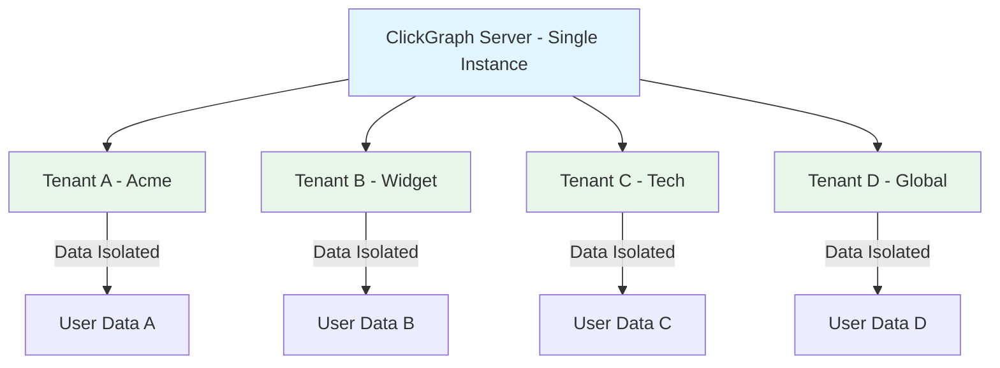
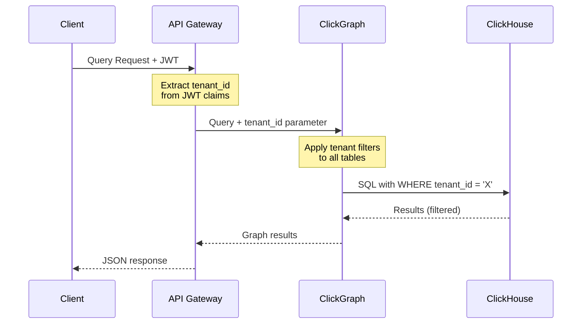

> **Note**: This documentation is for ClickGraph v0.5.2. [View latest docs →](../../wiki/Home.md)
# Multi-Tenancy & Role-Based Access Control

Comprehensive guide to implementing secure multi-tenant architectures with ClickGraph.

## Table of Contents
- [Multi-Tenancy Overview](#multi-tenancy-overview)
- [Schema-Level Isolation](#schema-level-isolation)
- [Row-Level Security](#row-level-security)
- [Role-Based Access Control](#role-based-access-control)
- [Implementation Patterns](#implementation-patterns)
- [Security Best Practices](#security-best-practices)
- [Performance Considerations](#performance-considerations)

---

## Multi-Tenancy Overview

### What is Multi-Tenancy?

**Multi-tenancy** enables serving multiple customers (tenants) from a single ClickGraph deployment while ensuring complete data isolation.



### Multi-Tenancy Approaches

| Approach | Isolation | Complexity | Cost | Use Case |
|----------|-----------|------------|------|----------|
| **Database per Tenant** | ✅ High | 🔴 High | 🔴 High | Enterprise, compliance |
| **Schema per Tenant** | ✅ Good | 🟡 Medium | 🟡 Medium | SaaS, departments |
| **Row-Level Filtering** | 🟡 Good | 🟢 Low | 🟢 Low | SMB, startups |
| **Hybrid** | ✅ Best | 🔴 Complex | 🟡 Medium | Large SaaS |

ClickGraph supports **all approaches** through flexible schema configuration.

---

## Schema-Level Isolation

### Approach 1: Separate Schemas Per Tenant

**Best for**: Strong isolation requirements, enterprise customers.

**Architecture**:
```
clickgraph_server
├── schemas/
│   ├── tenant_acme.yaml       → acme_db.users, acme_db.posts
│   ├── tenant_widget.yaml     → widget_db.users, widget_db.posts
│   └── tenant_techco.yaml     → techco_db.users, techco_db.posts
```

**Schema Example** (`tenant_acme.yaml`):
```yaml
name: acme_graph
version: "1.0"
description: "Acme Corp graph data"

graph_schema:
  nodes:
    - label: User
      database: acme_db
      table: users
      id_column: user_id
      property_mappings:
        user_id: user_id
        name: full_name
        email: email_address
  
  relationships:
    - type: FOLLOWS
      database: acme_db
      table: user_follows
      from_id: follower_id
      to_id: followed_id
      from_node: User
      to_node: User
```

**Querying**:
```cypher
-- Tenant A queries
USE acme_graph;
MATCH (u:User) RETURN u.name;

-- Tenant B queries (completely separate data)
USE widget_graph;
MATCH (u:User) RETURN u.name;
```

**Benefits**:
- ✅ Complete data isolation (physical separation)
- ✅ Easy backup/restore per tenant
- ✅ Tenant-specific optimizations
- ✅ No cross-tenant leakage risk

**Drawbacks**:
- ❌ Higher resource usage (N databases)
- ❌ Complex tenant provisioning
- ❌ Harder to aggregate cross-tenant analytics

---

## Row-Level Security

### Approach 2: Shared Tables with Tenant Filters

**Best for**: Cost efficiency, many small tenants, SaaS applications.

**Architecture**:
```
Single Database
└── shared_db
    ├── users          (tenant_id column)
    ├── posts          (tenant_id column)
    └── user_follows   (tenant_id column)
```

**Schema with Parameterized Views**:
```yaml
name: multi_tenant_graph
version: "1.0"
description: "Shared multi-tenant graph"

graph_schema:
  nodes:
    - label: User
      database: shared_db
      table: users
      id_column: user_id
      view_parameters: [tenant_id]  # Automatic tenant isolation
      property_mappings:
        user_id: user_id
        name: full_name
        email: email_address
        tenant_id: tenant_id
    
    - label: Post
      database: shared_db
      table: posts
      id_column: post_id
      view_parameters: [tenant_id]
      property_mappings:
        post_id: post_id
        content: post_content
        tenant_id: tenant_id
  
  relationships:
    - type: AUTHORED
      database: shared_db
      table: posts
      from_id: author_id
      to_id: post_id
      from_node: User
      to_node: Post
      view_parameters: [tenant_id]  # Also filter relationships
      property_mappings:
        post_date: post_date
```

**ClickHouse Table Structure**:
```sql
CREATE TABLE users (
    user_id UInt64,
    tenant_id String,  -- Tenant identifier
    full_name String,
    email_address String,
    registration_date Date
) ENGINE = MergeTree()
ORDER BY (tenant_id, user_id)  -- Partition by tenant for performance
PARTITION BY tenant_id;  -- Optional: Physical partition per tenant

CREATE TABLE user_follows (
    tenant_id String,
    follower_id UInt64,
    followed_id UInt64,
    follow_date Date
) ENGINE = MergeTree()
ORDER BY (tenant_id, follower_id, followed_id)
PARTITION BY tenant_id;
```

**Querying with Tenant Parameter**:
```bash
# Query for Tenant A
curl -X POST http://localhost:8080/query \
  -H "Content-Type: application/json" \
  -d '{
    "query": "MATCH (u:User) RETURN u.name",
    "view_parameters": {"tenant_id": "acme_corp"}
  }'

# Query for Tenant B (different data)
curl -X POST http://localhost:8080/query \
  -H "Content-Type: application/json" \
  -d '{
    "query": "MATCH (u:User) RETURN u.name",
    "view_parameters": {"tenant_id": "widget_inc"}
  }'
```

**Generated SQL** (tenant filter automatically applied):
```sql
-- For tenant "acme_corp"
SELECT full_name AS name
FROM shared_db.users
WHERE tenant_id = 'acme_corp';

-- For tenant "widget_inc"
SELECT full_name AS name
FROM shared_db.users
WHERE tenant_id = 'widget_inc';
```

**Benefits**:
- ✅ Low resource usage (shared infrastructure)
- ✅ Easy tenant provisioning (just new rows)
- ✅ Simplified maintenance (one schema)
- ✅ Cross-tenant analytics possible

**Drawbacks**:
- ⚠️ Risk of filter bypass (must test thoroughly)
- ⚠️ Noisy neighbor problem (one tenant affects others)
- ⚠️ More complex backup/restore per tenant

---

## Role-Based Access Control

### RBAC Architecture

```yaml
schema:
  name: "rbac_graph"
  
views:
  # View for admins: Full access
  - name: "admin_view"
    nodes:
      User:
        source_table: "users"
        identifier_property: "user_id"
        property_mappings:
          user_id: "user_id"
          name: "full_name"
          email: "email_address"  # Admins can see email
          ssn: "ssn"              # Admins can see SSN
  
  # View for regular users: Limited access
  - name: "user_view"
    nodes:
      User:
        source_table: "users"
        identifier_property: "user_id"
        property_mappings:
          user_id: "user_id"
          name: "full_name"
          # email: NOT INCLUDED (users can't see others' emails)
          # ssn: NOT INCLUDED (users can't see SSN)
  
  # View for analysts: Aggregated data only
  - name: "analyst_view"
    nodes:
      User:
        source_table: "users"
        identifier_property: "user_id"
        filters:
          - "is_deleted = 0"  # Exclude deleted users
        property_mappings:
          user_id: "user_id"
          country: "country"
          registration_date: "registration_date"
          # No PII (name, email, SSN)
```

**Request with Role**:
```json
{
  "query": "MATCH (u:User) RETURN u.name, u.email",
  "schema_name": "rbac_graph",
  "view_name": "admin_view",  // Admin can see email
  "role": "admin"
}
```

```json
{
  "query": "MATCH (u:User) RETURN u.name, u.email",
  "schema_name": "rbac_graph",
  "view_name": "user_view",  // User: email property not available
  "role": "user"
}
```

---

## Implementation Patterns

### Pattern 1: API Gateway with Tenant Resolution

**Architecture**:


**API Gateway (Node.js/Express)**:
```javascript
const express = require('express');
const jwt = require('jsonwebtoken');
const axios = require('axios');

const app = express();

// Middleware: Extract tenant from JWT
app.use((req, res, next) => {
  const token = req.headers.authorization?.split(' ')[1];
  if (!token) {
    return res.status(401).json({ error: 'No token' });
  }
  
  try {
    const decoded = jwt.verify(token, process.env.JWT_SECRET);
    req.tenant_id = decoded.tenant_id;
    req.role = decoded.role;
    next();
  } catch (err) {
    return res.status(401).json({ error: 'Invalid token' });
  }
});

// Proxy to ClickGraph with tenant context
app.post('/query', async (req, res) => {
  const { query } = req.body;
  
  try {
    const response = await axios.post('http://clickgraph:8080/query', {
      query,
      view_parameters: { tenant_id: req.tenant_id },
      role: req.role
    });
    
    res.json(response.data);
  } catch (err) {
    res.status(500).json({ error: err.message });
  }
});

app.listen(3000);
```

**Client Request**:
```bash
# JWT contains: {"tenant_id": "acme_corp", "role": "admin"}
curl -X POST http://api-gateway:3000/query \
  -H "Authorization: Bearer eyJhbGc..." \
  -H "Content-Type: application/json" \
  -d '{"query": "MATCH (u:User) RETURN count(u)"}'
```

### Pattern 2: Tenant-Specific Endpoints

```javascript
// Tenant-specific routes
app.post('/tenants/:tenant_id/query', async (req, res) => {
  const { tenant_id } = req.params;
  const { query } = req.body;
  
  // Verify user has access to this tenant
  if (!userHasAccessToTenant(req.user, tenant_id)) {
    return res.status(403).json({ error: 'Forbidden' });
  }
  
  const response = await axios.post('http://clickgraph:8080/query', {
    query,
    view_parameters: { tenant_id }
  });
  
  res.json(response.data);
});
```

**Usage**:
```bash
# Query for tenant "acme_corp"
POST /tenants/acme_corp/query

# Query for tenant "widget_inc"
POST /tenants/widget_inc/query
```

### Pattern 3: Connection Pooling Per Tenant

```python
from typing import Dict
import requests

class TenantQueryClient:
    def __init__(self, clickgraph_url: str):
        self.clickgraph_url = clickgraph_url
        self.sessions: Dict[str, requests.Session] = {}
    
    def get_session(self, tenant_id: str) -> requests.Session:
        """Get or create session for tenant."""
        if tenant_id not in self.sessions:
            session = requests.Session()
            session.headers.update({
                'X-Tenant-ID': tenant_id
            })
            self.sessions[tenant_id] = session
        return self.sessions[tenant_id]
    
    def query(self, tenant_id: str, cypher: str):
        """Execute query for specific tenant."""
        session = self.get_session(tenant_id)
        response = session.post(
            f"{self.clickgraph_url}/query",
            json={
                'query': cypher,
                'view_parameters': {'tenant_id': tenant_id}
            }
        )
        return response.json()

# Usage
client = TenantQueryClient('http://clickgraph:8080')

# Query for different tenants
acme_result = client.query('acme_corp', 'MATCH (u:User) RETURN count(u)')
widget_result = client.query('widget_inc', 'MATCH (u:User) RETURN count(u)')
```

---

## Security Best Practices

### 1. Always Validate Tenant Access

**❌ BAD: Trust tenant_id from client**
```javascript
// Client sends tenant_id (can be forged!)
app.post('/query', async (req, res) => {
  const { query, tenant_id } = req.body;  // ❌ DANGEROUS
  
  const response = await axios.post('http://clickgraph:8080/query', {
    query,
    view_parameters: { tenant_id }  // ❌ Client controls this!
  });
});
```

**✅ GOOD: Extract tenant_id from authenticated context**
```javascript
app.post('/query', async (req, res) => {
  const { query } = req.body;
  
  // Extract from JWT or session (server-controlled)
  const tenant_id = req.user.tenant_id;  // ✅ Server controls this
  
  const response = await axios.post('http://clickgraph:8080/query', {
    query,
    view_parameters: { tenant_id }
  });
});
```

### 2. Test Tenant Isolation

**Isolation Test Script**:
```python
# test_isolation.py
import requests

def test_tenant_isolation():
    """Verify tenants can't see each other's data."""
    
    # Create data for tenant A
    create_user('acme_corp', 'Alice', 'alice@acme.com')
    
    # Create data for tenant B
    create_user('widget_inc', 'Bob', 'bob@widget.com')
    
    # Query as tenant A
    acme_users = query_users('acme_corp')
    assert len(acme_users) == 1
    assert acme_users[0]['name'] == 'Alice'
    assert acme_users[0]['email'] == 'alice@acme.com'
    
    # Query as tenant B
    widget_users = query_users('widget_inc')
    assert len(widget_users) == 1
    assert widget_users[0]['name'] == 'Bob'
    assert widget_users[0]['email'] == 'bob@widget.com'
    
    # ✅ Tenants are isolated
    print("✓ Tenant isolation verified")

def query_users(tenant_id: str):
    response = requests.post('http://clickgraph:8080/query', json={
        'query': 'MATCH (u:User) RETURN u.name, u.email',
        'view_parameters': {'tenant_id': tenant_id}
    })
    return response.json()['results']

if __name__ == '__main__':
    test_tenant_isolation()
```

### 3. Audit Logging

```python
# Log all tenant queries for audit
import logging

logger = logging.getLogger('tenant_audit')

def audit_log_query(tenant_id: str, user_id: str, query: str):
    logger.info({
        'event': 'query_executed',
        'tenant_id': tenant_id,
        'user_id': user_id,
        'query': query,
        'timestamp': datetime.utcnow().isoformat()
    })

# In API handler
@app.post('/query')
def execute_query(req):
    tenant_id = req.user.tenant_id
    user_id = req.user.user_id
    query = req.body['query']
    
    # Log before execution
    audit_log_query(tenant_id, user_id, query)
    
    # Execute query
    result = clickgraph.query(query, tenant_id)
    return result
```

### 4. Rate Limiting Per Tenant

```nginx
# nginx rate limiting per tenant
map $http_x_tenant_id $tenant_limit {
    default       tenant_default;
    "acme_corp"   tenant_premium;   # Higher limit for premium
    "widget_inc"  tenant_default;
}

limit_req_zone $http_x_tenant_id zone=tenant_default:10m rate=100r/s;
limit_req_zone $http_x_tenant_id zone=tenant_premium:10m rate=1000r/s;

server {
    location /query {
        limit_req zone=$tenant_limit burst=20 nodelay;
        proxy_pass http://clickgraph;
    }
}
```

### 5. Data Encryption

**Encrypt sensitive fields**:
```sql
-- ClickHouse with encrypted columns
CREATE TABLE users (
    user_id UInt64,
    tenant_id String,
    full_name String,
    email_encrypted String,  -- Encrypted email
    ssn_encrypted String     -- Encrypted SSN
) ENGINE = MergeTree()
ORDER BY (tenant_id, user_id);

-- Insert with encryption
INSERT INTO users VALUES (
    1,
    'acme_corp',
    'Alice',
    encrypt('AES-256-GCM', 'alice@acme.com', 'encryption_key'),
    encrypt('AES-256-GCM', '123-45-6789', 'encryption_key')
);
```

**Schema with decryption**:
```yaml
nodes:
  User:
    source_table: "users"
    property_mappings:
      user_id: "user_id"
      name: "full_name"
      email: "decrypt('AES-256-GCM', email_encrypted, 'encryption_key')"
      ssn: "decrypt('AES-256-GCM', ssn_encrypted, 'encryption_key')"
```

---

## Performance Considerations

### 1. Indexing for Multi-Tenancy

**Critical**: Index tenant_id column for performance.

```sql
-- ✅ GOOD: Tenant_id in primary key
CREATE TABLE users (
    tenant_id String,
    user_id UInt64,
    full_name String
) ENGINE = MergeTree()
ORDER BY (tenant_id, user_id);  -- Fast tenant queries

-- ❌ BAD: Tenant_id not indexed
CREATE TABLE users (
    user_id UInt64,
    tenant_id String,
    full_name String
) ENGINE = MergeTree()
ORDER BY user_id;  -- Slow tenant queries (full scan)
```

**Performance Impact**:
```
With tenant_id indexed:    ~1ms   per query
Without tenant_id indexed: ~100ms per query (100x slower!)
```

### 2. Partitioning for Large Tenants

```sql
-- Partition by tenant for large datasets
CREATE TABLE events (
    tenant_id String,
    event_id UInt64,
    event_date Date,
    event_data String
) ENGINE = MergeTree()
PARTITION BY tenant_id  -- Physical separation
ORDER BY (tenant_id, event_date, event_id);
```

**Benefits**:
- ✅ Query only relevant partition (faster)
- ✅ Drop tenant data easily (DROP PARTITION)
- ✅ Tenant-specific optimizations

### 3. Connection Pooling

```python
# Pool connections per tenant for better performance
from clickhouse_driver import Client
from typing import Dict

class TenantConnectionPool:
    def __init__(self, clickhouse_url: str):
        self.clickhouse_url = clickhouse_url
        self.clients: Dict[str, Client] = {}
    
    def get_client(self, tenant_id: str) -> Client:
        """Get or create client for tenant."""
        if tenant_id not in self.clients:
            self.clients[tenant_id] = Client(
                host=self.clickhouse_url,
                settings={'max_threads': 4}
            )
        return self.clients[tenant_id]
```

### 4. Query Cache Per Tenant

ClickGraph's built-in query plan cache automatically handles multi-tenancy:

```
Tenant A query: MATCH (u:User) RETURN u.name
  → Cache key: query_structure + tenant_id_A
  → Cached plan reused for tenant A

Tenant B query: MATCH (u:User) RETURN u.name
  → Cache key: query_structure + tenant_id_B
  → Cached plan reused for tenant B (different from A)
```

---

## Multi-Tenancy Checklist

**Architecture**:
- [ ] Choose isolation level (schema vs. row-level)
- [ ] Design tenant identifier strategy (UUID, name, integer)
- [ ] Plan tenant provisioning process
- [ ] Consider tenant migration strategy

**Schema**:
- [ ] Add tenant_id column to all tables
- [ ] Index tenant_id (first column in ORDER BY)
- [ ] Add tenant filters to all views
- [ ] Use view_parameters for tenant isolation

**Security**:
- [ ] Extract tenant_id from authenticated context (never client)
- [ ] Test tenant isolation thoroughly
- [ ] Implement audit logging
- [ ] Add rate limiting per tenant
- [ ] Encrypt sensitive data

**Performance**:
- [ ] Partition large tables by tenant_id
- [ ] Use connection pooling per tenant
- [ ] Monitor per-tenant resource usage
- [ ] Set tenant-specific query timeouts
- [ ] Implement tenant-based caching

**Operations**:
- [ ] Backup strategy per tenant
- [ ] Tenant-specific monitoring dashboards
- [ ] Capacity planning for tenant growth
- [ ] Incident response procedures

---

## Next Steps

Now that you understand multi-tenancy:

- **[Schema Configuration Advanced](Schema-Configuration-Advanced.md)** - Advanced schema features
- **[Production Best Practices](Production-Best-Practices.md)** - Secure deployment
- **[Performance Optimization](Performance-Query-Optimization.md)** - Optimize tenant queries
- **[Architecture Guide](Architecture-Internals.md)** - Understand ClickGraph internals

---

[← Back: Schema Advanced](Schema-Configuration-Advanced.md) | [Home](Home.md) | [Next: Architecture →](Architecture-Internals.md)
