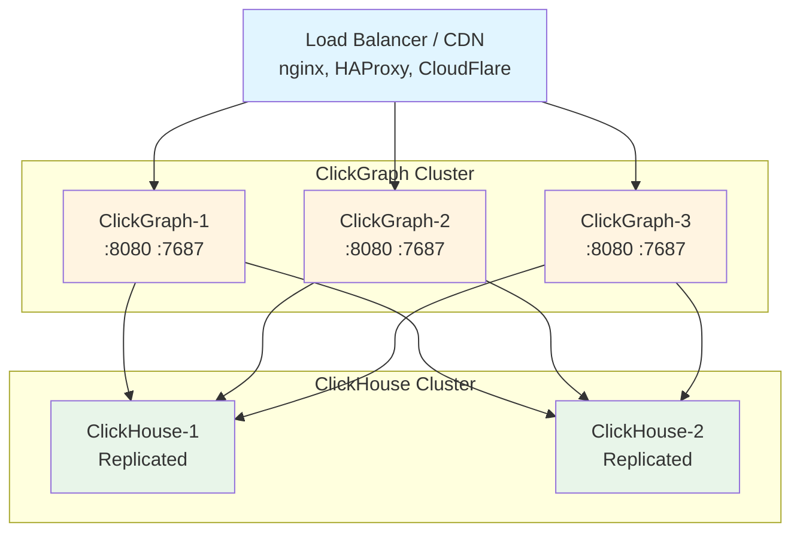

> **Note**: This documentation is for ClickGraph v0.5.2. [View latest docs →](../../wiki/Home.md)
# Production Best Practices

Comprehensive guide for deploying and operating ClickGraph in production environments.

## Table of Contents
- [Architecture Planning](#architecture-planning)
- [Security Hardening](#security-hardening)
- [Performance Optimization](#performance-optimization)
- [High Availability](#high-availability)
- [Monitoring and Observability](#monitoring-and-observability)
- [Backup and Disaster Recovery](#backup-and-disaster-recovery)
- [Operational Procedures](#operational-procedures)
- [Capacity Planning](#capacity-planning)

---

## Architecture Planning

### Recommended Production Architecture



**Components**:
- **ClickGraph Instances**: 3+ stateless instances behind load balancer
- **ClickHouse Cluster**: Replicated setup for high availability
- **Load Balancer**: Distributes traffic, SSL termination
- **Monitoring**: Prometheus + Grafana for metrics

### Sizing Guidelines

| Component | Small | Medium | Large |
|-----------|-------|--------|-------|
| **ClickGraph Instances** | 2 | 3-5 | 5-10+ |
| **ClickGraph CPU** | 2 cores | 4 cores | 8 cores |
| **ClickGraph Memory** | 2GB | 4GB | 8GB |
| **ClickHouse Nodes** | 1 | 2-3 | 3-10+ |
| **ClickHouse CPU** | 4 cores | 8 cores | 16+ cores |
| **ClickHouse Memory** | 8GB | 16-32GB | 64GB+ |
| **Expected QPS** | <100 | 100-1000 | 1000+ |
| **Graph Size** | <10M edges | 10M-100M | 100M-10B+ |

---

## Security Hardening

### 1. Network Security

**Firewall Rules**:
```bash
# Only allow necessary ports
# Production ClickGraph instances
iptables -A INPUT -p tcp --dport 8080 -s 10.0.0.0/8 -j ACCEPT  # Internal only
iptables -A INPUT -p tcp --dport 7687 -s 10.0.0.0/8 -j ACCEPT  # Internal only

# ClickHouse (internal only - never expose publicly)
iptables -A INPUT -p tcp --dport 8123 -s 10.0.1.0/24 -j ACCEPT  # From ClickGraph only
iptables -A INPUT -p tcp --dport 9000 -s 10.0.1.0/24 -j ACCEPT  # From ClickGraph only

# Deny all other traffic to these ports
iptables -A INPUT -p tcp --dport 8080 -j DROP
iptables -A INPUT -p tcp --dport 7687 -j DROP
iptables -A INPUT -p tcp --dport 8123 -j DROP
iptables -A INPUT -p tcp --dport 9000 -j DROP
```

**Network Segmentation**:
```yaml
# docker-compose with network isolation
networks:
  public:
    driver: bridge
    ipam:
      config:
        - subnet: 10.0.1.0/24
  
  backend:
    driver: bridge
    internal: true  # No external access
    ipam:
      config:
        - subnet: 10.0.2.0/24

services:
  clickgraph:
    networks:
      public:    # Client connections
        ipv4_address: 10.0.1.10
      backend:   # ClickHouse connections
        ipv4_address: 10.0.2.10
  
  clickhouse:
    networks:
      backend:   # No public network access
        ipv4_address: 10.0.2.20
```

### 2. Authentication and Authorization

**ClickHouse User Setup**:
```sql
-- Create dedicated ClickGraph user with minimal privileges
CREATE USER clickgraph_user IDENTIFIED BY 'strong_random_password';

-- Grant only necessary permissions
GRANT SELECT ON production_graph.* TO clickgraph_user;

-- For specific tables only
GRANT SELECT ON production_graph.users_bench TO clickgraph_user;
GRANT SELECT ON production_graph.user_follows_bench TO clickgraph_user;

-- Read-only role (no write access)
CREATE ROLE clickgraph_readonly;
GRANT SELECT ON production_graph.* TO clickgraph_readonly;
GRANT clickgraph_readonly TO clickgraph_user;

-- Verify permissions
SHOW GRANTS FOR clickgraph_user;
```

**RBAC Configuration** (ClickGraph):
```yaml
# Schema with role-based access
views:
  - name: tenant_data
    view_parameters: [tenant_id]
    nodes:
      User:
        source_table: users
        filters:
          - "tenant_id = ${tenant_id}"
```

**API Request with RBAC**:
```json
{
  "query": "MATCH (u:User) RETURN u.name LIMIT 10",
  "view_parameters": {"tenant_id": "acme"},
  "role": "viewer"
}
```

### 3. TLS/SSL Configuration

**Enable HTTPS for ClickGraph**:
```nginx
# nginx SSL termination
server {
    listen 443 ssl http2;
    server_name api.clickgraph.company.com;
    
    # Strong SSL configuration
    ssl_certificate /etc/ssl/certs/clickgraph.crt;
    ssl_certificate_key /etc/ssl/private/clickgraph.key;
    ssl_protocols TLSv1.2 TLSv1.3;
    ssl_ciphers 'ECDHE-ECDSA-AES128-GCM-SHA256:ECDHE-RSA-AES128-GCM-SHA256:ECDHE-ECDSA-AES256-GCM-SHA384:ECDHE-RSA-AES256-GCM-SHA384';
    ssl_prefer_server_ciphers on;
    ssl_session_cache shared:SSL:10m;
    ssl_session_timeout 10m;
    
    # HSTS
    add_header Strict-Transport-Security "max-age=31536000; includeSubDomains" always;
    
    # Additional security headers
    add_header X-Frame-Options "DENY" always;
    add_header X-Content-Type-Options "nosniff" always;
    add_header X-XSS-Protection "1; mode=block" always;
    add_header Referrer-Policy "no-referrer-when-downgrade" always;
    
    location / {
        proxy_pass http://clickgraph_backend;
        proxy_set_header Host $host;
        proxy_set_header X-Real-IP $remote_addr;
        proxy_set_header X-Forwarded-For $proxy_add_x_forwarded_for;
        proxy_set_header X-Forwarded-Proto $scheme;
    }
}
```

**ClickHouse SSL**:
```xml
<!-- /etc/clickhouse-server/config.d/ssl.xml -->
<yandex>
    <openSSL>
        <server>
            <certificateFile>/etc/clickhouse-server/server.crt</certificateFile>
            <privateKeyFile>/etc/clickhouse-server/server.key</privateKeyFile>
            <caConfig>/etc/clickhouse-server/ca.crt</caConfig>
            <verificationMode>strict</verificationMode>
            <loadDefaultCAFile>true</loadDefaultCAFile>
            <cacheSessions>true</cacheSessions>
            <disableProtocols>sslv2,sslv3</disableProtocols>
            <preferServerCiphers>true</preferServerCiphers>
        </server>
    </openSSL>
    
    <https_port>8443</https_port>
</yandex>
```

### 4. Input Validation

**Query Size Limits** (nginx):
```nginx
http {
    client_max_body_size 1m;  # Limit request size
    client_body_timeout 30s;
    client_header_timeout 30s;
}
```

**Rate Limiting** (nginx):
```nginx
# Define rate limit zones
limit_req_zone $binary_remote_addr zone=api_limit:10m rate=100r/s;
limit_req_zone $binary_remote_addr zone=burst_limit:10m rate=1000r/m;

server {
    location /query {
        # Apply rate limits
        limit_req zone=api_limit burst=20 nodelay;
        limit_req zone=burst_limit;
        
        proxy_pass http://clickgraph_backend;
    }
}
```

### 5. Secrets Management

**HashiCorp Vault Integration**:
```bash
# Store secrets in Vault
vault kv put secret/clickgraph/production \
  clickhouse_password="strong_password" \
  clickhouse_url="https://clickhouse.internal:8443"

# Retrieve at runtime
export CLICKHOUSE_PASSWORD=$(vault kv get -field=clickhouse_password secret/clickgraph/production)
```

**AWS Secrets Manager**:
```bash
# Store secret
aws secretsmanager create-secret \
  --name clickgraph/production/clickhouse \
  --secret-string '{"password":"strong_password","url":"https://clickhouse.internal:8443"}'

# Retrieve in Docker Compose
docker run \
  -e CLICKHOUSE_PASSWORD=$(aws secretsmanager get-secret-value --secret-id clickgraph/production/clickhouse --query SecretString --output text | jq -r .password) \
  clickgraph:latest
```

---

## Performance Optimization

### 1. ClickHouse Configuration

**Memory Settings** (`/etc/clickhouse-server/config.xml`):
```xml
<yandex>
    <!-- Memory limits -->
    <max_memory_usage>20000000000</max_memory_usage> <!-- 20GB -->
    <max_bytes_before_external_sort>30000000000</max_bytes_before_external_sort>
    <max_bytes_before_external_group_by>30000000000</max_bytes_before_external_group_by>
    
    <!-- Performance settings -->
    <max_threads>8</max_threads>
    <max_concurrent_queries>100</max_concurrent_queries>
    
    <!-- Connection pooling -->
    <keep_alive_timeout>30</keep_alive_timeout>
    <max_connections>4096</max_connections>
</yandex>
```

**Table Optimization**:
```sql
-- Use optimal table engines
CREATE TABLE users_bench (
    user_id UInt64,
    full_name String,
    email_address String,
    country String,
    city String,
    registration_date Date,
    is_active UInt8
) ENGINE = MergeTree()
ORDER BY (country, city, user_id)  -- Order by common filters
PARTITION BY toYYYYMM(registration_date)  -- Partition by month
SETTINGS index_granularity = 8192;

-- For mutable data (updates/deletes)
CREATE TABLE users_mutable (
    user_id UInt64,
    full_name String,
    version UInt64,
    is_deleted UInt8 DEFAULT 0
) ENGINE = ReplacingMergeTree(version)
ORDER BY user_id
SETTINGS index_granularity = 8192;

-- Optimize after bulk inserts
OPTIMIZE TABLE users_bench FINAL;
```

**Indexes for Graph Queries**:
```sql
-- Primary key for user lookups
ORDER BY (user_id)  -- Fast user_id = X queries

-- Composite key for filtered scans
ORDER BY (country, city, user_id)  -- Fast country+city filters

-- For relationship tables
CREATE TABLE user_follows_bench (
    follower_id UInt64,
    followed_id UInt64,
    follow_date Date
) ENGINE = MergeTree()
ORDER BY (follower_id, followed_id)  -- Fast forward traversals
;

-- Reverse index for backward traversals
CREATE MATERIALIZED VIEW user_follows_reverse
ENGINE = MergeTree()
ORDER BY (followed_id, follower_id)
AS SELECT followed_id, follower_id, follow_date
FROM user_follows_bench;
```

### 2. Query Caching

ClickGraph includes built-in query plan caching (10-100x speedup):

```bash
# Cache is enabled by default
# No configuration needed!

# First query: ~100ms (cold cache)
# Second query: ~1ms (cached plan)
```

**Cache Statistics** (via logs):
```
[INFO] Query plan cache hit rate: 87.3%
[INFO] Cache entries: 1,247 / 10,000
[INFO] Average cache hit speedup: 42x
```

### 3. Connection Pooling

**ClickHouse Connection Pool** (automatic in ClickGraph):
- Default pool size: 10 connections
- Reuses connections for multiple queries
- Automatic reconnection on failure

**nginx Connection Pooling**:
```nginx
upstream clickgraph_backend {
    server clickgraph-1:8080 max_fails=3 fail_timeout=30s;
    server clickgraph-2:8080 max_fails=3 fail_timeout=30s;
    
    keepalive 64;  # Keep 64 connections alive
}

server {
    location / {
        proxy_pass http://clickgraph_backend;
        proxy_http_version 1.1;
        proxy_set_header Connection "";  # Reuse connections
    }
}
```

### 4. Resource Limits

**ClickGraph Container Limits**:
```yaml
deploy:
  resources:
    limits:
      cpus: '4'
      memory: 4G
    reservations:
      cpus: '1'
      memory: 1G
      
# Or with docker run
docker run \
  --cpus=4 \
  --memory=4g \
  --memory-reservation=1g \
  clickgraph:latest
```

**Query Timeouts**:
```nginx
# nginx proxy timeouts
proxy_connect_timeout 10s;
proxy_send_timeout 60s;
proxy_read_timeout 60s;
```

---

## High Availability

### 1. ClickGraph Redundancy

**Stateless Design**: ClickGraph is stateless, making it easy to scale horizontally.

```yaml
# Run 3+ instances for HA
services:
  clickgraph:
    image: clickgraph:latest
    deploy:
      replicas: 3
      update_config:
        parallelism: 1      # Update 1 at a time
        delay: 10s
        order: start-first  # Start new before stopping old
      restart_policy:
        condition: on-failure
        delay: 5s
        max_attempts: 3
```

**Health Checks**:
```yaml
healthcheck:
  test: ["CMD", "curl", "-f", "http://localhost:8080/health"]
  interval: 30s
  timeout: 10s
  retries: 3
  start_period: 40s
```

### 2. ClickHouse Replication

**ReplicatedMergeTree Setup**:
```sql
-- On CH-1
CREATE TABLE users_bench ON CLUSTER production (
    user_id UInt64,
    full_name String,
    ...
) ENGINE = ReplicatedMergeTree('/clickhouse/tables/{shard}/users_bench', '{replica}')
ORDER BY user_id;

-- On CH-2 (automatically synced)
-- Same table definition
```

**ClickHouse Cluster Configuration** (`/etc/clickhouse-server/config.d/cluster.xml`):
```xml
<yandex>
    <remote_servers>
        <production_cluster>
            <shard>
                <replica>
                    <host>clickhouse-1</host>
                    <port>9000</port>
                </replica>
                <replica>
                    <host>clickhouse-2</host>
                    <port>9000</port>
                </replica>
            </shard>
        </production_cluster>
    </remote_servers>
    
    <zookeeper>
        <node>
            <host>zookeeper-1</host>
            <port>2181</port>
        </node>
        <node>
            <host>zookeeper-2</host>
            <port>2181</port>
        </node>
        <node>
            <host>zookeeper-3</host>
            <port>2181</port>
        </node>
    </zookeeper>
</yandex>
```

### 3. Load Balancer HA

**HAProxy Active-Passive**:
```cfg
# /etc/haproxy/haproxy.cfg
frontend clickgraph_http
    bind *:80
    bind *:443 ssl crt /etc/ssl/clickgraph.pem
    default_backend clickgraph_servers

backend clickgraph_servers
    balance leastconn
    option httpchk GET /health
    http-check expect status 200
    
    server cg1 10.0.1.10:8080 check inter 5s fall 3 rise 2
    server cg2 10.0.1.11:8080 check inter 5s fall 3 rise 2
    server cg3 10.0.1.12:8080 check inter 5s fall 3 rise 2
```

**Keepalived for LB HA**:
```cfg
# /etc/keepalived/keepalived.conf
vrrp_instance VI_1 {
    state MASTER
    interface eth0
    virtual_router_id 51
    priority 100
    advert_int 1
    
    virtual_ipaddress {
        10.0.1.100/24
    }
}
```

### 4. Graceful Shutdown

```bash
# Graceful shutdown (drain connections)
docker stop -t 30 clickgraph  # 30 second grace period

# Zero-downtime deployment
docker-compose up -d --no-deps --scale clickgraph=4  # Scale up
sleep 30  # Wait for health checks
docker-compose up -d --no-deps --scale clickgraph=3  # Scale down old
```

---

## Monitoring and Observability

### 1. Metrics Collection

**Prometheus Metrics** (built-in):
```yaml
# Expose metrics endpoint
services:
  clickgraph:
    ports:
      - "9090:9090"  # Metrics port
```

**Key Metrics to Monitor**:
- `clickgraph_requests_total` - Total requests
- `clickgraph_request_duration_seconds` - Request latency
- `clickgraph_cache_hits_total` - Cache hit rate
- `clickgraph_clickhouse_queries_total` - ClickHouse queries
- `clickgraph_errors_total` - Error count

**Prometheus Configuration** (`prometheus.yml`):
```yaml
scrape_configs:
  - job_name: 'clickgraph'
    static_configs:
      - targets: ['clickgraph-1:9090', 'clickgraph-2:9090', 'clickgraph-3:9090']
    scrape_interval: 15s
  
  - job_name: 'clickhouse'
    static_configs:
      - targets: ['clickhouse-1:9363', 'clickhouse-2:9363']
    scrape_interval: 30s
```

### 2. Logging

**Structured Logging**:
```bash
# JSON logs for easy parsing
export RUST_LOG=info
export LOG_FORMAT=json

# Sample log entry
{
  "timestamp": "2025-11-17T14:30:00Z",
  "level": "INFO",
  "message": "Query executed",
  "query": "MATCH (u:User) RETURN count(u)",
  "duration_ms": 42,
  "cache_hit": true
}
```

**Log Aggregation** (ELK Stack):
```yaml
services:
  clickgraph:
    logging:
      driver: "fluentd"
      options:
        fluentd-address: "localhost:24224"
        tag: "clickgraph"

  fluentd:
    image: fluent/fluentd:latest
    volumes:
      - ./fluentd.conf:/fluentd/etc/fluent.conf
    ports:
      - "24224:24224"
```

**Log Rotation**:
```yaml
logging:
  driver: "json-file"
  options:
    max-size: "10m"
    max-file: "5"
    compress: "true"
```

### 3. Alerting

**Prometheus Alertmanager** (`alerts.yml`):
```yaml
groups:
  - name: clickgraph_alerts
    interval: 30s
    rules:
      - alert: ClickGraphDown
        expr: up{job="clickgraph"} == 0
        for: 2m
        labels:
          severity: critical
        annotations:
          summary: "ClickGraph instance down"
          
      - alert: HighErrorRate
        expr: rate(clickgraph_errors_total[5m]) > 0.05
        for: 5m
        labels:
          severity: warning
        annotations:
          summary: "High error rate: {{ $value }}%"
          
      - alert: SlowQueries
        expr: histogram_quantile(0.95, clickgraph_request_duration_seconds) > 1
        for: 10m
        labels:
          severity: warning
        annotations:
          summary: "95th percentile latency > 1s"
          
      - alert: LowCacheHitRate
        expr: rate(clickgraph_cache_hits_total[10m]) / rate(clickgraph_requests_total[10m]) < 0.5
        for: 30m
        labels:
          severity: info
        annotations:
          summary: "Cache hit rate below 50%"
```

### 4. Distributed Tracing

**OpenTelemetry Integration** (planned feature):
```yaml
environment:
  OTEL_EXPORTER_OTLP_ENDPOINT: "http://jaeger:4317"
  OTEL_SERVICE_NAME: "clickgraph"
  OTEL_TRACES_SAMPLER: "parentbased_traceidratio"
  OTEL_TRACES_SAMPLER_ARG: "0.1"  # Sample 10% of traces
```

---

## Backup and Disaster Recovery

### 1. ClickHouse Backup Strategy

**Full Backup**:
```bash
# Using clickhouse-backup tool
docker run --rm \
  --network host \
  -v /var/lib/clickhouse:/var/lib/clickhouse:ro \
  -v /backups:/backups \
  alexakulov/clickhouse-backup \
  backup full_$(date +%Y%m%d)

# Incremental backup
clickhouse-backup backup incremental_$(date +%Y%m%d)
```

**Automated Backup Script** (`backup.sh`):
```bash
#!/bin/bash
set -e

BACKUP_DIR="/backups/clickhouse"
RETENTION_DAYS=30

# Full backup weekly (Sunday)
if [ $(date +%u) -eq 7 ]; then
    clickhouse-backup backup full_$(date +%Y%m%d)
else
    # Incremental daily
    clickhouse-backup backup incremental_$(date +%Y%m%d)
fi

# Upload to S3
aws s3 sync $BACKUP_DIR s3://my-bucket/clickhouse-backups/

# Clean old backups
find $BACKUP_DIR -type f -mtime +$RETENTION_DAYS -delete

echo "Backup completed: $(date)"
```

**Cron Schedule**:
```cron
# Daily backup at 2 AM
0 2 * * * /usr/local/bin/backup.sh >> /var/log/clickhouse-backup.log 2>&1
```

### 2. Schema Backup

```bash
# Git repository for schemas
git init /app/schemas
cd /app/schemas
git add .
git commit -m "Schema snapshot $(date +%Y%m%d)"
git push origin main

# Automated schema versioning
#!/bin/bash
cd /app/schemas
if [ -n "$(git status --porcelain)" ]; then
    git add .
    git commit -m "Auto-backup $(date +%Y-%m-%d_%H:%M:%S)"
    git push origin main
fi
```

### 3. Disaster Recovery Plan

**RTO/RPO Targets**:
- **RTO** (Recovery Time Objective): < 1 hour
- **RPO** (Recovery Point Objective): < 24 hours

**Recovery Procedure**:
```bash
# 1. Restore ClickHouse data
clickhouse-backup restore full_20251117

# 2. Verify data integrity
docker exec clickhouse clickhouse-client -q "SELECT count(*) FROM users_bench"

# 3. Start ClickGraph instances
docker-compose up -d clickgraph

# 4. Verify health
curl http://clickgraph-lb/health

# 5. Run smoke tests
./tests/smoke_test.sh
```

### 4. Cross-Region Replication

```bash
# S3 cross-region replication
aws s3api put-bucket-replication \
  --bucket my-bucket \
  --replication-configuration file://replication.json

# replication.json
{
  "Role": "arn:aws:iam::123456789012:role/s3-replication",
  "Rules": [{
    "Status": "Enabled",
    "Priority": 1,
    "Filter": {"Prefix": "clickhouse-backups/"},
    "Destination": {
      "Bucket": "arn:aws:s3:::my-bucket-dr",
      "ReplicationTime": {"Status": "Enabled", "Time": {"Minutes": 15}}
    }
  }]
}
```

---

## Operational Procedures

### 1. Deployment Checklist

**Pre-Deployment**:
- [ ] Run all tests (`cargo test --all`)
- [ ] Update CHANGELOG.md
- [ ] Tag release (`git tag v0.4.0`)
- [ ] Build Docker image
- [ ] Push to registry
- [ ] Update staging environment
- [ ] Run smoke tests on staging
- [ ] Review metrics/logs on staging
- [ ] Schedule maintenance window

**Deployment**:
- [ ] Scale up new version
- [ ] Wait for health checks
- [ ] Monitor error rates
- [ ] Scale down old version
- [ ] Verify metrics
- [ ] Run integration tests

**Post-Deployment**:
- [ ] Monitor for 1 hour
- [ ] Check error logs
- [ ] Verify cache hit rates
- [ ] Update documentation
- [ ] Notify team

### 2. Rolling Updates

```bash
# Zero-downtime rolling update
docker service update \
  --image clickgraph:v0.4.0 \
  --update-parallelism 1 \
  --update-delay 30s \
  --update-order start-first \
  clickgraph_app

# Monitor rollout
watch docker service ps clickgraph_app
```

### 3. Rollback Procedure

```bash
# Quick rollback
docker service update \
  --rollback \
  clickgraph_app

# Or manual rollback
docker service update \
  --image clickgraph:v0.3.0 \
  clickgraph_app
```

### 4. Maintenance Tasks

**Weekly**:
- Review error logs
- Check disk usage
- Verify backup completion
- Review metrics dashboards

**Monthly**:
- Update dependencies
- Rotate SSL certificates (if near expiry)
- Review and optimize slow queries
- Capacity planning review

**Quarterly**:
- Disaster recovery drill
- Security audit
- Performance testing
- Update documentation

---

## Capacity Planning

### 1. Resource Monitoring

**Track These Metrics**:
```
# ClickGraph
- Request rate (QPS)
- Response time (p50, p95, p99)
- Error rate
- Cache hit rate
- Memory usage
- CPU utilization

# ClickHouse
- Query execution time
- Concurrent queries
- Disk usage
- Network throughput
- Replication lag
```

### 2. Scaling Triggers

**Scale ClickGraph When**:
- CPU > 70% for 10 minutes
- Memory > 80% for 10 minutes
- p95 latency > 1 second
- Error rate > 1%

**Scale ClickHouse When**:
- Disk > 80% used
- CPU > 80% for 30 minutes
- Query queue depth > 100
- Replication lag > 60 seconds

### 3. Growth Projections

```python
# Simple capacity calculator
current_qps = 500
growth_rate = 0.2  # 20% per month
months = 12

future_qps = current_qps * (1 + growth_rate) ** months
instances_needed = future_qps / 1000  # 1000 QPS per instance

print(f"In {months} months: {future_qps:.0f} QPS, {instances_needed:.0f} instances")
```

---

## Next Steps

Now that you understand production best practices:

- **[Performance Tuning](Performance-Query-Optimization.md)** - Optimize query performance
- **[Monitoring Guide](Monitoring-Observability.md)** - Set up comprehensive monitoring
- **[Kubernetes Deployment](Kubernetes-Deployment.md)** - Deploy on K8s
- **[Troubleshooting](Troubleshooting-Guide.md)** - Debug production issues

---

[← Back: Docker Deployment](Docker-Deployment.md) | [Home](Home.md) | [Next: Performance Tuning →](Performance-Query-Optimization.md)
