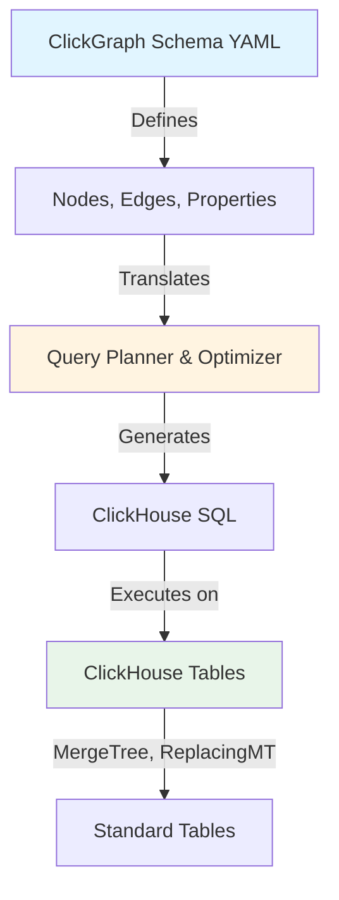

# Schema Configuration: Advanced Guide

Comprehensive guide to advanced schema configuration, optimization, and best practices for ClickGraph.

## Table of Contents
- [Schema Architecture](#schema-architecture)
- [Advanced Property Mappings](#advanced-property-mappings)
- [Multi-Schema Management](#multi-schema-management)
- [Dynamic Schema Features](#dynamic-schema-features)
- [Schema Validation](#schema-validation)
- [Performance Optimization](#performance-optimization)
- [Advanced Use Cases](#advanced-use-cases)
- [Migration Strategies](#migration-strategies)

---

## Schema Architecture

### Understanding ClickGraph's View-Based Model

ClickGraph uses a **view-based architecture** - it doesn't require special graph tables. Instead, it maps your existing ClickHouse tables to graph entities.



**Key Principles**:
1. **Non-invasive**: Works with existing tables
2. **Flexible**: Multiple views of same data
3. **Optimizable**: Leverage ClickHouse performance
4. **Multi-tenant**: Schema-level isolation

### Schema File Structure

```yaml
# Complete schema structure
name: production_graph
version: "1.0"
description: "Production social network graph"

graph_schema:
  nodes:
    - label: User
      database: brahmand
      table: users_bench
      id_column: user_id
      property_mappings:
        user_id: user_id
        name: full_name
        email: email_address
        registration_date: registration_date
        is_active: is_active
        country: country
        city: city
    
    - label: Post
      database: brahmand
      table: posts_bench
      id_column: post_id
      property_mappings:
        post_id: post_id
        title: post_title
        content: post_content
        date: post_date
  
  edges:
    - type: FOLLOWS
      database: brahmand
      table: user_follows_bench
      from_id: follower_id
      to_id: followed_id
      from_node: User
      to_node: User
      property_mappings:
        follow_date: follow_date
    
    - type: AUTHORED
      database: brahmand
      table: posts_bench
      from_id: author_id
      to_id: post_id
      from_node: User
      to_node: Post
      property_mappings:
        post_date: post_date
```

---

## Advanced Property Mappings

### 1. Computed Properties

**Scenario**: Derive properties from expressions.

```yaml
nodes:
  - label: User
    database: brahmand
    table: users
    id_column: user_id
    property_mappings:
      user_id: user_id
      name: full_name
      
      # Computed: Full name from first + last
      display_name: "concat(first_name, ' ', last_name)"
      
      # Computed: Age from birth_date
      age: "dateDiff('year', birth_date, today())"
      
      # Computed: Account age in days
      account_age: "dateDiff('day', registration_date, today())"
      
      # Computed: Active status
      # ⚠️ Conditionals not yet supported - use query time:
      # is_active: "last_login_date >= today() - INTERVAL 30 DAY"
```

**Usage**:
```cypher
MATCH (u:User)
WHERE u.age >= 18 AND u.is_active = true
RETURN u.display_name, u.account_age
```

**Generated SQL**:
```sql
SELECT 
    concat(first_name, ' ', last_name) AS display_name,
    dateDiff('day', registration_date, today()) AS account_age
FROM users
WHERE dateDiff('year', birth_date, today()) >= 18
  AND (last_login_date >= today() - INTERVAL 30 DAY) = 1
```

### 2. Type Conversions

```yaml
nodes:
  User:
    property_mappings:
      user_id: "user_id"
      
      # String to Date
      registration_date: "toDate(registration_date_str)"
      
      # String to Number
      age: "toUInt8(age_str)"
      
      # JSON parsing
      metadata: "JSONExtractString(metadata_json, 'key')"
      
      # Array from comma-separated
      tags: "splitByChar(',', tags_str)"
```

### 3. Conditional Mappings

<!-- ⚠️ NOT YET SUPPORTED - Planned for future release
     Conditional expressions (CASE WHEN, multiIf) in property mappings
     are not currently supported. Use query-time expressions instead.
     
     For now, use: WHERE CASE WHEN ... or multiIf() in RETURN clause

```yaml
nodes:
  User:
    property_mappings:
      user_id: "user_id"
      
      # Tier based on score
      tier: "CASE 
               WHEN score >= 1000 THEN 'gold'
               WHEN score >= 500 THEN 'silver'
               ELSE 'bronze'
             END"
      
      # Status from multiple conditions
      status: "multiIf(
                 is_deleted = 1, 'deleted',
                 is_banned = 1, 'banned',
                 is_active = 0, 'inactive',
                 'active'
               )"
```
-->

### 4. Edge Properties

```yaml
edges:  # YAML key 'relationships:' is accepted for backward compatibility
  FOLLOWS:
    source_table: "user_follows"
    from_node: "User"
    to_node: "User"
    from_property: "follower_id"
    to_property: "followed_id"
    
    property_mappings:
      since: "follow_date"
      duration: "dateDiff('day', follow_date, today())"
      # ⚠️ Conditionals not yet supported:
      # is_recent: "follow_date >= today() - INTERVAL 30 DAY"
      
      # Mathematical expressions are supported:
      strength: "interaction_count / 100.0"
```

**Usage**:
```cypher
MATCH (u1:User)-[r:FOLLOWS]->(u2:User)
WHERE r.is_recent = true AND r.strength > 0.5
RETURN u1.name, u2.name, r.duration
```

---

## Multi-Schema Management

### 1. Multiple Schemas in Production

**Use Cases**:
- Multi-tenancy (per-tenant schemas)
- Different data environments (staging, production)
- Multiple graph models (social, commerce, knowledge)

**Architecture**:
```yaml
# Schema 1: Social Network
schema:
  name: "social_graph"
views:
  - name: "social_network"
    nodes:
      User: ...
      Post: ...

---
# Schema 2: E-commerce
schema:
  name: "commerce_graph"
views:
  - name: "ecommerce"
    nodes:
      Customer: ...
      Product: ...
      Order: ...
```

### 2. Schema Selection via USE Clause

```cypher
-- Select schema explicitly
USE social_graph;
MATCH (u:User) RETURN u.name LIMIT 10;

-- Switch to different schema
USE commerce_graph;
MATCH (c:Customer) RETURN c.name LIMIT 10;
```

### 3. Per-Request Schema Selection

```bash
# Via HTTP API
curl -X POST http://localhost:8080/query \
  -H "Content-Type: application/json" \
  -d '{
    "query": "MATCH (u:User) RETURN u.name LIMIT 10",
    "schema_name": "social_graph"
  }'
```

```python
# Via Python client
import requests

def query_with_schema(query: str, schema: str):
    response = requests.post('http://localhost:8080/query', json={
        'query': query,
        'schema_name': schema
    })
    return response.json()

# Query social graph
result = query_with_schema(
    "MATCH (u:User) RETURN count(u)",
    "social_graph"
)

# Query commerce graph
result = query_with_schema(
    "MATCH (c:Customer) RETURN count(c)",
    "commerce_graph"
)
```

### 4. Schema Registration

**At Server Startup**:
```bash
# Load multiple schemas
export GRAPH_CONFIG_PATH="schemas/social.yaml,schemas/commerce.yaml,schemas/knowledge.yaml"

# Or via CLI
clickgraph \
  --schema schemas/social.yaml \
  --schema schemas/commerce.yaml \
  --schema schemas/knowledge.yaml
```

**Dynamic Registration** (via HTTP API):
```bash
# Load schema from file
curl -X POST http://localhost:8080/schemas/load \
  -H "Content-Type: application/json" \
  -d "$(jq -Rs '{schema_name: "new_graph", config_content: ., validate_schema: true}' new_schema.yaml)"

# Or with inline YAML content
curl -X POST http://localhost:8080/schemas/load \
  -H "Content-Type: application/json" \
  -d '{
    "schema_name": "new_graph",
    "config_content": "name: new_graph\ngraph_schema:\n  nodes: ...",
    "validate_schema": true
  }'
```

---

## Dynamic Schema Features

### 1. Parameterized Views (Multi-Tenancy)

**Schema with Parameters**:
```yaml
views:
  - name: "tenant_data"
    view_parameters: ["tenant_id"]
    
    nodes:
      User:
        source_table: "users"
        identifier_property: "user_id"
        filters:
          - "tenant_id = ${tenant_id}"
        property_mappings:
          user_id: "user_id"
          name: "full_name"
      
      Post:
        source_table: "posts"
        identifier_property: "post_id"
        filters:
          - "tenant_id = ${tenant_id}"
        property_mappings:
          post_id: "post_id"
          content: "post_content"
    
    edges:
      AUTHORED:
        source_table: "posts"
        from_node: "User"
        to_node: "Post"
        from_property: "author_id"
        to_property: "post_id"
        filters:
          - "tenant_id = ${tenant_id}"
```

**Usage**:
```bash
# Query for specific tenant
curl -X POST http://localhost:8080/query \
  -H "Content-Type: application/json" \
  -d '{
    "query": "MATCH (u:User) RETURN u.name",
    "view_parameters": {"tenant_id": "acme_corp"}
  }'
```

**Generated SQL** (automatically includes tenant filter):
```sql
SELECT full_name AS name
FROM users
WHERE tenant_id = 'acme_corp'
```

### 2. Time-Based Views

```yaml
views:
  - name: "recent_activity"
    view_parameters: ["days_back"]
    
    nodes:
      Post:
        source_table: "posts"
        filters:
          - "post_date >= today() - INTERVAL ${days_back} DAY"
        property_mappings:
          post_id: "post_id"
          content: "post_content"
    
    edges:
      LIKED:
        source_table: "post_likes"
        filters:
          - "like_date >= today() - INTERVAL ${days_back} DAY"
        from_node: "User"
        to_node: "Post"
```

**Usage**:
```json
{
  "query": "MATCH (u:User)-[:LIKED]->(p:Post) RETURN count(p)",
  "view_parameters": {"days_back": "7"}
}
```

### 3. Region-Based Views

```yaml
views:
  - name: "regional_data"
    view_parameters: ["region"]
    
    nodes:
      User:
        source_table: "users"
        filters:
          - "country IN (SELECT country FROM regions WHERE region = ${region})"
        property_mappings:
          user_id: "user_id"
          name: "full_name"
          country: "country"
```

---

## Schema Validation

### 1. Validation at Load Time

ClickGraph validates schemas when loading:

```bash
# Load schema with validation
export GRAPH_CONFIG_PATH="schemas/my_schema.yaml"
cargo run --bin clickgraph

# Output if valid:
[INFO] Schema loaded successfully: my_schema
[INFO] Nodes: 5, Edges: 8
[INFO] Validation: PASSED

# Output if invalid:
[ERROR] Schema validation failed: my_schema
[ERROR] Node 'User' references undefined source_table 'users_table'
[ERROR] Edge 'FOLLOWS' references undefined node 'UserProfile'
```

### 2. Common Validation Errors

**Missing Source Table**:
```yaml
nodes:
  User:
    source_table: "users_bench"  # Table must exist
    identifier_property: "user_id"
```

**Undefined Node Reference**:
```yaml
edges:
  FOLLOWS:
    from_node: "User"     # Must be defined in nodes
    to_node: "UserProfile"  # ❌ ERROR: Not defined!
```

**Missing Identifier Property**:
```yaml
nodes:
  User:
    source_table: "users"
    # ❌ ERROR: identifier_property required
    property_mappings:
      name: "full_name"
```

**Invalid Property Mapping**:
```yaml
nodes:
  User:
    source_table: "users"
    identifier_property: "user_id"
    property_mappings:
      user_id: "user_id"
      name: "nonexistent_column"  # ⚠️ Warning: Column doesn't exist
```

### 3. Schema Testing Script

```python
# test_schema.py
import yaml
import requests
import sys

def validate_schema(schema_path: str):
    """Validate schema by loading and testing queries."""
    
    # 1. Parse YAML
    with open(schema_path) as f:
        schema = yaml.safe_load(f)
    
    print(f"✓ YAML syntax valid")
    
    # 2. Check required fields
    assert 'schema' in schema, "Missing 'schema' key"
    assert 'views' in schema['schema'], "Missing 'views'"
    print(f"✓ Required fields present")
    
    # 3. Test basic query
    response = requests.post('http://localhost:8080/query', json={
        'query': 'MATCH (n) RETURN count(n) LIMIT 1'
    })
    
    if response.status_code == 200:
        print(f"✓ Schema loaded successfully")
        print(f"  Result: {response.json()}")
    else:
        print(f"✗ Schema validation failed: {response.text}")
        sys.exit(1)

if __name__ == '__main__':
    validate_schema(sys.argv[1])
```

**Usage**:
```bash
python test_schema.py schemas/my_schema.yaml
```

---

## Performance Optimization

### 1. Indexed Property Selection

**Choose identifier_property wisely**:

```yaml
# ✅ GOOD: Primary key is user_id
nodes:
  User:
    source_table: "users"
    identifier_property: "user_id"  # Indexed column
    property_mappings:
      user_id: "user_id"

# ❌ BAD: Email is not indexed
nodes:
  User:
    source_table: "users"
    identifier_property: "email"  # Not indexed!
```

**Impact**:
```cypher
-- With user_id (indexed): ~1ms
MATCH (u:User {user_id: 1}) RETURN u.name

-- With email (not indexed): ~100ms
MATCH (u:User {email: 'alice@example.com'}) RETURN u.name
```

### 2. Bidirectional Edge Optimization

**Create Reverse Indexes**:

```yaml
# Forward edge
edges:  # YAML key 'relationships:' is accepted for backward compatibility
  FOLLOWS:
    source_table: "user_follows"
    from_node: "User"
    to_node: "User"
    from_property: "follower_id"  # Indexed
    to_property: "followed_id"

# Reverse edge (uses materialized view)
  FOLLOWED_BY:
    source_table: "user_follows_reverse"  # Materialized view
    from_node: "User"
    to_node: "User"
    from_property: "followed_id"  # Indexed
    to_property: "follower_id"
```

**ClickHouse Setup**:
```sql
-- Materialized view for reverse lookups
CREATE MATERIALIZED VIEW user_follows_reverse
ENGINE = MergeTree()
ORDER BY (followed_id, follower_id)
AS SELECT followed_id, follower_id, follow_date
FROM user_follows;
```

**Performance**:
```cypher
-- Forward: Uses user_follows (fast)
MATCH (u:User {user_id: 1})-[:FOLLOWS]->(friend)
RETURN friend.name

-- Backward: Uses user_follows_reverse (also fast!)
MATCH (u:User {user_id: 1})<-[:FOLLOWS]-(follower)
RETURN follower.name
```

### 3. Property Projection Optimization

**Only map properties you need**:

```yaml
# ❌ BAD: Map all columns (bloats results)
nodes:
  User:
    property_mappings:
      user_id: "user_id"
      name: "full_name"
      email: "email_address"
      bio: "biography"
      avatar: "avatar_url"
      created_at: "registration_date"
      # ... 50 more columns

# ✅ GOOD: Map only commonly used properties
nodes:
  User:
    property_mappings:
      user_id: "user_id"
      name: "full_name"
      email: "email_address"
      # Query-specific properties can be added later
```

### 4. Filter Pushdown

**Use filters in schema**:

```yaml
views:
  - name: "active_users_only"
    nodes:
      User:
        source_table: "users"
        filters:
          - "is_active = 1"
          - "deleted_at IS NULL"
        property_mappings:
          user_id: "user_id"
          name: "full_name"
```

**Benefit**: Filters applied at table scan level (fastest).

---

## Advanced Use Cases

### 1. Temporal Graphs

**Model time-varying connections**:

```yaml
edges:  # YAML key 'relationships:' is accepted for backward compatibility
  EMPLOYED_BY:
    source_table: "employment_history"
    from_node: "Person"
    to_node: "Company"
    from_property: "person_id"
    to_property: "company_id"
    property_mappings:
      start_date: "start_date"
      end_date: "end_date"
      title: "job_title"
      is_current: "end_date IS NULL"
```

**Queries**:
```cypher
-- Current employment
MATCH (p:Person)-[r:EMPLOYED_BY]->(c:Company)
WHERE r.is_current = true
RETURN p.name, c.name, r.title

-- Employment during specific period
MATCH (p:Person)-[r:EMPLOYED_BY]->(c:Company)
WHERE r.start_date <= '2023-01-01' 
  AND (r.end_date IS NULL OR r.end_date >= '2023-01-01')
RETURN p.name, c.name
```

### 2. Hierarchical Data

**Model tree structures**:

```yaml
edges:
  REPORTS_TO:
    source_table: "employee_hierarchy"
    from_node: "Employee"
    to_node: "Employee"
    from_property: "employee_id"
    to_property: "manager_id"
    property_mappings:
      since: "reporting_start_date"
```

**Queries**:
```cypher
-- Direct reports
MATCH (manager:Employee {employee_id: 1})<-[:REPORTS_TO]-(report:Employee)
RETURN report.name

-- Entire reporting chain
MATCH path = (employee:Employee {employee_id: 42})-[:REPORTS_TO*]->(ceo:Employee)
WHERE NOT (ceo)-[:REPORTS_TO]->()
RETURN [n IN nodes(path) | n.name] AS chain
```

### 3. Weighted Graphs

**Model edge weights**:

```yaml
edges:  # YAML key 'relationships:' is accepted for backward compatibility
  SIMILAR_TO:
    source_table: "product_similarity"
    from_node: "Product"
    to_node: "Product"
    from_property: "product_a_id"
    to_property: "product_b_id"
    property_mappings:
      similarity: "similarity_score"
      method: "similarity_method"
```

**Queries**:
```cypher
-- High similarity products
MATCH (p1:Product {product_id: 123})-[r:SIMILAR_TO]->(p2:Product)
WHERE r.similarity > 0.8
RETURN p2.name, r.similarity
ORDER BY r.similarity DESC
LIMIT 10
```

### 4. Multi-Modal Graphs

**Mix different entity types**:

```yaml
views:
  - name: "knowledge_graph"
    nodes:
      Person:
        source_table: "persons"
        identifier_property: "person_id"
      
      Company:
        source_table: "companies"
        identifier_property: "company_id"
      
      Location:
        source_table: "locations"
        identifier_property: "location_id"
      
      Skill:
        source_table: "skills"
        identifier_property: "skill_id"
    
    edges:
      WORKS_AT:
        from_node: "Person"
        to_node: "Company"
      
      LOCATED_IN:
        from_node: "Company"
        to_node: "Location"
      
      HAS_SKILL:
        from_node: "Person"
        to_node: "Skill"
```

**Queries**:
```cypher
-- Find Python developers in San Francisco companies
MATCH (p:Person)-[:HAS_SKILL]->(s:Skill {name: 'Python'})
MATCH (p)-[:WORKS_AT]->(c:Company)-[:LOCATED_IN]->(l:Location {city: 'San Francisco'})
RETURN p.name, c.name
```

---

## Migration Strategies

### 1. Schema Versioning

**Version Your Schemas**:
```yaml
schema:
  name: "social_graph"
  version: "2.0"  # Increment on breaking changes
  changelog:
    - version: "2.0"
      date: "2025-11-17"
      changes: "Added Post.sentiment property"
    - version: "1.0"
      date: "2025-01-01"
      changes: "Initial schema"
```

### 2. Backward Compatible Changes

**✅ Safe Changes** (non-breaking):
- Add new nodes
- Add new edges
- Add new properties to existing nodes
- Add new views

```yaml
# v1.0 → v1.1 (backward compatible)
nodes:
  User:
    property_mappings:
      user_id: "user_id"
      name: "full_name"
      email: "email_address"
      # NEW in v1.1
      phone: "phone_number"  # ✅ Safe: Existing queries still work
```

**❌ Breaking Changes**:
- Rename nodes or edge types
- Remove properties
- Change identifier_property
- Change edge direction

```yaml
# v1.0 → v2.0 (breaking!)
nodes:
  User:
    identifier_property: "email"  # ❌ Breaking: Was "user_id"
```

### 3. Blue-Green Schema Deployment

```bash
# Step 1: Deploy new schema alongside old
export GRAPH_CONFIG_PATH="schemas/v1.yaml,schemas/v2.yaml"

# Step 2: Gradually migrate clients
# Old clients: USE schema_v1
# New clients: USE schema_v2

# Step 3: Remove old schema when all clients migrated
export GRAPH_CONFIG_PATH="schemas/v2.yaml"
```

### 4. Schema Migration Script

```python
# migrate_schema.py
import yaml

def migrate_v1_to_v2(v1_path: str, v2_path: str):
    """Migrate schema from v1 to v2."""
    
    with open(v1_path) as f:
        v1 = yaml.safe_load(f)
    
    # Add version info
    v1['schema']['version'] = '2.0'
    
    # Add new properties
    user_node = v1['schema']['views'][0]['nodes']['User']
    user_node['property_mappings']['phone'] = 'phone_number'
    
    # Write v2
    with open(v2_path, 'w') as f:
        yaml.dump(v1, f, default_flow_style=False)
    
    print(f"✓ Migrated {v1_path} → {v2_path}")

if __name__ == '__main__':
    migrate_v1_to_v2('schemas/social_v1.yaml', 'schemas/social_v2.yaml')
```

---

## Schema Best Practices Checklist

**Planning**:
- [ ] Identify core entities (become nodes)
- [ ] Identify edges (foreign keys → edges)
- [ ] Choose meaningful identifier properties (primary keys)
- [ ] Document schema purpose and version

**Performance**:
- [ ] Use indexed columns as identifier_property
- [ ] Create reverse indexes for bidirectional edges
- [ ] Map only commonly used properties
- [ ] Add filters for common query patterns
- [ ] Use parameterized views for multi-tenancy

**Maintenance**:
- [ ] Version your schemas (semantic versioning)
- [ ] Document breaking vs. non-breaking changes
- [ ] Test schemas with validation script
- [ ] Use git for schema version control
- [ ] Plan migration strategy for breaking changes

**Security**:
- [ ] Use view_parameters for tenant isolation
- [ ] Add row-level filters for sensitive data
- [ ] Document access control requirements
- [ ] Review property exposure (PII, sensitive data)

---

## Next Steps

Now that you understand advanced schema configuration:

- **[Multi-Tenancy & RBAC](Multi-Tenancy-RBAC.md)** - Implement tenant isolation
- **[Schema Configuration Basics](Schema-Basics.md)** - Review fundamentals
- **[Performance Optimization](Performance-Query-Optimization.md)** - Optimize queries
- **[Migration Guide](Migration-from-Neo4j.md)** - Migrate from other systems

---

[← Back: Schema Basics](Schema-Basics.md) | [Home](Home.md) | [Next: Multi-Tenancy →](Multi-Tenancy-RBAC.md)
