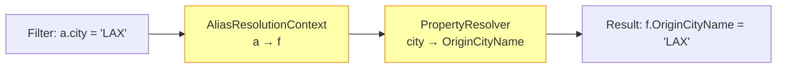
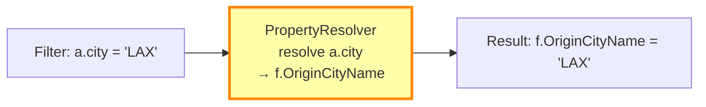
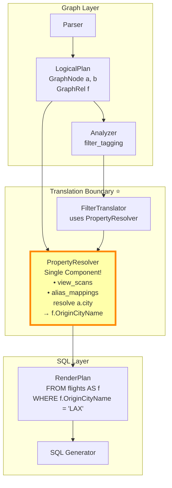

# Alias Resolution Timing Analysis

**Date**: November 24, 2025  
**Question**: Can we resolve aliases at the same time as properties? Do we need two separate components?

---

## Executive Summary

**Answer**: **Merge them into a single component** - `PropertyResolver` handles both property mapping AND alias resolution simultaneously.

**Rationale**:
1. ✅ **Timing**: Both happen at the same moment (during property resolution)
2. ✅ **Dependency**: Can't resolve properties without knowing the SQL alias
3. ✅ **Simplicity**: One lookup instead of two
4. ✅ **Exception**: Recursive CTEs are already handled separately (don't use this system)

---

## Current Architecture (Proposed with Two Boxes)



**Problem**: Two separate lookups for what's really one operation

---

## Simplified Architecture (Recommended)



**Advantage**: Single lookup, simpler code, easier debugging

---

## Detailed Analysis

### When Do We Need Alias Resolution?

**Answer**: Only when resolving properties!

```rust
// Use case 1: Property resolution
WHERE a.city = 'LAX'
      ↓
PropertyResolver.resolve_property("a", "city")
      ↓
Returns: PropertyResolution {
    table_alias: "f",              // ← Alias resolved here!
    sql_column: "OriginCityName",  // ← Property mapped here!
}

// Use case 2: Just need the table name for FROM/JOIN
FROM flights AS f
     ↑
     This doesn't need PropertyResolver!
     Already determined during RenderPlan building
```

**Key Insight**: We only need graph→SQL alias mapping when accessing **properties**, not when building table structure.

---

### What About Recursive CTEs?

**Current Status**: ⚠️ **Only works with STANDARD schema pattern!**

**Current Implementation**: Variable-length paths use a **different system entirely**

```rust
// From variable_length_cte.rs
pub struct VariableLengthCteGenerator {
    pub cte_name: String,              // "variable_path_<uuid>"
    pub start_node_table: String,      // "users" (ASSUMES STANDARD TABLE!)
    pub start_node_alias: String,      // "start_node" (SQL alias)
    pub start_cypher_alias: String,    // "u1" (Cypher alias)
    pub relationship_table: String,    // "follows" (ASSUMES STANDARD TABLE!)
    pub relationship_alias: String,    // "rel" (SQL alias)
    pub end_node_alias: String,        // "end_node" (SQL alias)
    pub end_cypher_alias: String,      // "u2" (Cypher alias)
    // ...
}
```

**Current Assumptions**:
1. ✅ Start node has its own table (`users`)
2. ✅ End node has its own table (`users`)
3. ✅ Relationship has its own table (`follows`)
4. ❌ **Does NOT support denormalized nodes** (no table for virtual nodes)
5. ❌ **Does NOT support polymorphic edges** (no type filtering)

**How It Works (Standard Pattern Only)**:
1. Variable-length path detection happens in `query_planner`
2. Generates a **CTE with fixed aliases**: `start_node`, `rel`, `end_node`
3. Assumes all three have separate tables
4. Returns a `Cte` structure that's added to `RenderPlan.ctes`
5. Main query references the CTE by `cte_name`

**Generated SQL**:
```sql
WITH RECURSIVE variable_path_abc123 AS (
    -- Base case
    SELECT 
        start_node.user_id AS start_id,
        end_node.user_id AS end_id,
        1 AS depth
    FROM users AS start_node      -- ← Fixed alias
    JOIN follows AS rel           -- ← Fixed alias
        ON rel.follower_id = start_node.user_id
    JOIN users AS end_node        -- ← Fixed alias
        ON rel.followed_id = end_node.user_id
    
    UNION ALL
    
    -- Recursive case
    SELECT ...
)
SELECT * FROM variable_path_abc123
WHERE start_id = 1  -- ← References CTE output, not graph aliases!
```

**Key Point**: Once the CTE is generated, the main query references **CTE columns** (`start_id`, `end_id`), not graph aliases (`u1`, `u2`).

**Alias Mapping for CTE Properties**:
```cypher
MATCH p = (u1:User)-[*1..3]->(u2:User)
WHERE u1.name = 'Alice'  -- ← Filter on start node
RETURN u2.name           -- ← Property from end node
```

The `PropertyResolver` would handle:
- `u1.name` → Resolved during CTE generation (becomes `start_node.full_name` in base case)
- `u2.name` → Maps to CTE output column (e.g., `end_full_name` from CTE SELECT)

**Current Limitations**:

❌ **Denormalized Pattern NOT Supported**:
```cypher
-- This will FAIL with denormalized Airport nodes
MATCH (a:Airport)-[:FLIGHT*1..3]->(b:Airport)
WHERE a.city = 'Los Angeles'
RETURN b.city
```
Why: CTE generator tries to SELECT from `Airport` table, but Airport has no table (it's virtual, properties on `flights` table)

❌ **Polymorphic Pattern NOT Supported**:
```cypher
-- This will FAIL to filter by interaction type
MATCH (u1:User)-[:FOLLOWS*1..3]->(u2:User)
RETURN u2.name
```
Why: CTE generator doesn't add `WHERE interaction_type = 'FOLLOWS'` filter to the polymorphic `interactions` table

**Conclusion**: Recursive CTEs currently only work with standard schema pattern. Denormalized and polymorphic patterns require additional implementation work in `VariableLengthCteGenerator`.

---

## Proposed Unified Design

### Single Component: PropertyResolver

```rust
pub struct PropertyResolver {
    /// ViewScan metadata for each graph alias
    view_scans: HashMap<String, ViewScan>,
    
    /// Graph-to-SQL alias mapping (embedded, not separate)
    alias_mappings: HashMap<String, AliasMapping>,
}

pub struct AliasMapping {
    pub sql_alias: String,
    pub position: NodePosition,  // From, To, Standalone
    pub is_denormalized: bool,
}

impl PropertyResolver {
    /// Resolve a graph property to SQL column
    /// Returns BOTH the SQL alias AND the column name
    pub fn resolve_property(
        &self,
        graph_alias: &str,
        property: &str,
    ) -> Result<PropertyResolution, CypherError> {
        // Step 1: Resolve graph alias to SQL alias
        let alias_mapping = self.alias_mappings.get(graph_alias)?;
        let sql_alias = &alias_mapping.sql_alias;
        
        // Step 2: Resolve property based on pattern
        let view_scan = self.view_scans.get(graph_alias)?;
        let sql_column = match (alias_mapping.is_denormalized, view_scan.is_polymorphic()) {
            (true, _) => {
                // Denormalized: position-dependent
                let property_map = match alias_mapping.position {
                    NodePosition::From => &view_scan.from_node_properties,
                    NodePosition::To => &view_scan.to_node_properties,
                    _ => panic!("Invalid position"),
                }?;
                property_map.get(property)?
            },
            (false, true) => {
                // Polymorphic: add type filters
                let column = view_scan.property_mappings.get(property)?;
                // ... also collect type_filters
                column
            },
            (false, false) => {
                // Standard: direct mapping
                view_scan.property_mappings.get(property)?
            }
        };
        
        Ok(PropertyResolution {
            table_alias: sql_alias.clone(),  // ← Alias resolved!
            sql_column: sql_column.clone(),  // ← Property mapped!
            type_filters: vec![],            // ← Type filters (polymorphic)
        })
    }
    
    /// Get just the SQL alias (for cases that don't need property)
    pub fn get_sql_alias(&self, graph_alias: &str) -> Result<&str, CypherError> {
        Ok(&self.alias_mappings.get(graph_alias)?.sql_alias)
    }
}
```

---

## Building the PropertyResolver

**When**: After `LogicalPlan` is complete, before filter translation

**How**: Single pass over LogicalPlan nodes and relationships

```rust
impl PlanBuilder {
    pub fn build_property_resolver(&self) -> Result<PropertyResolver, CypherError> {
        let mut view_scans = HashMap::new();
        let mut alias_mappings = HashMap::new();
        
        // Register all nodes
        for node in &self.nodes {
            let view_scan = node.view_scan.as_ref().unwrap();
            
            if view_scan.is_denormalized() {
                // Denormalized: find connected edge and position
                let (edge_alias, position) = self.find_edge_info(node)?;
                alias_mappings.insert(node.alias.clone(), AliasMapping {
                    sql_alias: edge_alias,
                    position,
                    is_denormalized: true,
                });
            } else {
                // Standard: maps to itself
                alias_mappings.insert(node.alias.clone(), AliasMapping {
                    sql_alias: node.alias.clone(),  // or generate unique alias
                    position: NodePosition::Standalone,
                    is_denormalized: false,
                });
            }
            
            view_scans.insert(node.alias.clone(), view_scan.clone());
        }
        
        // Register all relationships
        for rel in &self.relationships {
            if let Some(view_scan) = &rel.view_scan {
                alias_mappings.insert(rel.alias.clone(), AliasMapping {
                    sql_alias: rel.alias.clone(),
                    position: NodePosition::Standalone,
                    is_denormalized: false,
                });
                view_scans.insert(rel.alias.clone(), view_scan.clone());
            }
        }
        
        Ok(PropertyResolver {
            view_scans,
            alias_mappings,
        })
    }
}
```

---

## Comparison: Two Components vs Unified

### Two Components (Original Proposal)

```rust
// Step 1: Resolve alias
let alias_mapping = alias_context.resolve(graph_alias)?;
let sql_alias = alias_mapping.sql_alias;

// Step 2: Resolve property
let resolution = property_resolver.resolve_property(
    graph_alias, 
    property,
    &alias_mapping  // ← Pass alias info again!
)?;
```

**Cons**:
- Two lookups (alias_context, then property_resolver)
- Need to pass alias_mapping to property resolver
- More complex debugging (which component failed?)
- Artificially separated concerns

---

### Unified Component (Recommended)

```rust
// Single step: Resolve property (alias resolved internally)
let resolution = property_resolver.resolve_property(graph_alias, property)?;
// resolution contains both sql_alias and sql_column
```

**Pros**:
- ✅ One lookup
- ✅ Simpler API
- ✅ Easier debugging (single point of failure)
- ✅ Natural: "resolve this graph property" → get back SQL reference
- ✅ No duplicate data structures

---

## Edge Cases Analysis

### 1. Denormalized Nodes

**Question**: Do we need alias resolution before property resolution?

**Answer**: No! We resolve both together:

```rust
resolve_property("a", "city")
  ↓
1. Check ViewScan → is_denormalized: true
2. Find connected edge → edge alias is "f"
3. Check position → FROM position
4. Look up in from_node_properties → "city" → "OriginCityName"
5. Return PropertyResolution {
     table_alias: "f",
     sql_column: "OriginCityName"
   }
```

All in one method!

---

### 2. Polymorphic Edges

**Question**: Do we need alias resolution separately?

**Answer**: No! Type filters are determined alongside property:

```rust
resolve_property("f", "timestamp")
  ↓
1. Check ViewScan → is_polymorphic: true
2. Look up property → "timestamp" in property_mappings
3. Collect type filters from ViewScan:
   - type_column: "interaction_type" = "FOLLOWS"
   - from_type_column: "from_type" = "User"
   - to_type_column: "to_type" = "User"
4. Return PropertyResolution {
     table_alias: "f",
     sql_column: "timestamp",
     type_filters: [
       ("interaction_type", "FOLLOWS"),
       ("from_type", "User"),
       ("to_type", "User")
     ]
   }
```

---

### 3. Recursive CTEs

**Question**: Does CTE generation need separate alias resolution?

**Answer**: No! CTEs use a different system:

- CTE generator has **hardcoded aliases**: `start_node`, `rel`, `end_node`
- CTE generation happens **before** main query planning
- Main query references **CTE output columns**, not graph aliases
- `PropertyResolver` only needed for:
  - Properties in CTE filters (resolved during CTE generation)
  - Mapping CTE output columns to graph aliases (simple column mapping)

**Example**:
```cypher
MATCH p = (u1:User)-[*1..3]->(u2:User)
RETURN u2.name
```

CTE generates output column: `end_full_name`

Main query:
```sql
SELECT end_full_name AS name  -- ← Simple mapping, no complex resolution needed
FROM variable_path_abc123
```

---

## Implementation Recommendation

### ✅ Use Unified PropertyResolver

**Structure**:
```
PropertyResolver
├── view_scans: HashMap<String, ViewScan>
├── alias_mappings: HashMap<String, AliasMapping>  ← Embedded!
└── methods:
    ├── resolve_property(alias, property) → PropertyResolution
    └── get_sql_alias(alias) → String  (for edge cases)
```

**No separate AliasResolutionContext needed!**

---

## Updated Implementation Plan

### Phase 1: Create PropertyResolver (Day 1, 4 hours)

**Create**: `src/query_planner/translator/property_resolver.rs`

```rust
pub struct PropertyResolver {
    view_scans: HashMap<String, ViewScan>,
    alias_mappings: HashMap<String, AliasMapping>,  // ← Embedded
}

pub struct AliasMapping {
    pub sql_alias: String,
    pub position: NodePosition,
    pub is_denormalized: bool,
}

impl PropertyResolver {
    pub fn new(
        view_scans: HashMap<String, ViewScan>,
        alias_mappings: HashMap<String, AliasMapping>,
    ) -> Self {
        Self { view_scans, alias_mappings }
    }
    
    pub fn resolve_property(
        &self,
        graph_alias: &str,
        property: &str,
    ) -> Result<PropertyResolution, CypherError> {
        // 1. Get alias mapping
        let alias_mapping = self.alias_mappings.get(graph_alias)?;
        
        // 2. Get ViewScan
        let view_scan = self.view_scans.get(graph_alias)?;
        
        // 3. Resolve based on pattern
        // ... (implementation as shown above)
    }
}
```

**No `alias_resolution.rs` file needed!**

---

### Terminology Note

**Internal Code**: Still uses `relationship` everywhere (field names, structs, variables)
- `GraphRel` struct
- `relationship_table` field
- `rel_from_col` parameter

**External Docs**: Changed to `edge` to match ISO GQL
- User-facing documentation
- API examples
- Schema YAML files accept both `edges:` and `relationships:` (backwards compatible)

**Recommendation**: Keep internal code as-is (too many places to change). External docs consistency is what matters.

---

## Final Architecture Diagram



**Key**: Single unified component instead of two separate boxes!

---

## Summary

✅ **Merge AliasResolutionContext into PropertyResolver**
- They always work together
- Simpler API and implementation
- Easier debugging
- No artificial separation

✅ **Recursive CTEs are separate**
- Use hardcoded aliases internally
- Don't need this resolution system
- Already working correctly

✅ **Terminology: Keep internal code as-is**
- External docs use "edge" (ISO GQL)
- Internal code uses "relationship" (too pervasive to change)
- Schema accepts both (backwards compatible)

**Ready to implement with simpler, cleaner architecture!**
