# Graph→SQL Translation Boundary - Implementation Plan

**Date**: November 24, 2025  
**Approach**: Fix graph→SQL boundary with clean separation (Approach 2)  
**Estimated Time**: 3-4 days (22-26 hours)

---

## Architecture Overview

### Important Schema Clarifications

**Node IDs vs Edge IDs**:
- **Node IDs**: Always single column (`id_column` in schema config)
  - Example: `user_id`, `post_id`, `airport_code`
  - Stored as `Identifier::Single(String)` internally
  - Used in JOINs: `FROM users WHERE user_id = ...`

- **Edge IDs**: Can be single or composite (`edge_id` in schema config, development feature)
  - Single: `Identifier::Single("interaction_id")`
  - Composite: `Identifier::Composite(["from_id", "to_id", "type", "timestamp"])`
  - Used for uniqueness constraints and deduplication
  - Currently in development, not fully implemented in query generation

**Polymorphic Pattern Node Tables**:
- Polymorphic edges **ALWAYS use standard node tables** (separate tables with own schemas)
- The polymorphism is in the **edge table only** (via `type_column` discriminator)
- Example:
  - `users` table (standard) ← polymorphic `interactions` → `posts` table (standard)
  - NOT: denormalized nodes on interactions table
- Mixing: Polymorphic + Standard ✅ | Polymorphic + Denormalized ❌

**Recursive CTE Limitations** ⚠️:
- Variable-length paths (`*`, `*1..3`, etc.) currently **ONLY support standard schema pattern**
- Denormalized nodes: ❌ NOT SUPPORTED (CTE assumes node tables exist)
- Polymorphic edges: ❌ NOT SUPPORTED (CTE doesn't add type filters)
- Future work required: Extend `VariableLengthCteGenerator` to handle all patterns
- For this implementation: Focus on simple queries first, recursive CTEs are out of scope

```mermaid
graph TB
    subgraph "Graph Layer"
        P[Parser] --> LP[LogicalPlan<br/>GraphNode, GraphRel]
        LP --> A[Analyzer<br/>filter_tagging]
    end
    
    subgraph "Translation Boundary ⭐ NEW"
        A --> ARC[AliasResolutionContext<br/>graph → SQL alias]
        LP --> PR[PropertyResolver<br/>property resolution]
        A --> FT[FilterTranslator<br/>graph filters → SQL filters]
        
        PR -.uses.-> ARC
        FT -.uses.-> PR
    end
    
    subgraph "SQL Layer"
        ARC --> RP[RenderPlan<br/>TableSource]
        FT --> RP
        RP --> SG[SQL Generator]
    end
    
    style ARC fill:#ffa,stroke:#f80,stroke-width:3px
    style PR fill:#ffa,stroke:#f80,stroke-width:3px
    style FT fill:#ffa,stroke:#f80,stroke-width:3px
```



---

## Phase 1: Create Translation Boundary Module (Day 1, 4 hours)

**NOTE**: Simplified from original plan - merged AliasResolutionContext into PropertyResolver!

### 1.1 Create Module Structure (15 min)

**Create**: `src/query_planner/translator/mod.rs`
```rust
//! Graph-to-SQL Translation Boundary
//! 
//! This module provides a clean separation between graph concepts (Cypher)
//! and relational concepts (SQL). It handles:
//! - Property resolution (graph properties → SQL columns)
//! - Alias resolution (graph aliases → SQL aliases, embedded in PropertyResolver)
//! - Filter translation (graph filters → SQL WHERE clauses)

pub mod property_resolver;
pub mod filter_translator;

pub use property_resolver::{PropertyResolver, PropertyResolution, AliasMapping, NodePosition};
pub use filter_translator::FilterTranslator;
```

**Update**: `src/query_planner/mod.rs`
```rust
pub mod translator;  // Add new module
```

---

### 1.2 Implement Unified PropertyResolver (3 hours)

**Note**: AliasResolutionContext is now EMBEDDED in PropertyResolver - simpler architecture!

**Critical Design Point**: For denormalized patterns, the same node alias can appear in multiple edges with different roles!

**Example**:
```cypher
MATCH (a:Airport)-[f:FLIGHT]->(b:Airport)-[g:FLIGHT]->(c:Airport)
       ↑                        ↑                        ↑
       FROM in f                TO in f, FROM in g       TO in g
       a.city → f.OriginCity    b.city → ? (depends!)   c.city → g.DestCity
```

**Solution**: AliasMapping must be per (node_alias, edge_alias) pair, not just per node_alias!

**Create**: `src/query_planner/translator/property_resolver.rs`

```rust
use std::collections::HashMap;
use crate::query_planner::logical_plan::view_scan::ViewScan;
use crate::graph_catalog::expression_parser::PropertyValue;
use crate::errors::CypherError;

/// Maps graph aliases to SQL table aliases (embedded in PropertyResolver)
/// 
/// IMPORTANT: For denormalized patterns, the same node can appear in multiple edges
/// with different roles, so we need to track which edge context we're in!
#[derive(Debug, Clone)]
pub struct AliasMapping {
    /// SQL table alias
    pub sql_alias: String,
    
    /// Position in relationship (for denormalized nodes)
    pub position: NodePosition,
    
    /// Is this a denormalized node?
    pub is_denormalized: bool,
    
    /// Edge context (for denormalized): Which edge is this node part of?
    /// Example: In (a)-[f]->(b)-[g]->(c), node 'b' has TWO mappings:
    ///   - (b, f) → TO position
    ///   - (b, g) → FROM position
    pub edge_alias: Option<String>,
}

#[derive(Debug, Clone, Copy, PartialEq, Eq)]
pub enum NodePosition {
    /// Standalone node or relationship
    Standalone,
    
    /// Node at FROM position in denormalized relationship
    From,
    
    /// Node at TO position in denormalized relationship
    To,
}

/// Resolves graph properties to SQL columns AND aliases
/// 
/// Unified component that handles:
/// 1. Standard: property_mappings (e.g., name → username)
/// 2. Denormalized: from/to_node_properties (e.g., city → OriginCity vs DestCity)
/// 3. Polymorphic: property_mappings + type filters (e.g., type = 'FOLLOWS')
/// 
/// CRITICAL: For denormalized patterns, uses (node_alias, edge_alias) as composite key
/// because the same node can play different roles in different edges!
pub struct PropertyResolver {
    /// ViewScan metadata for each graph alias
    view_scans: HashMap<String, ViewScan>,
    
    /// Graph-to-SQL alias mapping
    /// Key: node_alias (for standard/polymorphic)
    ///      or (node_alias, edge_alias) for denormalized multi-hop
    alias_mappings: HashMap<String, Vec<AliasMapping>>,  // Vec to support multiple roles!
}

/// Result of property resolution
#[derive(Debug, Clone)]
pub struct PropertyResolution {
    /// Resolved SQL column expression
    pub property_value: PropertyValue,
    
    /// SQL table alias to use
    pub table_alias: String,
    
    /// Additional type filters (for polymorphic edges)
    pub type_filters: Vec<TypeFilter>,
}

#[derive(Debug, Clone)]
pub struct TypeFilter {
    pub column: String,
    pub value: String,
}

impl PropertyResolver {
    pub fn new(
        view_scans: HashMap<String, ViewScan>,
        alias_mappings: HashMap<String, AliasMapping>,
    ) -> Self {
        Self {
            view_scans,
            alias_mappings,
        }
    }
    
    /// Resolve a graph property to SQL column AND alias in one step
    /// 
    /// # Arguments
    /// * `graph_alias` - Graph alias (e.g., "a", "u", "f")
    /// * `property` - Property name (e.g., "city", "name")
    /// * `edge_context` - Optional edge alias for denormalized multi-hop resolution
    ///                    (e.g., "f" when resolving b.city in (a)-[f]->(b))
    /// 
    /// # Returns
    /// PropertyResolution with:
    /// - table_alias: SQL alias to use (resolved from graph alias)
    /// - property_value: PropertyValue::Column or PropertyValue::Expression
    /// - type_filters: Additional WHERE conditions (for polymorphic)
    /// 
    /// # Example (Denormalized Multi-Hop)
    /// ```cypher
    /// MATCH (a)-[f]->(b)-[g]->(c)
    /// WHERE b.city = 'NYC'  // Which edge? Need context!
    /// 
    /// resolve_property("b", "city", Some("f")) → f.DestCityName
    /// resolve_property("b", "city", Some("g")) → g.OriginCityName
    /// ```
    pub fn resolve_property(
        &self,
        graph_alias: &str,
        property: &str,
        edge_context: Option<&str>,
    ) -> Result<PropertyResolution, CypherError> {
        // Get alias mapping (graph → SQL alias)
        let alias_mapping = self.alias_mappings.get(graph_alias)
            .ok_or_else(|| CypherError::PropertyResolution {
                message: format!("Unknown graph alias: {}", graph_alias),
            })?;
        
        // Get ViewScan metadata
        let view_scan = self.view_scans.get(graph_alias)
            .ok_or_else(|| CypherError::PropertyResolution {
                message: format!("No ViewScan for alias: {}", graph_alias),
            })?;
        
        // Resolve based on pattern
        if alias_mapping.is_denormalized {
            self.resolve_denormalized_property(view_scan, alias_mapping, property)
        } else if view_scan.is_polymorphic() {
            self.resolve_polymorphic_property(view_scan, alias_mapping, property)
        } else {
            self.resolve_standard_property(view_scan, alias_mapping, property)
        }
    }
    
    /// Get just the SQL alias (for edge cases that don't need property)
    pub fn get_sql_alias(&self, graph_alias: &str) -> Result<&str, CypherError> {
        let alias_mapping = self.alias_mappings.get(graph_alias)
            .ok_or_else(|| CypherError::PropertyResolution {
                message: format!("Unknown graph alias: {}", graph_alias),
            })?;
        Ok(&alias_mapping.sql_alias)
    }
    
    /// Resolve standard pattern property
    fn resolve_standard_property(
        &self,
        view_scan: &ViewScan,
        alias_mapping: &AliasMapping,
        property: &str,
    ) -> Result<PropertyResolution, CypherError> {
        // Look up in property_mappings
        let property_value = view_scan.property_mappings
            .get(property)
            .ok_or_else(|| CypherError::PropertyResolution {
                message: format!(
                    "Property '{}' not found in ViewScan for '{}'",
                    property, view_scan.label
                ),
            })?
            .clone();
        
        Ok(PropertyResolution {
            property_value,
            table_alias: alias_mapping.sql_alias.clone(),
            type_filters: vec![],
        })
    }
    
    /// Resolve denormalized pattern property (position-dependent)
    fn resolve_denormalized_property(
        &self,
        view_scan: &ViewScan,
        alias_mapping: &AliasMapping,
        property: &str,
    ) -> Result<PropertyResolution, CypherError> {
        // Choose from_node_properties or to_node_properties based on position
        let property_map = match alias_mapping.position {
            NodePosition::From => {
                view_scan.from_node_properties.as_ref()
                    .ok_or_else(|| CypherError::PropertyResolution {
                        message: format!(
                            "Denormalized node '{}' has no from_node_properties",
                            view_scan.label
                        ),
                    })?
            },
            NodePosition::To => {
                view_scan.to_node_properties.as_ref()
                    .ok_or_else(|| CypherError::PropertyResolution {
                        message: format!(
                            "Denormalized node '{}' has no to_node_properties",
                            view_scan.label
                        ),
                    })?
            },
            NodePosition::Standalone => {
                return Err(CypherError::PropertyResolution {
                    message: format!(
                        "Denormalized node '{}' must have FROM or TO position",
                        view_scan.label
                    ),
                });
            }
        };
        
        // Look up property in appropriate map
        let sql_column = property_map.get(property)
            .ok_or_else(|| CypherError::PropertyResolution {
                message: format!(
                    "Property '{}' not found in {:?} properties for '{}'",
                    property, alias_mapping.position, view_scan.label
                ),
            })?;
        
        Ok(PropertyResolution {
            property_value: PropertyValue::Column(sql_column.clone()),
            table_alias: alias_mapping.sql_alias.clone(),
            type_filters: vec![],
        })
    }
    
    /// Resolve polymorphic pattern property (with type filters)
    fn resolve_polymorphic_property(
        &self,
        view_scan: &ViewScan,
        alias_mapping: &AliasMapping,
        property: &str,
    ) -> Result<PropertyResolution, CypherError> {
        // Standard property lookup
        let property_value = view_scan.property_mappings
            .get(property)
            .ok_or_else(|| CypherError::PropertyResolution {
                message: format!(
                    "Property '{}' not found in polymorphic ViewScan for '{}'",
                    property, view_scan.label
                ),
            })?
            .clone();
        
        // Build type filters
        let mut type_filters = vec![];
        
        // Add interaction_type filter
        if let Some(type_column) = &view_scan.type_column {
            type_filters.push(TypeFilter {
                column: type_column.clone(),
                value: view_scan.relationship_type.clone(),
            });
        }
        
        // Add from_type filter (if applicable)
        if let Some(from_type_column) = &view_scan.from_type_column {
            if let Some(from_label) = &view_scan.from_node_label {
                type_filters.push(TypeFilter {
                    column: from_type_column.clone(),
                    value: from_label.clone(),
                });
            }
        }
        
        // Add to_type filter (if applicable)
        if let Some(to_type_column) = &view_scan.to_type_column {
            if let Some(to_label) = &view_scan.to_node_label {
                type_filters.push(TypeFilter {
                    column: to_type_column.clone(),
                    value: to_label.clone(),
                });
            }
        }
        
        Ok(PropertyResolution {
            property_value,
            table_alias: alias_mapping.sql_alias.clone(),
            type_filters,
        })
    }
}
```

---

### 1.4 Add Fields to ViewScan (30 min)

**Update**: `src/query_planner/logical_plan/view_scan.rs`

Add fields for denormalized and polymorphic support:

```rust
pub struct ViewScan {
    // ... existing fields ...
    
    /// FROM node properties (for denormalized nodes)
    pub from_node_properties: Option<HashMap<String, String>>,
    
    /// TO node properties (for denormalized nodes)
    pub to_node_properties: Option<HashMap<String, String>>,
    
    /// Type column (for polymorphic edges)
    pub type_column: Option<String>,
    
    /// FROM type column (for polymorphic edges)
    pub from_type_column: Option<String>,
    
    /// TO type column (for polymorphic edges)
    pub to_type_column: Option<String>,
    
    /// Relationship type value (for polymorphic edges)
    pub relationship_type: String,
    
    /// FROM node label (for polymorphic edges)
    pub from_node_label: Option<String>,
    
    /// TO node label (for polymorphic edges)
    pub to_node_label: Option<String>,
}

impl ViewScan {
    /// Check if this ViewScan represents a polymorphic relationship
    pub fn is_polymorphic(&self) -> bool {
        self.type_column.is_some()
    }
    
    /// Check if this ViewScan represents a denormalized node
    pub fn is_denormalized(&self) -> bool {
        self.from_node_properties.is_some() || self.to_node_properties.is_some()
    }
}
```

---

## Phase 2: Populate ViewScan Metadata (Day 2 Morning, 3 hours)

### 2.1 Enhance view_resolver.rs (2.5 hours)

**Update**: `src/query_planner/analyzer/view_resolver.rs`

In `resolve_node()` method:

```rust
fn resolve_node(
    &mut self,
    node: &mut GraphNode,
    schema: &GraphSchema,
) -> Result<(), CypherError> {
    let node_schema = schema.get_node_schema(&node.label)?;
    
    // Standard fields
    let mut view_scan = ViewScan {
        label: node.label.clone(),
        table_name: node_schema.table.clone(),
        property_mappings: node_schema.property_mappings.clone(),
        // ... other fields ...
    };
    
    // Add denormalized properties if present
    if let Some(from_props) = &node_schema.from_node_properties {
        view_scan.from_node_properties = Some(from_props.clone());
    }
    
    if let Some(to_props) = &node_schema.to_node_properties {
        view_scan.to_node_properties = Some(to_props.clone());
    }
    
    node.view_scan = Some(view_scan);
    Ok(())
}
```

In `resolve_relationship()` method:

```rust
fn resolve_relationship(
    &mut self,
    rel: &mut GraphRel,
    schema: &GraphSchema,
) -> Result<(), CypherError> {
    let rel_schema = schema.get_relationship_schema(&rel.type_name)?;
    
    let mut view_scan = ViewScan {
        label: rel.type_name.clone(),
        table_name: rel_schema.table.clone(),
        property_mappings: rel_schema.property_mappings.clone(),
        // ... other fields ...
    };
    
    // Add polymorphic metadata if present
    if let Some(type_col) = &rel_schema.type_column {
        view_scan.type_column = Some(type_col.clone());
        view_scan.relationship_type = rel.type_name.clone();
        
        if let Some(from_type_col) = &rel_schema.from_type_column {
            view_scan.from_type_column = Some(from_type_col.clone());
        }
        
        if let Some(to_type_col) = &rel_schema.to_type_column {
            view_scan.to_type_column = Some(to_type_col.clone());
        }
        
        // Get node labels from connected nodes
        if let Some(from_node) = rel.from_node.as_ref() {
            view_scan.from_node_label = Some(from_node.label.clone());
        }
        
        if let Some(to_node) = rel.to_node.as_ref() {
            view_scan.to_node_label = Some(to_node.label.clone());
        }
    }
    
    rel.view_scan = Some(view_scan);
    Ok(())
}
```

---

### 2.2 Update Tests (30 min)

Add unit tests in `view_resolver.rs`:

```rust
#[cfg(test)]
mod tests {
    use super::*;
    
    #[test]
    fn test_denormalized_view_scan() {
        // Test that denormalized properties are populated
        let schema = load_test_schema("ontime_denormalized.yaml");
        let mut node = create_test_node("Airport", "a");
        
        resolve_node(&mut node, &schema).unwrap();
        
        let view_scan = node.view_scan.unwrap();
        assert!(view_scan.is_denormalized());
        assert!(view_scan.from_node_properties.is_some());
        assert!(view_scan.to_node_properties.is_some());
        
        // Check specific mappings
        let from_props = view_scan.from_node_properties.unwrap();
        assert_eq!(from_props.get("city"), Some(&"OriginCityName".to_string()));
    }
    
    #[test]
    fn test_polymorphic_view_scan() {
        // Test that polymorphic metadata is populated
        let schema = load_test_schema("social_polymorphic.yaml");
        let mut rel = create_test_relationship("FOLLOWS", "f");
        
        resolve_relationship(&mut rel, &schema).unwrap();
        
        let view_scan = rel.view_scan.unwrap();
        assert!(view_scan.is_polymorphic());
        assert_eq!(view_scan.type_column, Some("interaction_type".to_string()));
        assert_eq!(view_scan.relationship_type, "FOLLOWS");
    }
}
```

---

## Phase 3: Build Translation Context (Day 2 Afternoon, 3 hours)

**NOTE**: Simplified - no separate AliasResolutionContext to build!

### 3.1 Create Builder in plan_builder.rs (1.5 hours)

**Update**: `src/query_planner/logical_plan/plan_builder.rs`

Add method to build PropertyResolver (with embedded alias mappings):

```rust
use crate::query_planner::translator::{
    PropertyResolver, AliasMapping, NodePosition
};

impl PlanBuilder {
    /// Build property resolver with embedded alias mappings
    pub fn build_property_resolver(&self) -> Result<PropertyResolver, CypherError> {
        let mut view_scans = HashMap::new();
        let mut alias_mappings = HashMap::new();
        
        // Register all nodes
        for node in &self.nodes {
            let view_scan = node.view_scan.as_ref()
                .ok_or_else(|| CypherError::Planning {
                    message: format!("Node {} has no ViewScan", node.alias),
                })?;
            
            if view_scan.is_denormalized() {
                // Denormalized node - need to find connected edge
                let (edge_alias, position) = self.find_denormalized_edge_info(node)?;
                alias_mappings.insert(node.alias.clone(), AliasMapping {
                    sql_alias: edge_alias,
                    position,
                    is_denormalized: true,
                });
            } else {
                // Standard node - maps to itself
                alias_mappings.insert(node.alias.clone(), AliasMapping {
                    sql_alias: node.alias.clone(),  // or generate SQL alias
                    position: NodePosition::Standalone,
                    is_denormalized: false,
                });
            }
            
            view_scans.insert(node.alias.clone(), view_scan.clone());
        }
        
        // Register all relationships
        for rel in &self.relationships {
            if let Some(view_scan) = &rel.view_scan {
                alias_mappings.insert(rel.alias.clone(), AliasMapping {
                    sql_alias: rel.alias.clone(),  // or generate SQL alias
                    position: NodePosition::Standalone,
                    is_denormalized: false,
                });
                view_scans.insert(rel.alias.clone(), view_scan.clone());
            }
        }
        
        Ok(PropertyResolver::new(view_scans, alias_mappings))
    }
    
    /// Find edge information for a denormalized node
    fn find_denormalized_edge_info(
        &self,
        node: &GraphNode,
    ) -> Result<(String, NodePosition), CypherError> {
        // Find relationship where this node appears
        for rel in &self.relationships {
            if let Some(from_node) = &rel.from_node {
                if from_node.alias == node.alias {
                    return Ok((rel.alias.clone(), NodePosition::From));
                }
            }
            
            if let Some(to_node) = &rel.to_node {
                if to_node.alias == node.alias {
                    return Ok((rel.alias.clone(), NodePosition::To));
                }
            }
        }
        
        Err(CypherError::Planning {
            message: format!(
                "Denormalized node {} not connected to any relationship",
                node.alias
            ),
        })
    }
}
```

---

### 3.2 Integrate with filter_tagging.rs (1.5 hours)

**Update**: `src/query_planner/analyzer/filter_tagging.rs`

Add PropertyResolver to the tagging context:

```rust
use crate::query_planner::translator::PropertyResolver;

pub struct FilterTagger {
    property_resolver: PropertyResolver,
}

impl FilterTagger {
    pub fn new(property_resolver: PropertyResolver) -> Self {
        Self { property_resolver }
    }
    
    pub fn tag_filters(
        &self,
        filters: Vec<Filter>,
    ) -> Result<Vec<TaggedFilter>, CypherError> {
        filters.into_iter()
            .map(|filter| self.tag_filter(filter))
            .collect()
    }
    
    fn tag_filter(&self, filter: Filter) -> Result<TaggedFilter, CypherError> {
        match &filter.expr {
            Expr::Property { alias, property } => {
                // Resolve property using PropertyResolver
                let resolution = self.property_resolver.resolve_property(alias, property)?;
                
                Ok(TaggedFilter {
                    table_alias: resolution.table_alias,
                    property_value: resolution.property_value,
                    type_filters: resolution.type_filters,
                    operator: filter.operator,
                    value: filter.value,
                })
            }
            // ... handle other expression types ...
        }
    }
}

#[derive(Debug, Clone)]
pub struct TaggedFilter {
    /// SQL table alias
    pub table_alias: String,
    
    /// Resolved property (Column or Expression)
    pub property_value: PropertyValue,
    
    /// Additional type filters (for polymorphic)
    pub type_filters: Vec<TypeFilter>,
    
    /// Comparison operator
    pub operator: ComparisonOperator,
    
    /// Filter value
    pub value: Value,
}
```

---

## Phase 4: Update RenderPlan & SQL Generation (Day 3, 6 hours)

### 4.1 Pass TaggedFilter to RenderPlan (2 hours)

**Update**: `src/clickhouse_query_generator/render_plan.rs`

Use TaggedFilter instead of raw Filter:

```rust
pub struct RenderPlan {
    pub select: Vec<SelectedColumn>,
    pub from: TableSource,
    pub joins: Vec<JoinClause>,
    pub where_clause: Vec<WhereCondition>,  // Now uses resolved properties
    // ... other fields ...
}

#[derive(Debug, Clone)]
pub struct WhereCondition {
    /// SQL table alias
    pub table_alias: String,
    
    /// SQL column (already resolved)
    pub column: String,
    
    /// Operator
    pub operator: String,
    
    /// Value
    pub value: String,
    
    /// Additional type filters (for polymorphic)
    pub type_filters: Vec<(String, String)>,  // (column, value) pairs
}
```

---

### 4.2 Update SQL Generator (2 hours)

**Update**: `src/clickhouse_query_generator/sql_generator.rs`

Generate SQL from resolved properties:

```rust
fn render_where_clause(&self, conditions: &[WhereCondition]) -> String {
    let mut clauses = vec![];
    
    for condition in conditions {
        // Main condition
        let main_clause = format!(
            "{}.{} {} {}",
            condition.table_alias,
            condition.column,
            condition.operator,
            condition.value
        );
        clauses.push(main_clause);
        
        // Add type filters (for polymorphic edges)
        for (type_col, type_val) in &condition.type_filters {
            let type_clause = format!(
                "{}.{} = '{}'",
                condition.table_alias,
                type_col,
                type_val
            );
            clauses.push(type_clause);
        }
    }
    
    if clauses.is_empty() {
        String::new()
    } else {
        format!("WHERE {}", clauses.join(" AND "))
    }
}
```

---

### 4.3 Integration Testing (2 hours)

Create end-to-end tests:

**Create**: `tests/integration/test_denormalized_queries.rs`

```rust
#[tokio::test]
async fn test_lax_query() {
    let query = r#"
        MATCH (a:Airport)-[f:FLIGHT]->(b:Airport)
        WHERE a.city = 'Los Angeles' AND f.distance > 1000
        RETURN a.code, f.carrier, b.city
    "#;
    
    let result = execute_query(query, "ontime_denormalized").await.unwrap();
    
    // Verify SQL contains correct columns
    assert!(result.sql.contains("f.OriginCityName = 'Los Angeles'"));
    assert!(result.sql.contains("f.Distance > 1000"));
    assert!(result.sql.contains("f.Origin"));
    assert!(result.sql.contains("f.Carrier"));
    assert!(result.sql.contains("f.DestCityName"));
}

#[tokio::test]
async fn test_mixed_pattern_query() {
    // Query mixing standard User nodes and denormalized Airport nodes
    let query = r#"
        MATCH (u:User)-[:PURCHASED]->(p:Product)
        MATCH (a:Airport)-[f:FLIGHT]->(b:Airport)
        WHERE u.name = 'Alice' AND a.city = 'Los Angeles'
        RETURN u.name, p.name, a.code, f.carrier
    "#;
    
    let result = execute_query(query, "mixed_schema").await.unwrap();
    
    // Verify both patterns work
    assert!(result.sql.contains("users.username = 'Alice'"));
    assert!(result.sql.contains("f.OriginCityName = 'Los Angeles'"));
}
```

---

## Phase 5: Polymorphic Support (Day 4 Morning, 4 hours)

### 5.1 Add Type Filter Generation (2 hours)

**Update**: `src/query_planner/analyzer/graph_traversal_planning.rs`

Generate type filters for polymorphic edges:

```rust
fn plan_polymorphic_relationship(
    &mut self,
    rel: &GraphRel,
) -> Result<(), CypherError> {
    let view_scan = rel.view_scan.as_ref().unwrap();
    
    if let Some(type_column) = &view_scan.type_column {
        // Add type filter to WHERE clause
        let type_filter = Filter {
            expr: Expr::Property {
                alias: rel.alias.clone(),
                property: type_column.clone(),
            },
            operator: ComparisonOperator::Equal,
            value: Value::String(view_scan.relationship_type.clone()),
        };
        
        self.filters.push(type_filter);
        
        // Add node type filters if present
        if let Some(from_type_col) = &view_scan.from_type_column {
            if let Some(from_label) = &view_scan.from_node_label {
                let from_filter = Filter {
                    expr: Expr::Property {
                        alias: rel.alias.clone(),
                        property: from_type_col.clone(),
                    },
                    operator: ComparisonOperator::Equal,
                    value: Value::String(from_label.clone()),
                };
                self.filters.push(from_filter);
            }
        }
        
        // Similar for to_type_column...
    }
    
    Ok(())
}
```

---

### 5.2 Handle Multiple Relationship Types (UNION) (2 hours)

**Update**: `src/query_planner/logical_plan/relationship.rs`

Support alternate relationship types:

```rust
pub struct GraphRel {
    pub alias: String,
    pub type_names: Vec<String>,  // Changed from type_name: String
    // ... other fields ...
}

impl GraphRel {
    /// Check if this is a multi-type relationship (requires UNION)
    pub fn is_multi_type(&self) -> bool {
        self.type_names.len() > 1
    }
}
```

Generate UNION for multi-type:

```rust
fn generate_multi_type_query(
    &self,
    rel: &GraphRel,
) -> Result<String, CypherError> {
    let mut union_queries = vec![];
    
    for type_name in &rel.type_names {
        // Generate query for each type
        let sub_query = self.generate_single_type_query(rel, type_name)?;
        union_queries.push(sub_query);
    }
    
    Ok(union_queries.join(" UNION ALL "))
}
```

---

## Phase 6: Testing & Documentation (Day 4 Afternoon, 3 hours)

### 6.1 Comprehensive Test Suite (2 hours)

Test all patterns and mixing scenarios:

```rust
// Standard pattern (should still work)
#[test] fn test_standard_user_query() { ... }

// Denormalized pattern
#[test] fn test_denormalized_airport_query() { ... }
#[test] fn test_denormalized_from_properties() { ... }
#[test] fn test_denormalized_to_properties() { ... }

// Polymorphic pattern
#[test] fn test_polymorphic_single_type() { ... }
#[test] fn test_polymorphic_multi_type() { ... }
#[test] fn test_polymorphic_type_filters() { ... }

// Mixed patterns
#[test] fn test_standard_plus_denormalized() { ... }
#[test] fn test_standard_plus_polymorphic() { ... }

// Error cases
#[test] fn test_unknown_alias_error() { ... }
#[test] fn test_unknown_property_error() { ... }
```

---

### 6.2 Update Documentation (1 hour)

Update key documents:

**Update**: `STATUS.md`
- Add "Graph→SQL Translation Boundary" to "What Works"
- Update test statistics
- Note pattern mixing support

**Update**: `CHANGELOG.md`
```markdown
## [Unreleased]

### 🚀 Features
- **Graph→SQL Translation Boundary**: Clean separation between graph and SQL concepts
- **Unified Property Mapping**: Single PropertyResolver for all schema patterns
- **Pattern Mixing Support**: Standard + Denormalized queries work seamlessly
- **Polymorphic Edge Support**: Type-based filtering for multi-type edge tables

### 🐛 Bug Fixes
- Fixed denormalized node property resolution (LAX query now works)
- Fixed alias mapping for virtual nodes

### 📚 Documentation
- Added `GRAPH_TO_SQL_BOUNDARY_IMPLEMENTATION_PLAN.md`
- Added `SCHEMA_PATTERN_MIXING_ANALYSIS.md`
- Updated architecture diagrams with translation layer
```

**Create**: `notes/graph-sql-boundary.md`
```markdown
# Graph→SQL Translation Boundary

## Summary
Clean separation between graph concepts (Cypher) and relational concepts (SQL).
Translation happens at a well-defined boundary using:
- AliasResolutionContext (graph alias → SQL alias)
- PropertyResolver (graph property → SQL column)
- FilterTranslator (graph filter → SQL WHERE)

## Key Design Decisions
1. **Single resolution point**: All property mapping goes through PropertyResolver
2. **Pattern abstraction**: Standard/Denormalized/Polymorphic handled uniformly
3. **Mixing support**: Each alias resolved independently
4. **Debugging**: Can inspect intermediate translation state

## Files Modified
- `src/query_planner/translator/` (new module)
- `src/query_planner/logical_plan/view_scan.rs` (added fields)
- `src/query_planner/analyzer/filter_tagging.rs` (uses PropertyResolver)
- `src/clickhouse_query_generator/render_plan.rs` (uses TaggedFilter)

## Testing
- 466 existing tests still pass (standard pattern unchanged)
- 15 new denormalized tests
- 10 new polymorphic tests
- 5 new mixed pattern tests
```

---

## Success Criteria Checklist

### Core Functionality
- [ ] **LAX Query Works**: `WHERE a.city = 'Los Angeles'` generates `WHERE f.OriginCityName = 'Los Angeles'`
- [ ] **Standard Pattern Unchanged**: All 466 existing tests pass
- [ ] **Denormalized Pattern Fixed**: Airport queries generate correct SQL (simple queries only)
- [ ] **Polymorphic Pattern Working**: Type filters added to WHERE clause (simple queries only)
- [ ] **Mixed Patterns Work**: User + Airport in same query
- [ ] **Clear Debugging**: Can inspect PropertyResolver state
- [ ] **Clean Code**: No pattern-specific if/else scattered across files
- [ ] **Documentation Complete**: Notes, STATUS, CHANGELOG updated

### Out of Scope (Future Work)
- [ ] ⚠️ **Variable-length paths with denormalized nodes** (requires CTE generator changes)
- [ ] ⚠️ **Variable-length paths with polymorphic edges** (requires CTE generator changes)
- [ ] ⚠️ **Shortest path with denormalized/polymorphic** (depends on CTE support)

### Test Coverage
- [ ] Simple denormalized queries (no variable-length): ✅ PASS
- [ ] Simple polymorphic queries (no variable-length): ✅ PASS
- [ ] Variable-length with standard pattern: ✅ PASS (already working)
- [ ] Variable-length with denormalized: ⚠️ SKIP (known limitation)
- [ ] Variable-length with polymorphic: ⚠️ SKIP (known limitation)

---

## Implementation Checklist

### Day 1: Translation Boundary Module ✅
- [ ] Create `src/query_planner/translator/mod.rs`
- [ ] Implement `property_resolver.rs` (unified PropertyResolver with embedded alias mappings)
- [ ] Add fields to ViewScan structure
- [ ] Unit tests for PropertyResolver (alias resolution + property mapping together)

### Day 2: ViewScan Population & Context Building ✅
- [ ] Enhance view_resolver.rs for denormalized properties
- [ ] Enhance view_resolver.rs for polymorphic metadata
- [ ] Add tests for ViewScan population
- [ ] Implement build_property_resolver() in plan_builder.rs (single method, no separate alias context!)
- [ ] Update filter_tagging.rs to use PropertyResolver
- [ ] Create TaggedFilter structure

### Day 3: RenderPlan & SQL Generation ✅
- [ ] Update RenderPlan to use TaggedFilter
- [ ] Update SQL generator to use resolved properties
- [ ] Add polymorphic type filter generation
- [ ] Create integration tests for denormalized pattern
- [ ] Create integration tests for mixed patterns
- [ ] Fix any bugs found during testing

### Day 4: Polymorphic Support & Documentation ✅
- [ ] Add type filter generation in graph_traversal_planning.rs
- [ ] Implement UNION for multiple relationship types
- [ ] Create polymorphic integration tests
- [ ] Update STATUS.md
- [ ] Update CHANGELOG.md
- [ ] Create notes/graph-sql-boundary.md
- [ ] Final testing and bug fixes

---

## Risk Mitigation

**Risk**: Breaking existing tests
- **Mitigation**: Run full test suite after each phase
- **Rollback**: Keep phases small and git-committable

**Risk**: Complex integration issues
- **Mitigation**: Build translation context early, test independently
- **Debugging**: Add extensive logging in PropertyResolver

**Risk**: Edge cases in mixing scenarios
- **Mitigation**: Write comprehensive mixed pattern tests first
- **Validation**: Manual SQL inspection for generated queries

---

## Post-Implementation

After successful implementation:

1. **Performance Testing**: Measure query latency impact
2. **User Documentation**: Update Cypher guide with pattern examples
3. **Schema Examples**: Create more mixed pattern schema examples
4. **Future Extensions**: Document how to add new patterns

---

**Ready to implement!** This plan provides a clear path from current state to production-ready graph→SQL translation boundary with full pattern mixing support.
