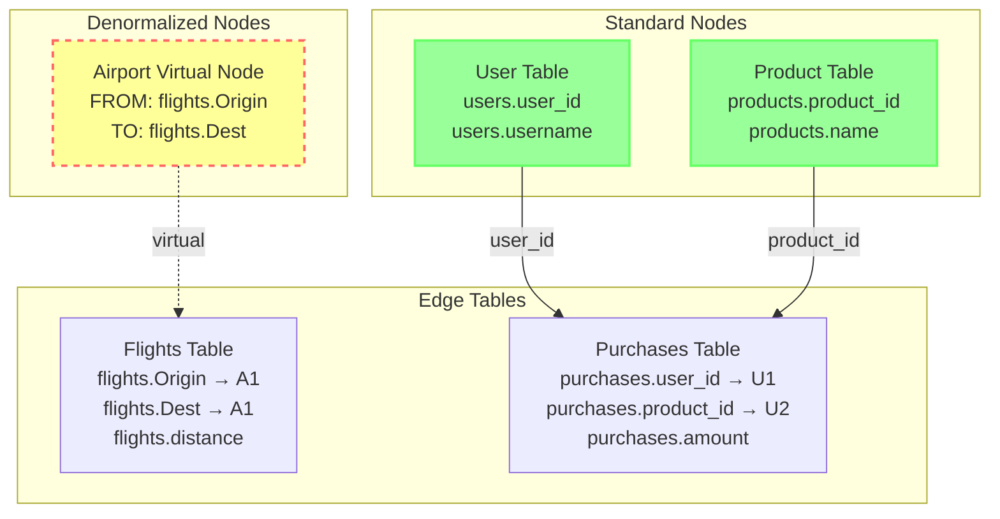
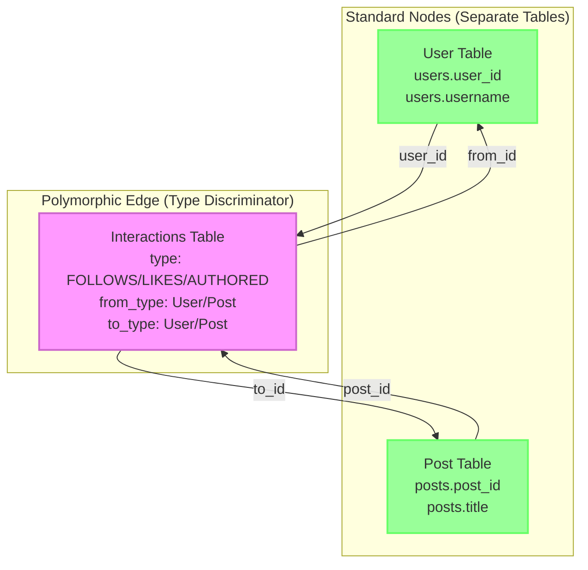
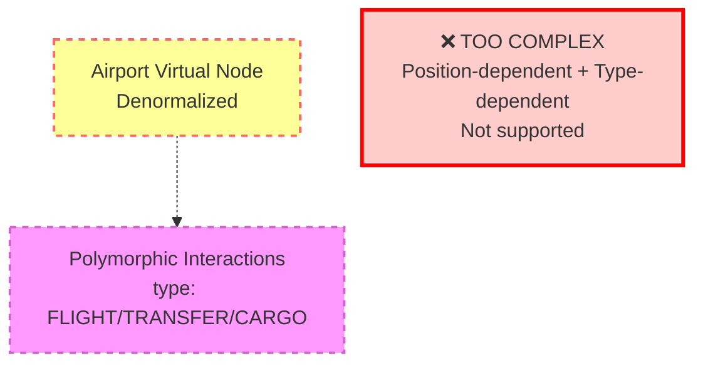
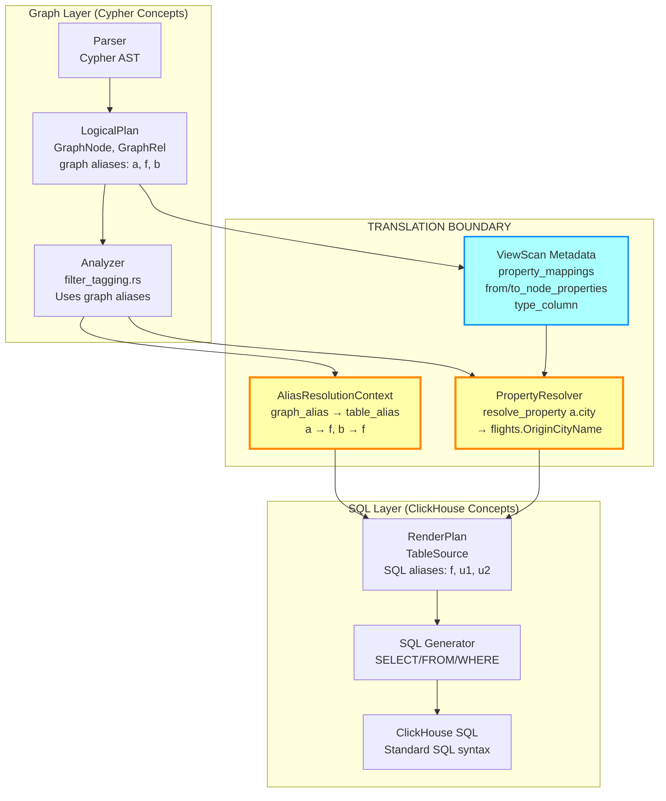
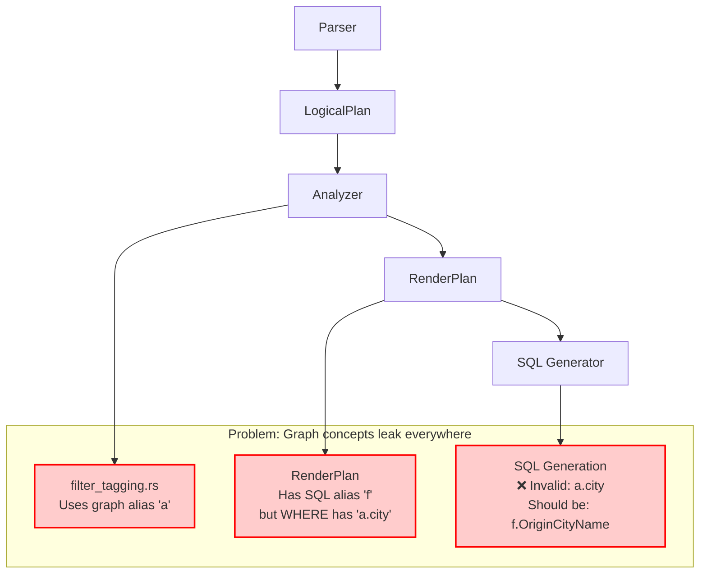
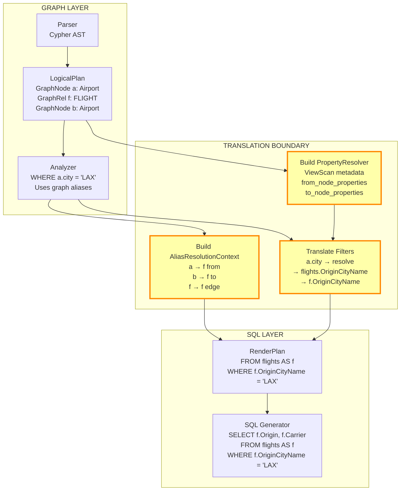

# Schema Pattern Mixing Analysis

**Date**: November 24, 2025  
**Context**: Determining best approach for fixing graph→SQL property mapping with pattern mixing support

## Executive Summary

Schema patterns **CAN and WILL mix** in real-world scenarios:
- ✅ **Standard + Denormalized**: Common (e.g., User table + denormalized Airport on flights)
- ⚠️ **Standard + Polymorphic**: Possible (e.g., User table + polymorphic interactions)
- ❌ **Denormalized + Polymorphic**: Not currently supported (too complex)

**Recommendation**: **Fix the graph→SQL boundary with clean separation** (Approach 2)
- Critical for maintainability and handling mixed patterns
- Provides clear conceptual layers
- Makes debugging and reasoning easier
- Better long-term architecture

---

## Pattern Mixing Scenarios

### Scenario 1: Standard + Denormalized (COMMON)



**Example Query**:
```cypher
MATCH (u:User)-[:PURCHASED]->(p:Product)
MATCH (a1:Airport)-[f:FLIGHT]->(a2:Airport)
WHERE u.name = 'Alice' 
  AND a1.city = 'Los Angeles'
RETURN u.name, p.name, a1.code, f.carrier, a2.city
```

**Property Resolution**:
- `u.name` → Standard pattern → `users.username` (via property_mappings)
- `p.name` → Standard pattern → `products.name` (via property_mappings)
- `a1.city` → **Denormalized FROM** → `flights.OriginCityName` (via from_node_properties)
- `f.carrier` → Standard edge property → `flights.Carrier` (via property_mappings)
- `a2.city` → **Denormalized TO** → `flights.DestCityName` (via to_node_properties)

**Why This Is Common**:
- Many datasets have core entities (users, products) in separate tables
- But also have embedded/denormalized data (geo data, temporal snapshots)
- OnTime flights dataset is perfect example: main entities separate, Airport denormalized

---

### Scenario 2: Standard + Polymorphic (POSSIBLE)

**Important**: Polymorphic edges always use **standard node tables**, not denormalized nodes.
The polymorphism is in the edge table only (type_column discriminator).



**Example Query**:
```cypher
MATCH (u:User)-[i:FOLLOWS|LIKES]->(target)
WHERE u.name = 'Alice'
RETURN u.name, type(i), target.name
```

**Property Resolution**:
- `u.name` → Standard pattern → `users.username` (via property_mappings)
- `type(i)` → Polymorphic → `interactions.interaction_type`
- `target.name` → **Dynamic** → Could be `users.username` OR `posts.title` depending on `to_type`

**ID Handling**:
- Node IDs: Always single column (`id_column` in schema)
  - `u.user_id` → `users.user_id` (single column)
  - `p.post_id` → `posts.post_id` (single column)
- Edge IDs: Can be composite (`edge_id` in schema, development feature)
  - Single: `interactions.interaction_id`
  - Composite: `[from_id, to_id, interaction_type, timestamp]` (tuple)

**Additional Complexity**:
- Type filters: `WHERE interaction_type IN ('FOLLOWS', 'LIKES')`
- Dynamic joins based on `from_type`/`to_type` columns
- Target resolution depends on runtime type

---

### Scenario 3: Denormalized + Polymorphic (NOT SUPPORTED)



**Why Not Supported**:
- Position-dependent (FROM/TO) property mapping
- **AND** type-dependent (interaction_type) filtering
- Combinatorial explosion of resolution logic
- No clear real-world use case justifies complexity

---

## Approach Comparison

### Approach 1: Quick Fix - Patch Denormalized Only

**Changes**:
1. Add denormalized property mapping to ViewScan population
2. Fix alias resolution in filter_tagging for denormalized nodes
3. Keep existing standard pattern logic untouched

**Pros**:
- ✅ Fast (1-2 days)
- ✅ Low risk
- ✅ Fixes immediate LAX query issue

**Cons**:
- ❌ **Doesn't fix polymorphic pattern**
- ❌ **Ad-hoc handling continues** (3rd pattern-specific code path)
- ❌ **Harder to add mixing support later**
- ❌ No clear graph→SQL boundary
- ❌ Property mapping still fragmented across files

**Mixing Support**:
- Standard + Denormalized: ⚠️ Might work with hacks
- Standard + Polymorphic: ❌ Still broken
- Future patterns: ❌ Requires more ad-hoc code

---

### Approach 2: Fix Graph→SQL Boundary (RECOMMENDED)

**Changes**:
1. Create clear **graph→SQL translation layer** with AliasResolutionContext
2. Implement **PropertyResolver** for unified property mapping
3. Integrate at the **boundary** between LogicalPlan (graph) and RenderPlan (SQL)
4. All patterns handled through single resolution interface

**Architecture**:



**Translation Boundary Components**:

1. **AliasResolutionContext** (graph → SQL alias mapping)
   ```rust
   struct AliasResolutionContext {
       graph_to_sql: HashMap<String, String>,
       // a → f, b → f (for denormalized)
       // u → u1, f → f (for standard)
   }
   ```

2. **PropertyResolver** (unified property resolution)
   ```rust
   struct PropertyResolver {
       view_scans: HashMap<String, ViewScan>,
       alias_context: AliasResolutionContext,
   }
   
   impl PropertyResolver {
       fn resolve_property(
           &self,
           graph_alias: &str,  // "a"
           property: &str      // "city"
       ) -> PropertyResolution {
           let view_scan = self.view_scans.get(graph_alias)?;
           let sql_alias = self.alias_context.resolve(graph_alias)?;
           
           match view_scan.pattern() {
               Standard => // property_mappings
               Denormalized => // from/to_node_properties
               Polymorphic => // property_mappings + type filters
           }
       }
   }
   ```

3. **ViewScan** (carries schema metadata)
   - Already exists, just needs proper population

**Pros**:
- ✅ **Clean separation of concerns** (graph vs SQL)
- ✅ **Single resolution interface** (all patterns)
- ✅ **Supports mixing naturally** (each alias resolved independently)
- ✅ **Easy to debug** (clear boundary to inspect)
- ✅ **Future-proof** (new patterns extend PropertyResolver)
- ✅ **Better code quality** (principled architecture)

**Cons**:
- ⚠️ More work upfront (3-4 days)
- ⚠️ Requires careful integration testing

**Mixing Support**:
- Standard + Denormalized: ✅ Each alias resolved independently
- Standard + Polymorphic: ✅ Type filters added per relationship
- Future patterns: ✅ Extend PropertyResolver.resolve_property()

---

## Detailed Architecture: Graph→SQL Boundary

### Current Flow (Conceptual Mixing)



### Proposed Flow (Clean Separation)



### Translation Steps

**Step 1: Build AliasResolutionContext** (from LogicalPlan)
```rust
// In plan_builder or early render phase
fn build_alias_context(logical_plan: &LogicalPlan) -> AliasResolutionContext {
    let mut context = AliasResolutionContext::new();
    
    for node in logical_plan.nodes() {
        let sql_alias = match node.view_scan.is_denormalized() {
            true => {
                // Denormalized: graph alias maps to edge alias
                let edge = find_connected_edge(node);
                edge.alias.clone()  // a → f, b → f
            },
            false => {
                // Standard: graph alias maps to own SQL alias
                node.alias.clone()  // u → u1
            }
        };
        context.register(node.alias.clone(), sql_alias);
    }
    
    context
}
```

**Step 2: Build PropertyResolver** (with ViewScan metadata)
```rust
fn build_property_resolver(
    logical_plan: &LogicalPlan,
    alias_context: &AliasResolutionContext
) -> PropertyResolver {
    let view_scans = logical_plan.collect_view_scans();
    PropertyResolver::new(view_scans, alias_context)
}
```

**Step 3: Translate Filters** (in filter_tagging or new translation pass)
```rust
fn translate_filter(
    filter: &Filter,
    resolver: &PropertyResolver
) -> RenderedFilter {
    match &filter.expr {
        Expr::Property { alias, property } => {
            let resolution = resolver.resolve_property(alias, property)?;
            RenderedFilter {
                column: format!("{}.{}", resolution.table_alias, resolution.sql_column),
                type_filters: resolution.type_filters,  // For polymorphic
            }
        }
        // ... other expressions
    }
}
```

---

## Implementation Estimate

### Approach 1: Quick Fix
- **Time**: 1-2 days
- **Files Changed**: 3-4 files
- **New Code**: ~150 lines
- **Risk**: Low (minimal changes)

### Approach 2: Clean Boundary (RECOMMENDED)
- **Time**: 3-4 days
- **Files Changed**: 8-10 files
- **New Code**: ~450 lines
- **Risk**: Medium (more integration points)

**Time Breakdown**:
1. **Day 1**: AliasResolutionContext + PropertyResolver core (4-6 hours)
2. **Day 2**: Integration with filter_tagging + RenderPlan (4-6 hours)
3. **Day 3**: Testing + bug fixes (4-6 hours)
4. **Day 4**: Polymorphic support + documentation (4-6 hours)

---

## Recommendation

### ✅ Choose Approach 2: Fix Graph→SQL Boundary

**Rationale**:

1. **Mixing Is Real**: Standard + Denormalized mixing is already happening (OnTime dataset)
2. **Clean Code Matters**: Clear separation makes debugging and reasoning easier
3. **Future-Proof**: Polymorphic and future patterns naturally extend the same interface
4. **One-Time Cost**: 2 extra days now saves weeks of technical debt later
5. **Better DX**: Developers can understand the boundary and debug issues more easily

**Critical Insight**: You're right that **clean separation and transition from graph to relational SQL is critical**. The current code has graph concepts (aliases, properties) leaking all the way into SQL generation. This makes:
- Debugging hard (which layer has the bug?)
- Mixing patterns nearly impossible (no clear resolution point)
- Adding new patterns requires scattered changes

By creating a **clear translation boundary**, we:
- Know exactly where graph→SQL happens (in PropertyResolver)
- Can inspect intermediate state (AliasResolutionContext, PropertyResolution)
- Handle mixing naturally (each alias resolved independently)
- Make future extensions clean (just extend PropertyResolver)

---

## Next Steps

1. **Create translation boundary module**: `src/query_planner/translator/` 
   - `alias_resolution.rs` (AliasResolutionContext)
   - `property_resolver.rs` (PropertyResolver + PropertyResolution)
   - `mod.rs` (translation orchestration)

2. **Enhance ViewScan population** in `view_resolver.rs`
   - Add denormalized property mappings (from/to_node_properties)
   - Add polymorphic metadata (type_column, type_values)

3. **Integrate in planning pipeline** 
   - Build translation context after LogicalPlan finalization
   - Use in filter_tagging and expression translation
   - Pass to RenderPlan builder

4. **Add polymorphic support** in `graph_traversal_planning.rs`
   - Generate type filters from RelationshipSchema
   - Handle multiple relationship types (UNION)

5. **Comprehensive testing**
   - Standard pattern (existing tests should pass)
   - Denormalized pattern (LAX query + others)
   - Polymorphic pattern (new tests)
   - **Mixed patterns** (Standard + Denormalized queries)

---

## Success Criteria

- ✅ LAX query works: `WHERE a.city = 'Los Angeles'` generates `WHERE f.OriginCityName = 'Los Angeles'`
- ✅ Standard pattern unchanged (466 tests still pass)
- ✅ Mixed pattern query works (User + Airport in same query)
- ✅ Clear debugging: Can inspect AliasResolutionContext and PropertyResolution
- ✅ Code quality: Single resolution interface, no ad-hoc pattern checks
- ✅ Foundation for polymorphic: Type filter generation ready

**Ready to implement?** The architecture is clear, mixing scenarios are understood, and the path forward is well-defined. Approach 2 gives us the clean, maintainable foundation needed for long-term success.
