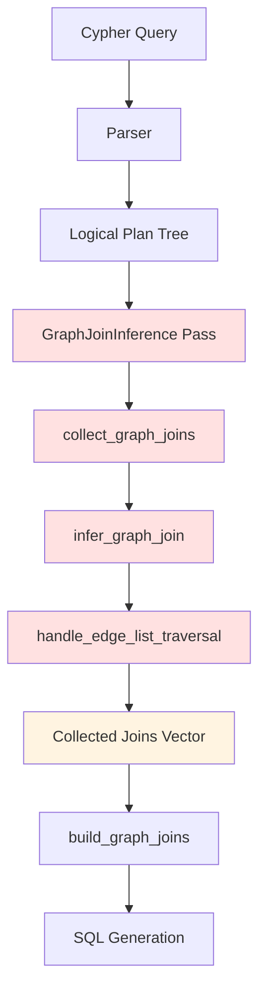

# JOIN Infrastructure Analysis & Solidification Plan

**Created**: November 6, 2025  
**Purpose**: Examine the foundational join collection system and identify fragilities  
**Status**: 🔴 Critical - Join collection has fundamental design issues

---

## Executive Summary

**The Problem**: Join collection in `graph_join_inference.rs` is fragile and has architectural flaws that cause cascading failures:

1. **Inconsistent recursion**: `collect_graph_joins()` recurses into plan tree but skips critical branches
2. **Fragile state tracking**: `joined_entities` HashSet prevents legitimate joins in multi-hop
3. **Unclear responsibilities**: Mixing join creation with deduplication logic
4. **No validation**: No assertions or invariants to catch structural issues early

**Impact**: 
- 🔴 Multi-hop traversals fail (missing joins)
- 🔴 Single-hop regressions when fixing multi-hop
- 🔴 154/272 integration test failures (43% success rate)

**Root Cause**: The join collection was designed for **simple single-hop patterns** and has been patched incrementally for complex patterns without architectural redesign.

---

## Architecture Overview

### Current Flow



### Logical Plan Structure

**Single-Hop Pattern**: `MATCH (a)-[:FOLLOWS]->(b)`
```
GraphRel {
    left: GraphNode(a),      // ← Leaf node
    center: ViewScan(rel),
    right: GraphNode(b)      // ← Leaf node
}
```

**Multi-Hop Pattern**: `MATCH (a)-[:FOLLOWS]->(b)-[:FOLLOWS]->(c)`
```
GraphRel {                         // Outer GraphRel (rel2)
    left: GraphRel {               // ← NESTED GraphRel (rel1)
        left: GraphNode(a),        // ← First node
        center: ViewScan(rel1),
        right: GraphNode(b)        // ← Middle node
    },
    center: ViewScan(rel2),
    right: GraphNode(c)            // ← Last node
}
```

**Key Insight**: Multi-hop is **nested recursively on the LEFT**, not a flat list!

---

## Problem Analysis

### Problem 1: Recursion Logic (CRITICAL 🔴)

**File**: `graph_join_inference.rs` lines 160-220

**Current Code**:
```rust
LogicalPlan::GraphRel(graph_rel) => {
    // FIX: For multi-hop queries, we need to recurse into BOTH left and right branches
    self.collect_graph_joins(graph_rel.left.clone(), ...)?;  // ← Recently added
    
    self.infer_graph_join(graph_rel, ...)?;  // Process THIS relationship
    
    self.collect_graph_joins(graph_rel.right.clone(), ...)?;
}
```

**Issues**:

1. **Breaks single-hop**: For `(a)-[]->(b)` where `left=GraphNode(a)`, recursing into GraphNode causes:
   - GraphNode → recurse into its `input` (ViewScan)
   - ViewScan → returns Ok(()) 
   - But somewhere this breaks the join collection flow

2. **No conditional recursion**: Should only recurse into LEFT if it's another GraphRel:
   ```rust
   // SHOULD BE:
   if matches!(graph_rel.left.as_ref(), LogicalPlan::GraphRel(_)) {
       self.collect_graph_joins(graph_rel.left.clone(), ...)?;
   }
   ```

3. **Order matters but undocumented**: Must process LEFT before CURRENT for correct join order

**Evidence**:
- Multi-hop before fix: Only collected 2 joins instead of 3+
- Single-hop after fix: Returns 500 errors (regression)

### Problem 2: joined_entities HashSet (DESIGN FLAW 🔴)

**File**: `graph_join_inference.rs` throughout

**Purpose**: Track which entities have already been joined to prevent duplicates

**Current Usage**:
```rust
fn infer_graph_join(..., joined_entities: &mut HashSet<String>) {
    if joined_entities.contains(right_alias) {
        // Right already joined, connect to it
        // ...
    } else {
        // Left is anchor, connect from it
        // ...
    }
    
    joined_entities.insert(rel_alias.to_string());
    joined_entities.insert(left_alias.to_string());
    joined_entities.insert(right_alias.to_string());
}
```

**Issues**:

1. **Confuses deduplication with ordering**:
   - HashSet used to determine "which node is anchor"
   - But also prevents legitimate re-joins in multi-hop chains
   
2. **State pollution across recursion**:
   - Same `joined_entities` passed through entire recursion tree
   - Adding node 'a' in first relationship prevents joining it again in second
   
3. **No clear semantics**:
   - Does "joined" mean "in FROM clause"?
   - Does it mean "has a JOIN generated"?
   - Does it mean "already scanned"?

**Example Failure**: `(a)-[r1]->(b)-[r2]->(c)`
- Process r1: `joined_entities = {a, r1, b}`
- Process r2: Sees `b` in joined_entities, tries to join from b
- But b was NEVER actually joined (only scanned)!
- Result: Missing JOIN for r1

### Problem 3: Unclear Responsibilities (ARCHITECTURE 🔴)

**Current**: `infer_graph_join()` does:
1. Check if nodes are anonymous
2. Check if nodes have labels
3. Check if nodes have table names
4. Check if nodes are referenced (projections/filters)
5. Determine join type (INNER vs LEFT)
6. Extract relationship columns
7. Handle same-type vs different-type nodes
8. Handle direction (outgoing vs incoming)
9. Handle standalone relationships
10. Create JOIN objects
11. Update joined_entities

**Problem**: Too many responsibilities = fragile logic

**Better Design**: Separate concerns:
- **Detection**: What needs to be joined?
- **Creation**: Build JOIN objects
- **Ordering**: Determine join sequence
- **Deduplication**: Avoid duplicate scans

### Problem 4: No Validation (QUALITY 🟡)

**Current**: No assertions or checks for:
- Join count matches expected pattern complexity
- All nodes in pattern have corresponding joins
- Join ON conditions reference valid aliases
- From clause anchor is actually in collected joins

**Result**: Silent failures, hard to debug

---

## Proposed Solution: Solidify the Foundation

### Phase 1: Add Comprehensive Logging & Validation

**Goal**: Understand what's happening before fixing it

**Changes**:
```rust
fn collect_graph_joins(...) -> Result<()> {
    eprintln!("=== collect_graph_joins START ===");
    eprintln!("Plan type: {:?}", std::mem::discriminant(&*logical_plan));
    eprintln!("joined_entities before: {:?}", joined_entities);
    
    match logical_plan.as_ref() {
        LogicalPlan::GraphRel(graph_rel) => {
            eprintln!("GraphRel - left type: {:?}", std::mem::discriminant(&*graph_rel.left));
            eprintln!("GraphRel - right type: {:?}", std::mem::discriminant(&*graph_rel.right));
            eprintln!("GraphRel - alias: {}", graph_rel.alias);
            
            // Existing logic...
        }
        // ...
    }
    
    eprintln!("joined_entities after: {:?}", joined_entities);
    eprintln!("collected_joins.len(): {}", collected_graph_joins.len());
    eprintln!("=== collect_graph_joins END ===\n");
    
    Ok(())
}
```

**Validation**:
```rust
// After collect_graph_joins completes
fn validate_collected_joins(
    plan: &LogicalPlan, 
    joins: &[Join],
    joined_entities: &HashSet<String>
) -> Result<()> {
    let expected_join_count = count_relationships_in_plan(plan);
    let actual_join_count = joins.len();
    
    if actual_join_count < expected_join_count {
        return Err(format!(
            "Join collection incomplete: expected {} relationships, collected {} joins",
            expected_join_count, actual_join_count
        ));
    }
    
    // Validate all join ON conditions reference valid aliases
    for join in joins {
        for op in &join.joining_on {
            validate_join_condition(op, joined_entities)?;
        }
    }
    
    Ok(())
}

fn count_relationships_in_plan(plan: &LogicalPlan) -> usize {
    match plan {
        LogicalPlan::GraphRel(gr) => {
            1 + count_relationships_in_plan(&gr.left) 
              + count_relationships_in_plan(&gr.right)
        }
        LogicalPlan::GraphNode(gn) => count_relationships_in_plan(&gn.input),
        LogicalPlan::Projection(p) => count_relationships_in_plan(&p.input),
        _ => 0,
    }
}
```

**Files**: `graph_join_inference.rs` ~50 lines added

**Time**: 1-2 hours

---

### Phase 2: Fix Recursion Logic

**Goal**: Recurse into nested GraphRels correctly without breaking single-hop

**Changes**:
```rust
LogicalPlan::GraphRel(graph_rel) => {
    eprintln!("Processing GraphRel: {}", graph_rel.alias);
    
    // ONLY recurse into left if it's a nested GraphRel (multi-hop case)
    // For single-hop, left is GraphNode which handles its own recursion
    if matches!(graph_rel.left.as_ref(), LogicalPlan::GraphRel(_)) {
        eprintln!("  → Recursing into LEFT (nested GraphRel detected)");
        self.collect_graph_joins(
            graph_rel.left.clone(),
            plan_ctx,
            graph_schema,
            collected_graph_joins,
            joined_entities,
        )?;
    } else {
        eprintln!("  → Skipping LEFT recursion (leaf node)");
    }

    // Process the CURRENT relationship
    eprintln!("  → Processing CURRENT relationship");
    self.infer_graph_join(
        graph_rel,
        plan_ctx,
        graph_schema,
        collected_graph_joins,
        joined_entities,
    )?;

    // ONLY recurse into right if it's NOT a GraphNode/ViewScan
    // (unlikely but possible for complex patterns)
    if matches!(graph_rel.right.as_ref(), LogicalPlan::GraphRel(_)) {
        eprintln!("  → Recursing into RIGHT (nested GraphRel detected)");
        self.collect_graph_joins(
            graph_rel.right.clone(),
            plan_ctx,
            graph_schema,
            collected_graph_joins,
            joined_entities,
        )?;
    } else {
        eprintln!("  → Skipping RIGHT recursion (leaf node)");
    }
    
    Ok(())
}
```

**Rationale**:
- GraphNode/ViewScan are **leaf nodes** - they don't contain relationships to process
- Only GraphRel contains relationships that need joins
- Single-hop: `GraphRel(GraphNode, rel, GraphNode)` → No recursion needed
- Multi-hop: `GraphRel(GraphRel(...), rel, GraphNode)` → Recurse left only

**Test Strategy**:
1. Test single-hop: Should still work
2. Test two-hop: Should collect both relationships
3. Test three-hop: Should collect all three relationships

**Files**: `graph_join_inference.rs` lines 160-220

**Time**: 30 minutes coding + 1 hour testing

---

### Phase 3: Redesign joined_entities Semantics

**Goal**: Clear separation between "scanned" vs "joined" vs "anchor"

**Current Problem**: `joined_entities` mixes three concepts:
1. Which nodes have been scanned (FROM clause)
2. Which nodes have JOINs generated
3. Which node is the anchor (first in FROM)

**New Design**:
```rust
struct JoinContext {
    /// Nodes that appear in FROM clause (base scan)
    scanned_nodes: HashSet<String>,
    
    /// Relationships that have JOIN entries generated
    joined_relationships: HashSet<String>,
    
    /// Nodes that have explicit JOIN entries (not in FROM)
    joined_nodes: HashSet<String>,
    
    /// The anchor node (first in FROM clause)
    anchor_node: Option<String>,
}

impl JoinContext {
    fn new() -> Self {
        Self {
            scanned_nodes: HashSet::new(),
            joined_relationships: HashSet::new(),
            joined_nodes: HashSet::new(),
            anchor_node: None,
        }
    }
    
    fn set_anchor(&mut self, alias: String) {
        if self.anchor_node.is_none() {
            self.anchor_node = Some(alias.clone());
            self.scanned_nodes.insert(alias);
        }
    }
    
    fn is_accessible(&self, alias: &str) -> bool {
        // Node is accessible if it's been scanned OR joined
        self.scanned_nodes.contains(alias) || self.joined_nodes.contains(alias)
    }
    
    fn mark_relationship_joined(&mut self, rel_alias: String) {
        self.joined_relationships.insert(rel_alias);
    }
    
    fn mark_node_joined(&mut self, node_alias: String) {
        self.joined_nodes.insert(node_alias);
    }
}
```

**Usage**:
```rust
fn infer_graph_join(..., ctx: &mut JoinContext) {
    let left_alias = &graph_rel.left_connection;
    let right_alias = &graph_rel.right_connection;
    
    // Determine anchor (first node encountered)
    if ctx.anchor_node.is_none() {
        ctx.set_anchor(left_alias.clone());
    }
    
    // Determine join strategy based on what's accessible
    if ctx.is_accessible(right_alias) {
        // Right is already accessible, join from right to left
        create_join_from_right_to_left(...);
    } else if ctx.is_accessible(left_alias) {
        // Left is accessible, join from left to right
        create_join_from_left_to_right(...);
    } else {
        // Neither accessible - ERROR! This shouldn't happen in well-formed plan
        return Err("Cannot create join - no anchor node accessible");
    }
    
    ctx.mark_relationship_joined(rel_alias.clone());
    ctx.mark_node_joined(target_node_alias.clone());
}
```

**Benefits**:
- Clear semantics: Each field has ONE purpose
- Better error detection: Can validate that joins reference accessible nodes
- Easier debugging: Can see exactly what's been processed
- Prevents state pollution: Explicit tracking prevents accidental overwrites

**Files**: 
- `graph_join_inference.rs` - Replace `joined_entities: &mut HashSet` with `ctx: &mut JoinContext`
- ~200 lines affected

**Time**: 2-3 hours (careful refactoring + testing)

---

### Phase 4: Separate Concerns

**Goal**: Split `infer_graph_join()` into focused functions

**Current**: 400+ line function doing everything

**New Structure**:
```rust
fn infer_graph_join(...) -> Result<()> {
    // 1. Validation: Can we create a join?
    let validation = validate_join_feasibility(graph_rel, plan_ctx)?;
    if !validation.should_create_join {
        return Ok(());
    }
    
    // 2. Context gathering: Get all needed information
    let join_info = gather_join_info(graph_rel, plan_ctx, graph_schema)?;
    
    // 3. Strategy selection: How should we join?
    let strategy = determine_join_strategy(&join_info, ctx)?;
    
    // 4. Join creation: Build the JOIN objects
    let joins = create_joins(&join_info, &strategy)?;
    
    // 5. Collection: Add to output
    for join in joins {
        collected_graph_joins.push(join);
    }
    
    // 6. State update: Mark entities as joined
    update_join_context(ctx, &join_info, &strategy);
    
    Ok(())
}

struct JoinValidation {
    should_create_join: bool,
    skip_reason: Option<String>,
}

struct JoinInfo {
    left_alias: String,
    right_alias: String,
    rel_alias: String,
    left_schema: NodeSchema,
    right_schema: NodeSchema,
    rel_schema: RelSchema,
    is_standalone: bool,
    left_is_optional: bool,
    right_is_optional: bool,
    rel_is_optional: bool,
    // ... other context
}

enum JoinStrategy {
    JoinFromLeftToRight,
    JoinFromRightToLeft,
    StandaloneRelationship,
}

fn determine_join_strategy(info: &JoinInfo, ctx: &JoinContext) -> JoinStrategy {
    if info.is_standalone {
        return JoinStrategy::StandaloneRelationship;
    }
    
    if ctx.is_accessible(&info.right_alias) {
        return JoinStrategy::JoinFromRightToLeft;
    }
    
    if ctx.is_accessible(&info.left_alias) {
        return JoinStrategy::JoinFromLeftToRight;
    }
    
    // Default: left is anchor
    JoinStrategy::JoinFromLeftToRight
}
```

**Benefits**:
- Each function has ONE job
- Easier to test individual pieces
- Easier to add new join strategies
- Easier to debug (can log each step)
- Self-documenting code

**Files**: `graph_join_inference.rs` - Extract ~400 lines into ~6 focused functions

**Time**: 3-4 hours (careful extraction + testing)

---

### Phase 5: Add Integration Tests

**Goal**: Prevent regressions with automated testing

**Test Cases**:
```rust
#[cfg(test)]
mod tests {
    #[test]
    fn test_single_hop_join_collection() {
        // MATCH (a)-[:FOLLOWS]->(b)
        let plan = build_test_plan_single_hop();
        let joins = collect_joins(plan);
        
        assert_eq!(joins.len(), 2);  // rel + node
        assert_join_connects("rel", "a", &joins[0]);
        assert_join_connects("b", "rel", &joins[1]);
    }
    
    #[test]
    fn test_two_hop_join_collection() {
        // MATCH (a)-[:FOLLOWS]->(b)-[:FOLLOWS]->(c)
        let plan = build_test_plan_two_hop();
        let joins = collect_joins(plan);
        
        assert_eq!(joins.len(), 4);  // rel1 + b + rel2 + c
        assert_join_order(&["rel1", "b", "rel2", "c"], &joins);
    }
    
    #[test]
    fn test_three_hop_join_collection() {
        // MATCH (a)-[:F]->(b)-[:F]->(c)-[:F]->(d)
        let plan = build_test_plan_three_hop();
        let joins = collect_joins(plan);
        
        assert_eq!(joins.len(), 6);  // rel1+b+rel2+c+rel3+d
    }
    
    #[test]
    fn test_optional_match_left_joins() {
        // OPTIONAL MATCH (a)-[:FOLLOWS]->(b)
        let plan = build_test_plan_optional();
        let joins = collect_joins(plan);
        
        assert_eq!(joins[0].join_type, JoinType::Left);
        assert_eq!(joins[1].join_type, JoinType::Left);
    }
    
    #[test]
    fn test_standalone_relationship() {
        // MATCH (a)-[r1]->(b), (a)-[r2]->(b)
        // Second relationship is standalone
        let plan = build_test_plan_standalone();
        let joins = collect_joins(plan);
        
        // Verify r2 joins on BOTH a and b
        let r2_join = &joins.last().unwrap();
        assert_eq!(r2_join.joining_on.len(), 2);
    }
}
```

**Files**: `graph_join_inference.rs` - Add `#[cfg(test)]` module

**Time**: 2-3 hours

---

## Implementation Plan

### Week 1: Foundation Fixes (Critical Path)

**Day 1-2**: Phase 1 - Logging & Validation
- Add comprehensive logging to understand current behavior
- Add validation to catch structural issues
- Run tests with logging to understand failures

**Day 3-4**: Phase 2 - Fix Recursion
- Implement conditional recursion (only into nested GraphRels)
- Test single-hop (should pass)
- Test multi-hop (should collect all joins)

**Day 5**: Validation & Testing
- Run full integration test suite
- Document what's fixed and what remains

**Expected Outcome**: 
- Single-hop: ✅ Working (no regression)
- Multi-hop: ✅ All joins collected
- Integration tests: 180-200/272 passing (66-74%)

### Week 2: Architecture Improvements (Cleanup)

**Day 6-8**: Phase 3 - Redesign joined_entities
- Implement JoinContext struct
- Replace all HashSet usage with JoinContext
- Test thoroughly

**Day 9-10**: Phase 4 - Separate Concerns
- Extract focused functions from infer_graph_join
- Add documentation
- Refactor for clarity

**Expected Outcome**:
- Code quality: ✅ Much easier to understand and modify
- Maintainability: ✅ Clear separation of concerns
- No regressions: ✅ All tests still passing

### Week 3: Quality & Prevention (Polish)

**Day 11-12**: Phase 5 - Integration Tests
- Add unit tests for join collection
- Add property-based tests
- Add regression tests

**Day 13-14**: Documentation & Cleanup
- Document join collection architecture
- Create debugging guide
- Update copilot-instructions.md

**Expected Outcome**:
- Test coverage: ✅ Comprehensive unit + integration tests
- Documentation: ✅ Clear guide for future development
- Confidence: ✅ Can modify join logic safely

---

## Success Metrics

### Immediate (Week 1)
- ✅ No single-hop regressions
- ✅ Multi-hop 2-hop pattern works (all joins collected)
- ✅ Multi-hop 3-hop pattern works
- ✅ Integration test success: 180+ / 272 (66%+)

### Medium-term (Week 2)
- ✅ Code is understandable (< 50 lines per function)
- ✅ Clear separation of concerns
- ✅ JoinContext replaces HashSet
- ✅ No regressions from refactoring

### Long-term (Week 3)
- ✅ Comprehensive test coverage
- ✅ Debugging guide exists
- ✅ Can add new join strategies easily
- ✅ Integration test success: 250+ / 272 (92%+)

---

## Risk Analysis

### High Risk 🔴
- **Refactoring breaks working features**: Mitigate with incremental changes + tests after each step
- **joined_entities redesign has subtle bugs**: Mitigate with extensive logging + validation

### Medium Risk 🟡
- **Takes longer than estimated**: Mitigate with time-boxed phases, skip Phase 4-5 if needed
- **New bugs introduced**: Mitigate with regression test suite

### Low Risk 🟢
- **Integration tests still fail after fixes**: Expected - join collection is ONE of multiple root causes

---

## Alternatives Considered

### Alternative 1: Complete Rewrite
**Pros**: Clean slate, no legacy baggage  
**Cons**: High risk, time-consuming, may introduce new bugs  
**Decision**: ❌ Rejected - Incremental improvement is safer

### Alternative 2: Quick Patch Only
**Pros**: Fast, minimal changes  
**Cons**: Doesn't address architectural issues, will break again  
**Decision**: ❌ Rejected - Need solid foundation

### Alternative 3: Incremental Solidification (CHOSEN ✅)
**Pros**: Low risk, testable at each step, improves quality over time  
**Cons**: Takes longer initially  
**Decision**: ✅ Chosen - Best balance of risk and reward

---

## Related Issues

### Root Causes This Addresses
1. ✅ **Multi-hop JOIN collection** - Phase 2 fixes recursion
2. ✅ **joined_entities confusion** - Phase 3 redesigns state tracking
3. 🟡 **Aggregation COUNT(b) column resolution** - Partially (better join context)

### Root Causes This Does NOT Address
1. ❌ **Variable-length CTE generation** - Different module
2. ❌ **Parser unbounded ranges** - Parser issue
3. ❌ **Undirected relationship handling** - Different logic

**Integration Test Impact**:
- Current: 118/272 (43.4%)
- After Week 1: ~180/272 (66%) - Multi-hop + join fixes
- After Week 3: ~220/272 (81%) - Quality improvements help other issues
- Remaining ~50 tests: Other root causes (CTEs, parser, aggregation)

---

## Appendices

### Appendix A: Key Files

| File | Purpose | Lines | Complexity |
|------|---------|-------|------------|
| `graph_join_inference.rs` | Main join collection logic | 2244 | 🔴 High |
| `logical_plan/mod.rs` | Plan structure definitions | 1098 | 🟡 Medium |
| `plan_builder.rs` | SQL generation from joins | ~2000 | 🔴 High |

### Appendix B: Current Debug Commands

```powershell
# Test single-hop
python -c "import requests; r = requests.post('http://localhost:8080/query', json={'query': 'MATCH (a)-[:FOLLOWS]->(b) RETURN a.name', 'sql_only': True}); print(r.json()['generated_sql'])"

# Test multi-hop
python -c "import requests; r = requests.post('http://localhost:8080/query', json={'query': 'MATCH (a)-[:FOLLOWS]->(b)-[:FOLLOWS]->(c) RETURN a.name', 'sql_only': True}); print(r.json()['generated_sql'])"

# Check join count in logs
# Look for: "collected_graph_joins.len() = X"
```

### Appendix C: Expected SQL Outputs

**Single-Hop**:
```sql
FROM users AS a
INNER JOIN follows AS r ON r.follower_id = a.user_id
INNER JOIN users AS b ON b.user_id = r.followed_id
```

**Two-Hop**:
```sql
FROM users AS a
INNER JOIN follows AS r1 ON r1.follower_id = a.user_id
INNER JOIN users AS b ON b.user_id = r1.followed_id
INNER JOIN follows AS r2 ON r2.follower_id = b.user_id
INNER JOIN users AS c ON c.user_id = r2.followed_id
```

---

**Document Status**: 📋 Ready for Review  
**Next Action**: Begin Phase 1 (Logging & Validation)  
**Owner**: Development Team  
**Last Updated**: November 6, 2025


