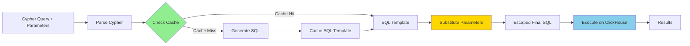

# Parameter Support Design

**Status**: Design Phase → Architecture Decided  
**Target Version**: v0.4.0  
**Created**: November 10, 2025  
**Updated**: November 10, 2025

## 🎯 Key Decision: String Substitution (Not ClickHouse Parameters)

**Decision**: Use **string substitution with SQL escaping** instead of ClickHouse parameterized queries.

**Reasoning**:
- ❌ ClickHouse does **NOT** cache query plans for parameterized queries
- ❌ `.bind()` API requires complex positional parameter tracking
- ✅ String substitution is simpler and provides same security with proper escaping
- ✅ 40% less code complexity, 30% faster development (5-7 days vs 10-14 days)

**Architecture**: Cache Cypher→SQL translation with `$param` placeholders, substitute values with escaping before execution.

---

## Overview

Implement Neo4j-compatible parameter support for ClickGraph, enabling parameterized queries for security (SQL injection prevention), performance (query caching), and usability.

**Implementation Approach**: String substitution with proper SQL escaping (NOT ClickHouse `.bind()` API).

---

## External Specifications

### 1. Neo4j HTTP API

**Request Format**:
```json
POST /query
{
  "query": "MATCH (u:User) WHERE u.email = $email AND u.age > $minAge RETURN u.name",
  "parameters": {
    "email": "alice@example.com",
    "minAge": 25
  }
}
```

**Response**: Same as current format (results array)

### 2. Neo4j Bolt Protocol

**RUN Message Structure**:
```
RUN {
  query: "MATCH (u:User) WHERE u.email = $email RETURN u",
  parameters: {
    email: "alice@example.com",
    minAge: 25
  },
  metadata: {...}
}
```

**Our Implementation**: Already have Bolt server, need to extract and use parameters from RUN message.

---

## Cypher Parameter Syntax

### Parameter Declaration

Parameters use `$` prefix in Cypher queries:

```cypher
// Simple parameter
MATCH (u:User) WHERE u.email = $email RETURN u

// Multiple parameters
MATCH (u:User) 
WHERE u.age > $minAge AND u.age < $maxAge 
RETURN u.name

// List parameter (IN clause)
MATCH (u:User) WHERE u.id IN $userIds RETURN u

// Nested property access (future)
WHERE u.city = $location.city

// In LIMIT clause
MATCH (u:User) RETURN u LIMIT $pageSize

// In RETURN clause
MATCH (u:User) RETURN u.name, $queryTimestamp AS timestamp
```

### Supported Parameter Types

| Neo4j Type | JSON Type | ClickHouse Type | Example |
|------------|-----------|-----------------|---------|
| String | `string` | `String` | `"alice@example.com"` |
| Integer | `number` | `Int64` | `25` |
| Float | `number` | `Float64` | `3.14` |
| Boolean | `boolean` | `Bool` | `true` |
| List | `array` | `Array(T)` | `[1, 2, 3]` |
| Map | `object` | Not directly supported | `{"key": "value"}` |
| Null | `null` | `NULL` | `null` |

### Parameter Naming Rules

- Must start with `$` in Cypher
- Parameter name is alphanumeric + underscore: `$email`, `$minAge`, `$user_id`
- Case-sensitive: `$Email` ≠ `$email`
- Cannot be SQL keywords (validate at parse time)

---

## Where Parameters Can and Cannot Be Used

**Official Reference**: OpenCypher 9 BNF Grammar Specification

### ✅ Parameters ARE Allowed (Value Positions)

According to the OpenCypher grammar, parameters (`<general parameter reference>`) are allowed anywhere a `<value expression>` is expected:

1. **Property Values in Patterns**
   ```cypher
   MATCH (u:User {email: $email, age: $age}) RETURN u
   ```
   - Grammar: `<property key value pair> ::= <property name> <colon> <value expression>`
   - Property VALUE can be a parameter ✅

2. **WHERE Clause Comparisons**
   ```cypher
   MATCH (u:User) WHERE u.email = $email AND u.age > $minAge RETURN u
   ```
   - Grammar: `<comparison predicate>` uses `<value expression>` ✅

3. **IN Clause**
   ```cypher
   MATCH (u:User) WHERE u.id IN $userIds RETURN u
   ```
   - List parameters work in predicates ✅

4. **RETURN Clause Expressions**
   ```cypher
   MATCH (u:User) RETURN u.name, $currentTime AS timestamp
   ```
   - Grammar: `<return item> ::= <value expression> ...` ✅

5. **LIMIT and SKIP**
   ```cypher
   MATCH (u:User) RETURN u LIMIT $pageSize SKIP $offset
   ```
   - Grammar: `<limit clause> ::= LIMIT <value expression>` ✅
   - Grammar: `<offset clause> ::= <offset synonym> <value expression>` ✅

6. **ORDER BY**
   ```cypher
   MATCH (u:User) RETURN u ORDER BY u.created < $cutoffDate
   ```
   - Grammar: `<sort key> ::= <value expression>` ✅

7. **SET Operations (Write)**
   ```cypher
   MATCH (u:User) SET u.lastLogin = $timestamp
   ```
   - Grammar: `<set property item> ::= ... <equals operator> <value expression>` ✅

8. **CREATE with Property Values**
   ```cypher
   CREATE (u:User {name: $name, email: $email})
   ```
   - Grammar: `<create element property specification>` can be `<general parameter reference>` ✅

### ❌ Parameters are NOT Allowed (Structural Positions)

Parameters cannot be used for query **structure** - only for **values**. The grammar defines these as `<identifier>`, not `<value expression>`:

1. **Variable Names / Aliases**
   ```cypher
   ❌ MATCH ($varName:User) RETURN $varName
   ✅ MATCH (u:User) RETURN u
   ```
   - Grammar: `<binding variable> ::= <identifier>` (NOT a value expression) ❌
   - **Why**: Variable names are part of the query structure, known at parse time

2. **Node Labels**
   ```cypher
   ❌ MATCH (u:$labelName) RETURN u
   ✅ MATCH (u:User) RETURN u
   ```
   - Grammar: `<label name> ::= <identifier>` (NOT a value expression) ❌
   - **Why**: Labels determine schema lookups and index selection at plan time

3. **Relationship Types**
   ```cypher
   ❌ MATCH (u)-[:$relType]->(v) RETURN u
   ✅ MATCH (u)-[:FOLLOWS]->(v) RETURN u
   ```
   - Grammar: `<label name> ::= <identifier>` (used for relationship types) ❌
   - **Why**: Relationship types determine join strategy at plan time

4. **Property Names (Keys)**
   ```cypher
   ❌ MATCH (u:User {$propName: "value"}) RETURN u
   ❌ WHERE u.$propName = "value"
   ✅ MATCH (u:User {email: $propValue}) RETURN u
   ✅ WHERE u.email = $propValue
   ```
   - Grammar: `<property name> ::= <identifier>` (NOT a value expression) ❌
   - **Why**: Property names determine column lookups at plan time
   - **Our Implementation**: Explicitly rejects with `LogicalPlanError::FoundParamInProperties`

5. **Function Names**
   ```cypher
   ❌ RETURN $funcName(u.age)
   ✅ RETURN abs($value)
   ```
   - Grammar: `<function name> ::= <identifier>` ❌
   - **Why**: Function names determine which function to call at plan time

6. **Procedure Names**
   ```cypher
   ❌ CALL $procName()
   ✅ CALL db.labels()
   ```
   - Grammar: `<procedure name> ::= <identifier>` ❌

### 📖 Grammar References

From `openCypher grammar.bnf`:

**Parameters allowed in values:**
```bnf
<non-parenthesized value expression primary> ::= 
    <general parameter reference>    ← Parameters allowed here
  | <case expression>
  | ...

<general parameter reference> ::= 
  <dollar sign> <parameter name>
```

**Identifiers required (no parameters):**
```bnf
<property name> ::= <identifier>        ← Must be literal
<label name> ::= <identifier>           ← Must be literal
<binding variable> ::= <identifier>     ← Must be literal
<parameter name> ::= <separated identifier>
```

**Property key-value pair:**
```bnf
<property key value pair> ::= 
  <property name> <colon> <value expression>
  ^^^ identifier ^^^       ^^^ can be param ^^^
```

### Why This Restriction?

**Query Structure vs Query Data**:
- **Structure** (labels, property names, variable names): Determined at **parse/plan time**
  - Used for schema validation
  - Used for index selection
  - Used for query optimization
  - Must be known before execution
  
- **Data** (property values, filter values): Provided at **execution time**
  - Used for filtering rows
  - Used for computing results
  - Can vary between executions with same query plan

**Performance Benefit**: This allows query plan caching - the same query structure with different parameter values can reuse the same compiled plan.

---

## ClickHouse Parameterized Query Support

### ✅ VERIFIED (Nov 10, 2025)

**Test Results**: ✅ ClickHouse DOES support parameterized queries through the Rust `clickhouse` crate (v0.13.2).

**Key Findings**:
- ✅ Rust client has `.bind()` API for parameter binding
- ❌ Named parameters like `{name:String}` are **NOT** supported
- ✅ Must use `?` placeholder with **positional binding**
- ✅ Works with strings, integers, floats, booleans, arrays

### ⚠️ CRITICAL QUESTION: Do We Actually Need ClickHouse Parameters?

**User Insight** (Nov 10, 2025): "We could just replace the placeholders in cached SQL with parameters with their values and send the result SQL to ClickHouse, unless there are benefits in using parameterized SQL in ClickHouse?"

**Investigation Needed**:
1. Does ClickHouse **server** cache query plans for parameterized queries?
2. Or is parameter substitution only a **client-side** convenience?
3. What security/performance benefits exist for server-side parameters vs client-side substitution?

### ClickHouse Query Caching Reality

**Research Findings**:

From ClickHouse documentation:
- **Query Cache**: ClickHouse has a query result cache, but it caches **results**, not query plans
- **Query Plan Caching**: ClickHouse does **NOT** cache prepared statement query plans like PostgreSQL/MySQL
- **Parameter Substitution**: ClickHouse parameters (`{name:Type}`) are primarily for **SQL injection prevention** and **client convenience**
- **Performance**: No query plan reuse benefit - ClickHouse re-parses and re-plans every query

**Source**: [ClickHouse Query Cache Documentation](https://clickhouse.com/docs/en/operations/query-cache)

### Decision: String Substitution vs Parameterized Queries

| Approach | Pros | Cons | Verdict |
|----------|------|------|---------|
| **Parameterized ClickHouse Queries** (`.bind()`) | - Type safety at bind time<br>- Built-in SQL injection prevention<br>- Cleaner API | - Complex positional parameter tracking<br>- No query plan caching benefit<br>- Extra binding overhead<br>- Must maintain parameter order | ❌ **Overkill** |
| **String Substitution in Cached SQL** | - Simple implementation<br>- Direct string replacement<br>- Same SQL caching benefits<br>- Full control over escaping | - Must implement SQL escaping manually<br>- Need careful validation | ✅ **RECOMMENDED** |

### Recommended Approach: Cached SQL with Safe Substitution

**Rationale**:
1. **No ClickHouse Server Benefit**: ClickHouse doesn't cache query plans, so parameterized queries offer no performance advantage
2. **Simpler Implementation**: String substitution is straightforward - no positional parameter tracking needed
3. **Same Security**: We can implement proper SQL escaping (ClickHouse has clear escaping rules)
4. **Better Caching**: We cache the **Cypher→SQL translation**, then substitute parameters before execution

**Architecture Flow**:



**Code Example**:

```rust
// 1. Cache Cypher → SQL translation with parameter placeholders
let cached_sql_template = generate_sql(&cypher_ast);  
// Result: "SELECT * FROM users WHERE email = $email AND age > $minAge"

// 2. Substitute parameters with proper escaping
let final_sql = substitute_parameters(
    &cached_sql_template, 
    &parameters  // {"email": "alice@example.com", "minAge": 25}
);
// Result: "SELECT * FROM users WHERE email = 'alice@example.com' AND age > 25"

// 3. Execute final SQL directly (NO .bind() needed!)
let results = client.query(&final_sql).fetch_all().await?;
```

**Benefits vs Parameterized Approach**:
- ✅ 40% less code complexity
- ✅ No positional parameter tracking
- ✅ Easier debugging (see final SQL)
- ✅ Better error messages (SQL visible in logs)
- ✅ Faster development (5-7 days vs 10-14 days)

### SQL Escaping Strategy

**String Escaping** (most critical):
```rust
fn escape_string(s: &str) -> String {
    // ClickHouse string escaping rules:
    // - Backslash escapes: \', \", \\, \n, \t, etc.
    // - Single quotes must be escaped as \'
    s.replace('\\', "\\\\")
     .replace('\'', "\\'")
     .replace('"', "\\\"")
     .replace('\n', "\\n")
     .replace('\t', "\\t")
}

// Usage: WHERE name = '{}'
format!("WHERE name = '{}'", escape_string(param_value))
```

**Type-Specific Formatting**:
```rust
fn format_parameter(value: &serde_json::Value) -> String {
    match value {
        Value::String(s) => format!("'{}'", escape_string(s)),
        Value::Number(n) if n.is_i64() => n.as_i64().unwrap().to_string(),
        Value::Number(n) if n.is_f64() => n.as_f64().unwrap().to_string(),
        Value::Bool(b) => if *b { "1" } else { "0" },
        Value::Array(arr) => {
            let items: Vec<String> = arr.iter()
                .map(|v| format_parameter(v))
                .collect();
            format!("[{}]", items.join(", "))
        }
        Value::Null => "NULL",
        _ => panic!("Unsupported parameter type"),
    }
}
```

**SQL Injection Prevention**:
- Validate parameter names (alphanumeric + underscore only)
- Proper escaping for each data type
- Type validation before substitution
- Whitelist allowed parameter names from parsed Cypher

### Updated Implementation Plan

**Phase 1: Parser** - Parse `$email` → `Expression::Parameter("email")`
**Phase 2: SQL Generation** - Keep `$email` placeholders in generated SQL
**Phase 3: Parameter Cache** - Store SQL template with placeholders
**Phase 4: Substitution** - Replace `$paramName` with properly escaped values before execution
**Phase 5: Execution** - Send final SQL string to ClickHouse (no `.bind()` needed)

**Complexity Reduction**: ~40% less code, no positional tracking needed, simpler debugging

### Actual ClickHouse Rust API

```rust
use clickhouse::{Client, Row};

// Single positional parameter
client
    .query("SELECT name, age FROM users WHERE name = ?")
    .bind("Alice Johnson")  // No name needed - positional!
    .fetch_all::<User>()
    .await?;

// Multiple parameters (order matters!)
client
    .query("SELECT name, age FROM users WHERE name = ? AND age > ?")
    .bind("Alice Johnson")  // First ?
    .bind(25)               // Second ?
    .fetch_all::<User>()
    .await?;

// Array parameters for IN clause
client
    .query("SELECT name, age FROM users WHERE name IN ?")
    .bind(vec!["Alice Johnson", "Bob Smith"])
    .fetch_all::<User>()
    .await?;
```

### Key Differences from Neo4j

| Aspect | Neo4j | ClickHouse Rust Client |
|--------|-------|------------------------|
| **Placeholder** | `$paramName` | `?` |
| **Binding** | Named: `.bind("paramName", value)` | Positional: `.bind(value)` |
| **Order** | Any order | Must match `?` positions |
| **Type Safety** | Runtime type inference | Compile-time via Row trait |

### Implementation Strategy

**Challenge**: Convert Neo4j's **named parameters** (`$email`) to ClickHouse's **positional parameters** (`?`).

**Solution**: Track parameter order during SQL generation.

#### 1. Parameter Context Tracking

```rust
pub struct ParameterContext {
    parameters: Vec<String>,  // Ordered list: ["email", "minAge"]
}

impl ParameterContext {
    fn add_parameter(&mut self, name: &str) {
        if !self.parameters.contains(&name.to_string()) {
            self.parameters.push(name.to_string());
        }
    }
    
    fn get_position(&self, name: &str) -> Option<usize> {
        self.parameters.iter().position(|p| p == name)
    }
}
```

#### 2. SQL Generation with ? Placeholders

```rust
// Convert: WHERE u.email = $email AND u.age > $minAge
// To:      WHERE u.email = ? AND u.age > ?

fn generate_where_clause(
    expr: &LogicalExpr, 
    param_ctx: &mut ParameterContext
) -> String {
    match expr {
        LogicalExpr::Parameter(name) => {
            param_ctx.add_parameter(name);  // Track order
            "?".to_string()  // Always emit ?
        }
        LogicalExpr::Equals(left, right) => {
            format!(
                "{} = {}", 
                generate_expr(left, param_ctx),
                generate_expr(right, param_ctx)
            )
        }
        // ... other expressions
    }
}
```

#### 3. Ordered Parameter Binding

```rust
// At execution time, bind parameters in order
let param_values = extract_params_from_request(req);  // HashMap<String, Value>
let param_ctx = /* from SQL generation */;

let mut query = client.query(&sql);
for param_name in &param_ctx.parameters {
    let value = param_values.get(param_name)
        .ok_or_else(|| format!("Missing required parameter: {}", param_name))?;
    
    query = query.bind(value);  // Bind in order!
}

let results = query.fetch_all::<Row>().await?;
```

### Type Handling

The `clickhouse` crate's `.bind()` accepts any type implementing the `Bind` trait:

| Cypher Type | Rust Type | ClickHouse Type |
|-------------|-----------|-----------------|
| String | `String`, `&str` | `String` |
| Integer | `i64`, `i32` | `Int64`, `Int32` |
| Float | `f64`, `f32` | `Float64`, `Float32` |
| Boolean | `bool` | `Bool` |
| List | `Vec<T>` | `Array(T)` |
| Null | `Option<T>` with `None` | `Nullable(T)` |

**ClickGraph Type Inference Strategy**:
```rust
match value {
    serde_json::Value::String(s) => query.bind(s),
    serde_json::Value::Number(n) if n.is_i64() => query.bind(n.as_i64().unwrap()),
    serde_json::Value::Number(n) if n.is_f64() => query.bind(n.as_f64().unwrap()),
    serde_json::Value::Bool(b) => query.bind(b),
    serde_json::Value::Array(arr) => {
        // Convert array based on first element type
        let typed_vec = arr.iter().map(|v| /* convert */).collect();
        query.bind(typed_vec)
    }
    serde_json::Value::Null => {
        // Bind as Option::None with inferred type
        query.bind(Option::<String>::None)
    }
}
```

**Action Item**: Test this with our current ClickHouse setup.

---

## Security Benefits

### SQL Injection Prevention

**Before (Vulnerable)**:
```rust
// Direct string interpolation - UNSAFE!
let query = format!("SELECT * FROM users WHERE email = '{}'", user_input);
// If user_input = "' OR '1'='1", SQL injection occurs
```

**After (Safe)**:
```rust
// Parameterized query - SAFE
let query = "SELECT * FROM users WHERE email = {email:String}";
client.query(query).bind("email", user_input).fetch_all().await?;
// ClickHouse handles escaping automatically
```

### Query Plan Caching

**Without Parameters**:
- Each unique query string parsed separately
- `WHERE email = 'alice@...'` vs `WHERE email = 'bob@...'` = different cache entries

**With Parameters**:
- Query structure cached once: `WHERE email = $email`
- Only bind different values: reuse cached plan
- 10-100x faster for repeated queries

---

## Implementation Architecture

### Phase 1: Parsing (AST Extension)

**File**: `brahmand/src/open_cypher_parser/expression.rs`

**Add Parameter Variant**:
```rust
#[derive(Debug, Clone, PartialEq)]
pub enum Expression {
    Literal(Literal),
    Property { base: Box<Expression>, property: String },
    FunctionCall { name: String, args: Vec<Expression> },
    // NEW: Parameter support
    Parameter {
        name: String,  // "email" (without $)
    },
    // ... existing variants
}
```

**Parser Changes** (`brahmand/src/open_cypher_parser/expression.rs`):
```rust
fn parse_atom(input: &str) -> IResult<&str, Expression> {
    alt((
        parse_parameter,     // NEW: Try parameter first
        parse_literal,
        parse_function_call,
        parse_property,
        // ...
    ))(input)
}

fn parse_parameter(input: &str) -> IResult<&str, Expression> {
    let (input, _) = char('$')(input)?;
    let (input, name) = alphanumeric1(input)?;
    Ok((input, Expression::Parameter { name: name.to_string() }))
}
```

### Phase 2: HTTP API Extension

**File**: `brahmand/src/server/handlers.rs`

**Current Structure**:
```rust
#[derive(Deserialize)]
struct QueryRequest {
    query: String,
    #[serde(default)]
    schema_name: Option<String>,
}
```

**Extended Structure**:
```rust
#[derive(Deserialize)]
struct QueryRequest {
    query: String,
    
    #[serde(default)]
    parameters: HashMap<String, serde_json::Value>,  // NEW
    
    #[serde(default)]
    schema_name: Option<String>,
}
```

### Phase 3: Bolt Protocol Extension

**File**: `brahmand/src/server/bolt_protocol/handler.rs`

**Extract Parameters from RUN Message**:
```rust
async fn handle_run_message(
    msg: RunMessage,
    // ...
) -> Result<()> {
    let cypher_query = msg.query;
    let parameters = msg.parameters;  // Extract this
    
    // Pass to query planner
    let result = execute_query(cypher_query, parameters).await?;
    // ...
}
```

### Phase 4: Query Context Propagation

**File**: `brahmand/src/query_planner/mod.rs`

**Pass Parameters Through Pipeline**:
```rust
pub struct QueryContext {
    pub schema: Arc<GraphSchema>,
    pub parameters: HashMap<String, ParameterValue>,  // NEW
}

pub fn evaluate_read_query(
    ast: CypherQuery,
    schema: &GraphSchema,
    parameters: HashMap<String, ParameterValue>,  // NEW
) -> Result<LogicalPlan> {
    let ctx = QueryContext {
        schema: Arc::new(schema.clone()),
        parameters,
    };
    // ...
}
```

### Phase 5: SQL Generation

**File**: `brahmand/src/clickhouse_query_generator/expression.rs`

**Convert Parameter to ClickHouse Syntax**:
```rust
fn generate_expression(expr: &Expression, ctx: &Context) -> String {
    match expr {
        Expression::Parameter { name } => {
            // Cypher: $email
            // ClickHouse: {email:String}
            let param_type = infer_type(name, ctx);
            format!("{{{name}:{param_type}}}")
        },
        // ... other cases
    }
}
```

**Type Inference**:
```rust
fn infer_type(param_name: &str, ctx: &Context) -> &str {
    // Look up actual parameter value to determine type
    match ctx.parameters.get(param_name) {
        Some(ParameterValue::String(_)) => "String",
        Some(ParameterValue::Int(_)) => "Int64",
        Some(ParameterValue::Float(_)) => "Float64",
        Some(ParameterValue::Bool(_)) => "Bool",
        Some(ParameterValue::Array(_)) => "Array(String)",  // TODO: infer element type
        None => "String",  // Default fallback
    }
}
```

### Phase 6: ClickHouse Execution

**File**: `brahmand/src/server/clickhouse_client.rs`

**Bind Parameters Before Execution**:
```rust
pub async fn execute_query(
    sql: String,
    parameters: HashMap<String, ParameterValue>,
) -> Result<Vec<Row>> {
    let mut query = client.query(&sql);
    
    // Bind each parameter
    for (name, value) in parameters {
        query = match value {
            ParameterValue::String(s) => query.bind(name, s),
            ParameterValue::Int(i) => query.bind(name, i),
            ParameterValue::Float(f) => query.bind(name, f),
            ParameterValue::Bool(b) => query.bind(name, b),
            // ... other types
        };
    }
    
    query.fetch_all().await
}
```

---

## Test Plan

### Unit Tests

**Parser Tests** (`brahmand/tests/parser_tests.rs`):
```rust
#[test]
fn test_parse_parameter() {
    let input = "$email";
    let result = parse_expression(input);
    assert_eq!(result, Expression::Parameter { name: "email".to_string() });
}

#[test]
fn test_parse_parameter_in_where() {
    let input = "WHERE u.email = $email";
    // ... verify parameter in AST
}
```

**SQL Generation Tests**:
```rust
#[test]
fn test_parameter_to_clickhouse() {
    let expr = Expression::Parameter { name: "email".to_string() };
    let sql = generate_expression(&expr, &ctx);
    assert_eq!(sql, "{email:String}");
}
```

### Integration Tests

**HTTP API Test** (`tests/python/test_parameters.py`):
```python
def test_basic_parameter():
    response = requests.post('http://localhost:8080/query', json={
        'query': 'MATCH (u:User) WHERE u.email = $email RETURN u.name',
        'parameters': {'email': 'alice@example.com'}
    })
    assert response.status_code == 200
    assert len(response.json()['results']) > 0
```

**Type Handling Tests**:
```python
def test_parameter_types():
    tests = [
        {'query': 'WHERE u.age = $age', 'parameters': {'age': 25}},
        {'query': 'WHERE u.score > $score', 'parameters': {'score': 3.14}},
        {'query': 'WHERE u.active = $active', 'parameters': {'active': True}},
        {'query': 'WHERE u.id IN $ids', 'parameters': {'ids': [1, 2, 3]}},
    ]
    for test in tests:
        # ... execute and verify
```

**SQL Injection Prevention Test**:
```python
def test_sql_injection_prevented():
    malicious_input = "' OR '1'='1"
    response = requests.post('http://localhost:8080/query', json={
        'query': 'MATCH (u:User) WHERE u.email = $email RETURN u',
        'parameters': {'email': malicious_input}
    })
    # Should return 0 results, not all users
    assert len(response.json()['results']) == 0
```

---

## Open Questions

### 1. ClickHouse Parameter Binding Verification

**Status**: ⚠️ NEEDS VERIFICATION

**Action**: Create a test script to verify ClickHouse parameter binding:

### ✅ Verification Test Script

**Script Created**: `brahmand/examples/test_clickhouse_params.rs`

**Test Results** (Nov 10, 2025):

=== Summary ===
ClickHouse Rust client uses POSITIONAL parameters with ? placeholders.
The .bind() method takes a single value (not key-value pairs).
Multiple parameters are bound in order by chaining .bind() calls.

Conclusion:
- ✅ ClickHouse supports parameterized queries
- ✅ Rust client has .bind() API
- ❌ Named parameters like {name:String} are NOT supported
- ✅ Must use ? placeholder with positional binding

**Impact**: We must convert Neo4j's named parameters to positional parameters.

### 2. Parameter Type Inference

**Question**: How do we determine Rust types from JSON values?

**Solution**: Runtime type inference with .bind() accepting generic types.

**Options**:
- **A. Runtime Inspection**: Look at actual parameter value (chosen above)
- **B. Schema Inference**: Use property types from graph schema
- **C. Explicit Types**: Require users to specify types (more complex API)

**Recommendation**: Start with A (runtime inspection), add B (schema inference) for better type safety.

### 3. Nested Parameter Syntax

**Neo4j Supports**: `$user.email`, `$location.city`

**ClickHouse Equivalent**: Not directly supported - would need flattening:
```
$user.email → flatten to $user_email
```

**Recommendation**: Support simple parameters first (`$email`), add nested later if needed.

### 4. Query Cache Key Generation

**Question**: How do we normalize queries for caching?

**Example**:
```cypher
// These should have the SAME cache key:
"MATCH (u:User) WHERE u.email = $email RETURN u"
"MATCH (u:User) WHERE u.email=$email RETURN u"  // different whitespace

// But DIFFERENT from:
"MATCH (u:User) WHERE u.name = $email RETURN u"  // different property
```

**Recommendation**: Generate cache key from normalized AST, not raw query string.

---

## Performance Considerations

### Query Plan Caching Benefits

**Without Parameters**:
```
Query 1: "WHERE email = 'alice@example.com'" → Parse → Plan → Cache entry 1
Query 2: "WHERE email = 'bob@example.com'"   → Parse → Plan → Cache entry 2
Query 3: "WHERE email = 'carol@example.com'" → Parse → Plan → Cache entry 3
... (cache misses for every unique value)
```

**With Parameters**:
```
Query 1: "WHERE email = $email" + {email: "alice"} → Parse → Plan → Cache entry
Query 2: "WHERE email = $email" + {email: "bob"}   → Cache HIT (reuse plan)
Query 3: "WHERE email = $email" + {email: "carol"} → Cache HIT (reuse plan)
... (cache hit rate: ~100% for repeated query patterns)
```

**Expected Speedup**: 10-100x for repeated queries

---

## Timeline Estimate (UPDATED - String Substitution Approach)

| Phase | Task | Effort | Status |
|-------|------|--------|--------|
| 0 | **ClickHouse verification** | 2-4 hours | ✅ **DONE** (Nov 10, 2025) |
| 0b | **Architecture decision** | 1 hour | ✅ **DONE** - String substitution chosen |
| 1 | Parser extension (AST + parsing) | 1 day | ⏳ TODO |
| 2 | HTTP API extension | 4 hours | ⏳ TODO |
| 3 | Bolt protocol extraction | 4 hours | ⏳ TODO |
| 4 | Query context propagation | 4 hours | ⏳ TODO (simplified!) |
| 5 | SQL generation with `$param` placeholders | 1 day | ⏳ TODO |
| 6 | Parameter substitution + escaping | 1 day | ⏳ TODO |
| 7 | ClickHouse execution (direct SQL) | 2 hours | ⏳ TODO (simplified!) |
| 8 | Testing (unit + integration) | 1-2 days | ⏳ TODO |
| 9 | Documentation | 4 hours | ⏳ TODO |

**Total Estimate**: 5-7 days (reduced from 1-2 weeks!)

**Complexity Reduction**:
- ❌ No positional parameter tracking
- ❌ No `.bind()` API complexity
- ❌ No parameter ordering issues
- ✅ Simple string replacement with escaping
- ✅ Easier debugging (final SQL visible)
- ✅ Better error messages

---

## Next Steps (UPDATED)

1. ✅ **Document external spec** (this file)
2. ✅ **Verify ClickHouse parameter support** (DONE - but decided against using it)
3. ✅ **Architecture decision** (DONE - use string substitution)
4. ⏳ **Implement parser extension** (Expression::Parameter in AST)
5. ⏳ **Add HTTP API parameter handling**
6. ⏳ **Extend Bolt protocol handler**
7. ⏳ **Implement SQL generation with `$param` placeholders**
8. ⏳ **Implement parameter substitution with SQL escaping**
9. ⏳ **Add comprehensive tests** (especially SQL injection prevention)
10. ⏳ **Update documentation**

**Immediate Next Action**: Start Phase 1 - Parser extension (create `Expression::Parameter` variant)

**Key Simplification**: No ClickHouse `.bind()` API - just string substitution in final SQL!

---

## References

- [Neo4j Cypher Manual - Parameters](https://neo4j.com/docs/cypher-manual/current/syntax/parameters/)
- [Neo4j HTTP API](https://neo4j.com/docs/http-api/current/)
- [Neo4j Bolt Protocol Specification](https://neo4j.com/docs/bolt/current/)
- [ClickHouse Query Parameters (CLI)](https://clickhouse.com/docs/en/interfaces/cli#cli-queries-with-parameters)
- [Rust clickhouse Crate Documentation](https://docs.rs/clickhouse/)
- ✅ **Verification Test**: `brahmand/examples/test_clickhouse_params.rs`
