# Property Pruning Architecture Diagrams

## Current Architecture (Before Optimization)

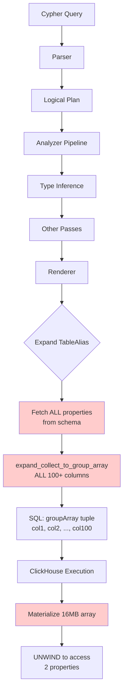

**Problems** (red boxes):
- ❌ Fetches ALL properties from schema
- ❌ Creates tuple with ALL columns
- ❌ Materializes large arrays unnecessarily

---

## Optimized Architecture (After Implementation)

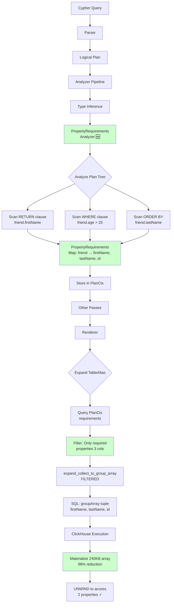

**Improvements** (green boxes):
- ✅ New analyzer pass tracks requirements
- ✅ Stores requirements in PlanCtx
- ✅ Filters properties before expansion
- ✅ Materializes only what's needed

---

## Data Flow: Property Requirements

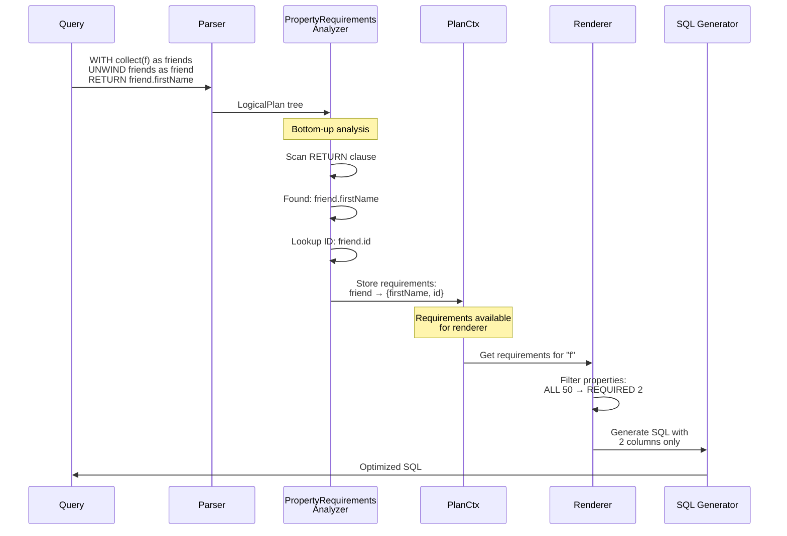

---

## Property Requirements Flow

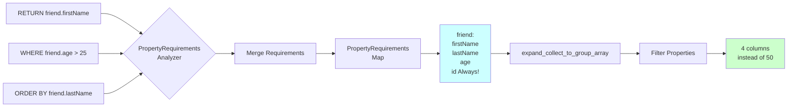

---

## Analyzer Pass Integration

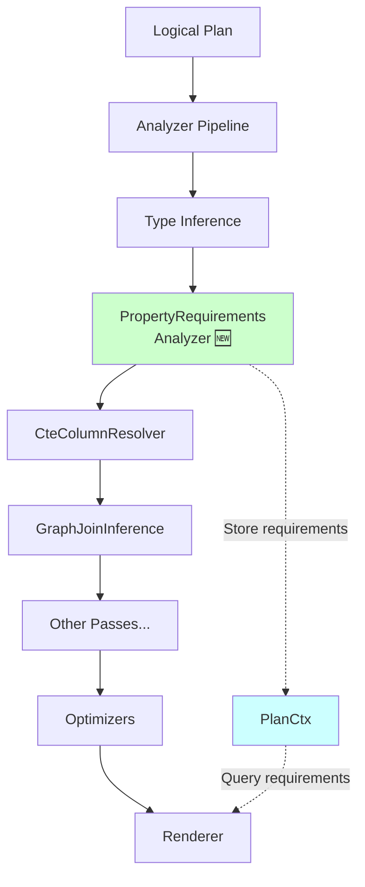

**Key Points**:
- ✅ Runs AFTER type inference (needs type info)
- ✅ Runs BEFORE rendering (results used during SQL gen)
- ✅ Non-destructive pass (only analysis, no transformation)
- ✅ Results stored in PlanCtx for renderer access

---

## Edge Case Handling

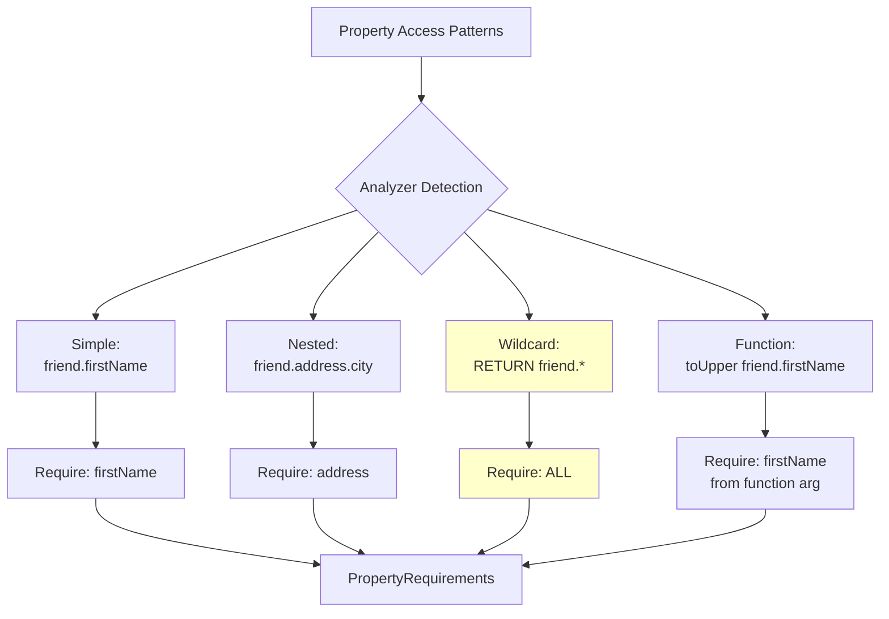

**Edge Cases**:
- ✅ Nested properties → Require parent property
- ✅ Wildcards → Mark as "require all"
- ✅ Functions → Extract from arguments
- ✅ Always include ID for correctness

---

## Performance Impact Visualization

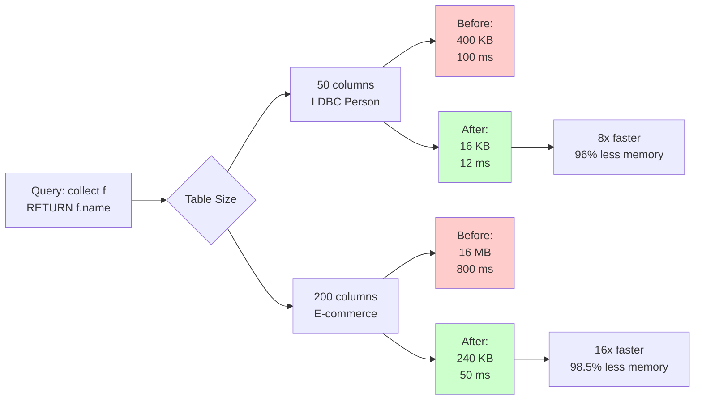

---

## Implementation Phases

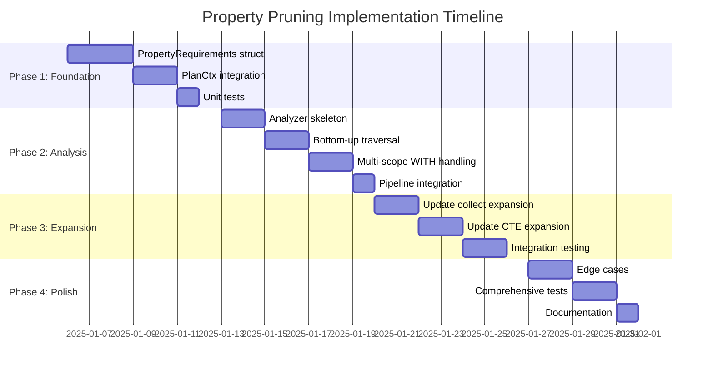

---

## Three Property Resolvers Working Together

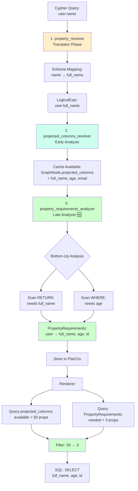

**Three Resolvers, Three Jobs**:
1. **property_resolver**: Schema mapping (Cypher names → DB columns)
2. **projected_columns_resolver**: Cache what's available
3. **property_requirements_analyzer**: Determine what's needed

---

## Multi-Scope Bottom-Up Analysis

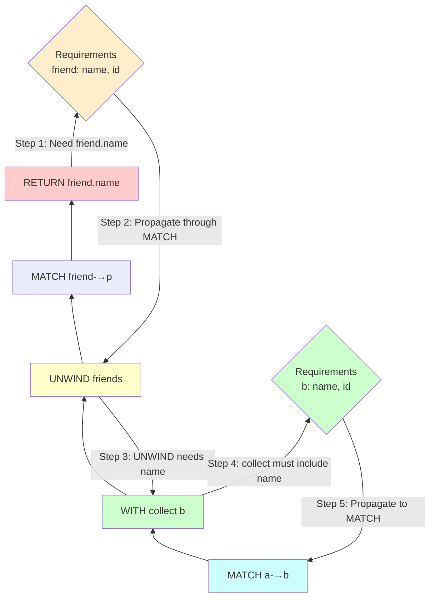

**Key**: Analysis flows **BOTTOM → TOP** (RETURN → MATCH) to correctly propagate requirements through scope boundaries!

---

## Backward Compatibility

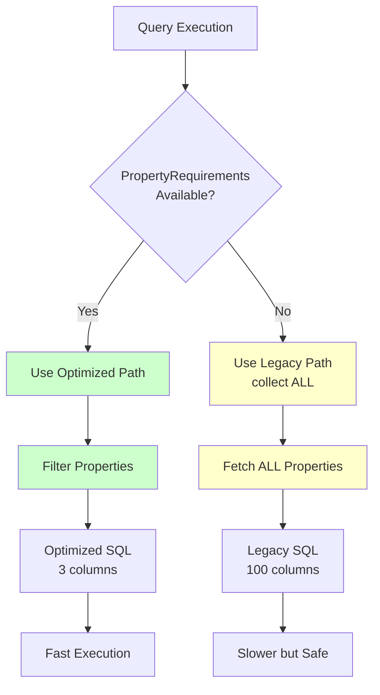

**Graceful Degradation**:
- ✅ If analyzer doesn't run → Falls back to current behavior
- ✅ If requirements empty → Collects all properties (safe)
- ✅ No breaking changes to existing queries
- ✅ Optional feature flag for gradual rollout

---

These diagrams illustrate:
1. **Before/After** comparison showing the optimization
2. **Data flow** of property requirements through the system
3. **Integration** of new analyzer pass in pipeline
4. **Edge case** handling strategies
5. **Performance impact** visualization
6. **Implementation timeline** as Gantt chart
7. **Backward compatibility** safety measures
